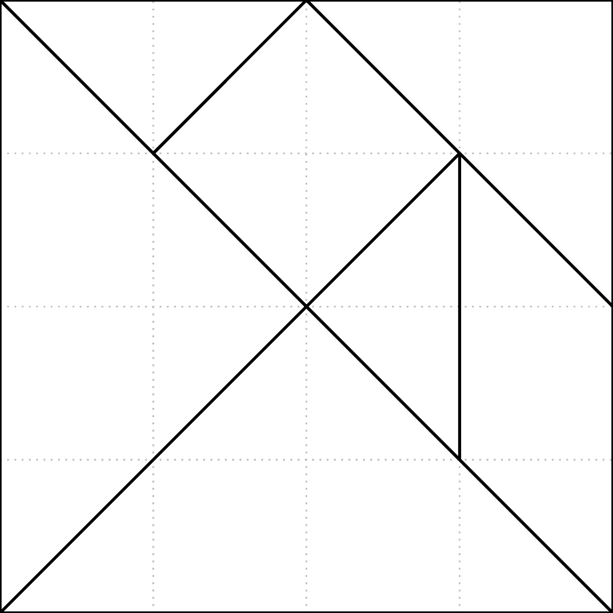

======================================
繪製向量式資料
======================================

.. attention::

    本教學適用於 GMT 6 的現代模式。如須參閱 GMT 6 (傳統模式) 與 GMT 4-5 繪製相似圖片的教程，\ `請至這裡 <plot_vector_data_gmt5.html>`_。

地理空間資料通常會以網格形式或向量形式儲存。所謂的向量式資料，其實就是描述「點、線、面」位置與形狀的資料。有關於如何繪製點資料的技巧，我們已經在「\ :doc:`scatter_plot`\ 」一章中提及，因此在本章中，將會說明如何利用 GMT 繪製線段以及多邊形、簡介與 GMT 相容的向量式資料檔案格式，以及透明度的設定--這種填色技巧非常適合用在常常需要疊在一起呈現的向量式資料上。

目標
--------------------------------------
繪製一張\ `七巧板 <https://zh.wikipedia.org/wiki/%E4%B8%83%E5%B7%A7%E6%9D%BF>`_\ 的盤面，如下所示。七巧板是一種類似拼圖的玩具，遊玩目標通常是利用 7 個多邊形拼出指定的圖案。這邊拼出的是正方形，也是所有的圖案裡最基本的一種。

在此圖中，七個多邊形顏色均不相同，但都有黑色邊緣，而且在盤面上還有淡色的棋盤式格子，可以幫助你計算每個多邊形的大小。要讓這些線條與多邊形的顏色同時呈現，我們必須要在色階檔中加上透明度的設定，並且使用不同的出圖指令。

.. _最終版圖片:

.. image:: plot_vector_data/tangram_gmt6.png
    :width: 1000px
    :align: center

直接觀看\ `指令稿`_

使用的指令與概念
--------------------------------------
- ``makecpt`` - **製作含有透明度設定的離散色階檔**
- ``basemap`` - 設定作圖區的基本資訊
- ``plot`` - **繪製線段與多邊形**

操作流程
--------------------------------------
在「\ :doc:`scatter_plot`」中我們看到 ``plot`` 如何處理點資料。如要處理線段資料和多邊形資料，我們可以使用相同的 ``plot`` 語法：

.. code-block:: bash

    $ gmt plot 輸入檔名稱 [選項...]

線段顧名思義，就是很多個頂點連起來的線條。GMT 接受以純文字格式記載的線段資料，如下所示：

.. code-block:: bash

    # (所有以 # 號開頭的行都會被解讀成註解)
    > [線段 1 的設定]
    線段 1 的頂點 1
    線段 1 的頂點 2
    ...
    > [線段 2 的設定]
    線段 2 的頂點 1
    線段 2 的頂點 2
    ...
    > [線段 3 的設定]
    ...

如果是二維線段，頂點就是兩欄資料，分別為 X 座標和 Y 座標。因為是線段，所以每條線至少都要有 2 個頂點。不同線段之間預設以 ``>`` 符號隔開，符號後方可以接上 ``-W`` 或者 ``-Z``，代表 ``plot`` 在畫圖時會對這條線使用的繪圖選項：

- ``-W``：指定畫筆樣式
- ``-Z``：藉由給定色階檔的數值指定顏色

詳細的說明請參考\ `這裡 <https://docs.generic-mapping-tools.org/6.0/plot.html#segment-header-parsing>`_。我們就來研究一下，如果要畫出七巧板的背景網格，需要怎麼樣的線段檔案：

.. code-block:: bash

    > -W3p,black,.
    1 0
    1 4
    >
    2 0
    2 4
    >
    3 0
    3 4
    >
    0 1
    4 1
    >
    0 2
    4 2
    >
    0 3
    4 3

在此檔案中，總共有 6 條線段，前三條是直線，後三條是橫線。以第 1 條為例，它是從座標 (1, 0) 到 (1, 4) 的線段。第一條線段的 ``>`` 符號後面有 ``-W`` 設定，意味著這條線要使用黑色、點點樣式和 3p 寬度來繪製。之後所有的 ``>`` 符號後面都沒有任何設定，當 ``plot`` 在繪圖的時候，會\ **自動沿用之前已經設定過的參數值**\ ，因此後五條線畫出來的外觀會與第一條相同。把檔案存為 ``lines.txt``，然後使用如下指令，就可以畫出背景網格。

.. code-block:: bash

    $ gmt plot lines.txt -R0/4/0/4 -JX15c -png lines

.. image:: plot_vector_data/plot_vector_data_gmt6_fig1.png
    :width: 1000px
    :align: center

看起來還不錯！接下來讓我們看一下要怎麼畫多邊形。其實多邊形資料與線段大同小異，就是把所有的頂點座標紀錄在檔案內而已；不過，多邊形的頂點數目最少要有 3 個。GMT 可接受的多邊形檔案格式，如下所示：

.. code-block:: bash

    > [多邊形 1 的設定]
    多邊形 1 的頂點 1
    多邊形 1 的頂點 2
    多邊形 1 的頂點 3
    ...
    > [多邊形 2 的設定]
    ...

分隔符號後方可以接上 ``-W``、``-Z`` 或 ``-G`` (詳細的說明請參考\ `這裡 <https://docs.generic-mapping-tools.org/6.0/plot.html#segment-header-parsing>`_\ )：

- ``-W``：指定多邊形的外框畫筆樣式
- ``-Z``：藉由給定色階檔的數值指定多邊形填色
- ``-G``：直接指定多邊形填色

例如，要畫出七巧板上的圖形，我們可以使用如下的檔案內容：

.. code-block:: bash

    > -Z0
    0 0
    2 2
    4 0
    > -Z3
    0 0
    2 2
    0 4
    > -Z6
    0 4
    1 3
    2 4
    > -Z9
    1 3
    2 4
    3 3
    2 2
    > -Z12
    3 3
    2 2
    3 1
    > -Z15
    3 1
    3 3
    4 2
    4 0
    > -Z18
    2 4
    4 2
    4 4

第一個多邊形是七巧板底部的大三角形，座標從 (0, 0)、(2, 2) 到 (4, 0)，各位可以試試看找出其他六個多邊形分別是什麼形狀。注意在每個多邊形的 ``>`` 後方都有 ``-Z`` 設定，代表著我們只要給定色階檔，GMT 就會自動的依照 Z 值與色階檔的對應，為每個多邊形填上不同的顏色。在 GMT 中，有一個稱為「\ **wysiwyg**\ [#]_\ 」的色階檔，最適合用來當這種依照數值指定不同種類顏色的參考色階。它的顏色如下所示：

.. image:: plot_vector_data/plot_vector_data_gmt6_fig2.png
    :align: center

把以上的文字檔案另存成 ``pieces.txt``，然後使用如下的指令繪圖：

.. code-block:: bash

    gmt begin pieces png
        gmt makecpt -Cwysiwyg -T0/20/1    # 色階數值範圍為 0 至 20，每隔 1 取樣
        gmt plot pieces.txt -R0/4/0/4 -JX15c -L -C    
    gmt end 

注意這裡的 ``-L``，這個參數會告訴 ``plot`` 我們畫的是多邊形，如此一來 ``plot`` 就會\ **強制封閉線段**。另外，在畫多邊形的時候，``plot`` 指令的預設行為是畫邊而且不填色。因此，要加上 ``-C`` 告訴 GMT 我們要用新創造的色階檔對多邊形填色。

.. image:: plot_vector_data/plot_vector_data_gmt6_fig3.png
    :width: 1000px
    :align: center

這下子七巧板也有模有樣了！我們順便來加上邊框：

.. code-block:: bash

    gmt begin pieces png
        gmt makecpt -Cwysiwyg -T0/20/1
        gmt plot pieces.txt -R0/4/0/4 -JX15c -L -C -W2p,black
    gmt end 

.. image:: plot_vector_data/plot_vector_data_gmt6_fig4.png
    :width: 1000px
    :align: center

看起來非常不錯，不過請注意到圖片邊框，線段的寬度似乎跟圖片內部多邊形邊緣線段寬度不一樣。這是因為 GMT 會沿著多邊形的邊緣 (而不是黑色線段的邊緣) 裁剪影像，因此邊框的線段寬度會變成原本的一半。如果你覺得這沒關係，那倒無妨；但如果你是個完美主義者，不想看到不一致的線段寬度，可以選擇的替代方案，就是把多邊形邊框挪到 ``lines.txt`` 裡面做成線段資料，與網格線條一起繪製。因此，我們的 ``lines.txt`` 要多增加幾行資訊：

.. 看起來非常不錯，不過請注意到圖形的角落，例如左下角，有一些小小的線段突出來了。這是因為使用這種方式繪製的邊框是沿著多邊形邊邊描繪，因此原本的各個多邊形會稍稍放大一點點。如果你覺得這沒關係，那倒無妨；但如果你是個完美主義者，不想看到任何東西突出在正方形方框外面，可以選擇的替代方案，就是把多邊形邊框挪到 ``lines.txt`` 裡面做成線段資料，與網格線條一起繪製。因此，我們的 ``lines.txt`` 要多增加幾行資訊：

.. code-block:: bash

    > -W1p,grey,.
    # 注意我改動了網格線段的樣式設定！
    1 0
    1 4
    >
    2 0
    2 4
    >
    3 0
    3 4
    >
    0 1
    4 1
    >
    0 2
    4 2
    >
    0 3
    4 3
    > -W2p,black
    0 0
    4 0
    4 4
    0 4
    0 0
    > 
    0 4
    4 0
    > 
    0 0
    3 3
    > 
    3 1
    3 3
    > 
    1 3
    2 4
    > 
    2 4
    4 2

後半從 ``> -W2p,black`` 開始的部份，就是七巧板邊框與拼圖的邊界線段。讓我們再試一次以下指令：

.. code-block:: bash

    $ gmt plot lines.txt -R0/4/0/4 -JX15c -png lines

看起來賞心悅目多了！最後的問題，就是把多邊形和線條疊加在一起而不擋到彼此。這個問題可以簡單的以具有\ **透明度**\ 設定的色階解決。``makecpt`` 的 ``-A`` 選項可以用來指定透明度，我們來試著在終端機中輸入：

.. code-block:: bash

    $ gmt makecpt -Cwysiwyg -T0/20/1 -A70   # -A: %70 透明
    0    64/0/64@70    1    64/0/64@70
    1    64/0/192@70   2    64/0/192@70
    ... (以下略)

在色階資料中，``@`` 符號後面的就是透明度，因此整個顏色的格式為：``紅/綠/藍@透明度``。使用此色階畫圖，所有的顏色就會被套上透明度設定。這下子你就能看到透明、粉嫩粉嫩的顏色了！

.. 問題是，PostScript 格式其實是不支援透明度的，就算你設定了透明選項，直接打開 .ps 檔的話，仍然不會看到任何改變。幸好，GMT 提供了一個指令 ``psconvert``，可以把 .ps 檔中不能顯示的透明度設定，轉檔成別的格式以成功顯示。它的語法為

..    $ psconvert 輸入的ps檔 -T輸出檔格式 [其他選項...]

.. ``輸出檔格式`` 使用單一字母來指定，例如 ``g`` 是 PNG，``f`` 是 PDF 等等。在最終的指令稿中，我們使用的格式和選項如下所示：

..    $ psconvert tangram.ps -Tg -A -P
..    # -A: 裁剪至影像範圍
..    # -P: 強迫直向輸出 (我們的圖本來就是直向，所以在本例中這個不加也沒差，但一律加上的話對其他不同的情況很方便)

.. 輸出檔會自動的把 ``.ps`` 改成 ``.png``，主檔名則維持不變，但這下子你就能看到透明、粉嫩粉嫩的顏色了！

.. attention

..    在舊的 GMT 腳本中，這個功能是由 ``ps2raster`` 指令負責執行，但在 GMT 5 中，``ps2raster`` 預計會被 ``psconvert`` 逐步取代。因此，如果你使用以下指令轉檔，會出現警告訊息，提醒你要把 ``ps2raster`` 換成 ``psconvert``。

.. ps2raster tangram.ps -Tg -A -P

指令稿
--------------------------------------
本圖片的最終指令稿如下：

.. code-block:: bash

    gmt begin tangram_gmt6 png
        gmt makecpt -Cwysiwyg -T0/20/1 -A70
        gmt basemap -R0/4/0/4 -JX15c -Bnews    # 設定座標軸範圍 (-R) 的同時，不畫出座標軸 (-Bnews)
        gmt plot pieces.txt -L -C
        gmt plot lines.txt                     # 先填色再畫邊框，確保邊框會疊在填色上面。你可以試試看把這一行移到更上方，確認透明度的效果設定。
    gmt end

線段資料 ``lines.txt`` 內容如下，並\ :download:`可在這裡下載 <plot_vector_data/lines.txt>`\ 。

.. code-block:: bash

    > -W1p,grey,.
    1 0
    1 4
    >
    2 0
    2 4
    >
    3 0
    3 4
    >
    0 1
    4 1
    >
    0 2
    4 2
    >
    0 3
    4 3
    > -W2p,black
    0 0
    4 0
    4 4
    0 4
    0 0
    > 
    0 4
    4 0
    > 
    0 0
    3 3
    > 
    3 1
    3 3
    > 
    1 3
    2 4
    > 
    2 4
    4 2

多邊形資料 ``pieces.txt`` 內容如下，並\ :download:`可在這裡下載 <plot_vector_data/pieces.txt>`\ 。

.. code-block:: bash

    > -Z0
    0 0
    2 2
    4 0
    > -Z3
    0 0
    2 2
    0 4
    > -Z6
    0 4
    1 3
    2 4
    > -Z9
    1 3
    2 4
    3 3
    2 2
    > -Z12
    3 3
    2 2
    3 1
    > -Z15
    3 1
    3 3
    4 2
    4 0
    > -Z18
    2 4
    4 2
    4 4

.. note::

    「使用 ``wysiwyg`` 作為母色階並加上透明度設定，接下來繪製七巧板填色、座標格線與七巧板邊線。」

.. 為了使透明度可見，我們使用 ``psconvert`` 把輸出檔轉成 PNG 格式以成功顯示。

觀看\ `最終版圖片`_

習題
--------------------------------------
1. 畫出六面體骰子的任一種展開圖，使用 ``wysiwyg`` 作為母色階為每面塗上不同的顏色。

.. [#] What You See Is What You Get, 即「所見即所得」。
