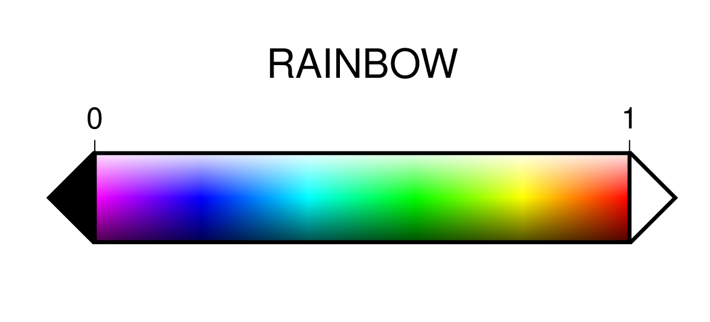
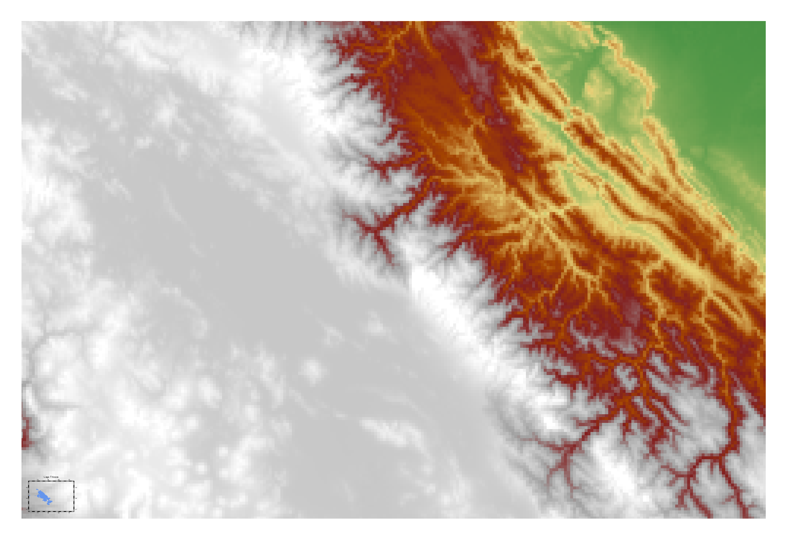

======================================
為地形圖上色
======================================

把地圖依照不同屬性、在不同區域著色，可以把龐大的資料有效視覺化。最常用來著色的屬性，\
高度絕對是其中之一。在典型的地形圖中，不同的海拔高度會套上不同的顏色。本章中將會詳細\
說明如何利用地表的不同高度，製作彩色的地形圖。

目標
--------------------------------------
製作一張\ `的的喀喀湖`_ 
(Lago Titicaca) 的分層設色地形圖，如下圖所示。的的喀喀湖位於秘魯和玻利維亞交界，\
面積達 8372 平方公里。特殊的是，湖面位置的海拔高達 3812 公尺，是全世界最高的商業通航\
湖泊\ [#]_。圖中的藍色線條表示河流，注意右側的河流其實是亞馬遜河的源頭，而且並沒有和的的喀喀湖\
連接。黑色的虛線是兩國國界。地形圖的顏色從海拔 0 至 5000 公尺，依循以下顏色過渡：\
綠色 -> 黃色 -> 紅色 -> 灰色 -> 白色，其中 2800 公尺以上即開始以灰色系展示。\
這麼高的湖泊，位於一片白色系背景當中，更增添了些許雪國的氣氛 (實際上，的的喀喀湖\
冬天非常乾燥，幾乎不會下雪\ [#]_)。

.. _的的喀喀湖: https://zh.wikipedia.org/wiki/%E7%9A%84%E7%9A%84%E5%96%80%E5%96%80%E6%B9%96

.. _最終版地圖:

.. image:: coloring_topography/titicaca.png

直接觀看\ `指令稿`_

使用的指令與概念
--------------------------------------
- ``grdinfo`` - **查閱網格檔的基本資訊**
- ``grdimage`` - **繪製著色影像**
- ``pscoast`` - **繪製河流、湖泊與國界**
- GMT 共用選項：``-O`` ``-K``
- 輸入網格化地形資料到 GMT 中
- 從 `cpt-city`_ 尋找適合地圖的色階檔
- 如何疊加輸出圖層
- 使用腳本一次下達所有繪圖指令

.. _cpt-city: http://soliton.vm.bytemark.co.uk/pub/cpt-city

前置作業
--------------------------------------
這次我們必須要先取得繪圖區域的地形資料。這類型的資料有時後會被視作機密，尤其是高解析度的區域資料，\
時常需經申請或付費才能使用。不過這次我們預計使用的資料，已經公開在網路上了，任何人都可以直接下載使用。\
它就是 `ETOPO`_，或稱為「全球地形數位模型」。ETOPO 是由美國大氣海洋局 (NOAA) 附屬的美國環境資訊中心 (NCEI) 建立\
及維護，此資料庫蒐集了數個不同測高衛星與海洋探測的地形調查資料，再把他們統一彙整到相同的解析度。\
這裡我們要用資料版本是 ETOPO1 Bedrock (ETOPO 解析度 1 弧分的地形高程，極區採用冰層下的基盤高度)
以 **netCDF** 格式發布的檔案。檔案可以在 `ETOPO`_ 的網站下載 (ETOPO1 Bedrock -> 
grid-registered: netCDF)，或是使用如下快速連結下載：

`下載 ETOPO1 Bedrock netCDF 檔`_ (383M，解壓後約 891M)

.. _ETOPO: https://www.ngdc.noaa.gov/mgg/global/global.html
.. _下載 ETOPO1 Bedrock netCDF 檔: https://www.ngdc.noaa.gov/mgg/global/relief/ETOPO1/data/bedrock/grid_registered/netcdf/ETOPO1_Bed_g_gmt4.grd.gz

解壓縮後，會有一個叫做 ``ETOPO1_Bed_g_gmt4.grd`` 的檔案，副檔名是 ``.grd``，表明了它是某種\
「網格檔」，亦即地球的二維表面被切割成網格狀，每個「格子」內，都有一個相對應的高度數據。(非常類似 
GeoTiff 的概念，只不過在 GeoTiff 中，相對應的術語稱為「像素」而非「網格點」。) ``.grd`` 
檔是 netCDF 格式常見的附檔名，也就是說它可被 GMT 讀取並作圖。如果想要參閱檔案的基本資訊，除了上
`ETOPO`_ 官網外，也可以透過終端機輸入 ``grdinfo`` 指令來達成。執行畫面會像如下所示：

.. code-block:: bash

    $ grdinfo ETOPO1_Bed_g_gmt4.grd
    ETOPO1_Bed_g_gmt4.grd: Title: ETOPO1_Bed_g_gmt4.grd
    ETOPO1_Bed_g_gmt4.grd: Command: 
    ETOPO1_Bed_g_gmt4.grd: Remark: 
    ETOPO1_Bed_g_gmt4.grd: Gridline node registration used [Geographic grid]
    ETOPO1_Bed_g_gmt4.grd: Grid file format: ni = GMT netCDF format (32-bit integer), COARDS, CF-1.5
    ETOPO1_Bed_g_gmt4.grd: x_min: -180 x_max: 180 x_inc: 0.0166666666667 name: Longitude [degrees_east] nx: 21601
    ETOPO1_Bed_g_gmt4.grd: y_min: -90 y_max: 90 y_inc: 0.0166666666667 name: Latitude [degrees_north] ny: 10801
    ETOPO1_Bed_g_gmt4.grd: z_min: -10898 z_max: 8271 name: z
    ETOPO1_Bed_g_gmt4.grd: scale_factor: 1 add_offset: 0
    ETOPO1_Bed_g_gmt4.grd: format: classic

從輸出文字中你可以看到一些基本資訊，像是

- 網格檔的格式是 netCDF，CF-1.5。
- X 從 -180 度到 180 度，Y 從 -90 度到 90 度，意味著此網格檔涵蓋全球的範圍。
- 網格大小是 0.0166666666667，也就是 1/60 度 (1 弧分)。
- 總共有 21601 x 10801 = 233312401 個格點 (也就是兩億三千三百萬像素)。
- Z 值 (高度) 從 -10898 到 8271。雖然沒有註明單位，但很容易可以推敲出來是公尺。\
  為什麼最高的地方不是 8848 公尺 (聖母峰的高度)? 那是因為網格的解析度還是不夠高，\
  1 弧分其實只相當於 1 至 2 公里才取一個點而已。

操作流程
--------------------------------------
取得全球的地形資料後，就是決定地圖繪製的區域。如同前一章--\ :doc:`making_first_map`\
--所述，我們可以使用 *Google Map* 等工具決定區域。這裡我們考慮到高度的呈現效果，選擇\
經度從 -70.8 到 -66.56 (負值表示西經)，緯度從 -17.17 到 -14.42 (負值表示南緯。)

.. figure:: coloring_topography/coloring_topography_fig1.png
    :align: center

    本次作圖區域在 `Google Map` 上呈現的樣子。

使用 ``grdimage`` 呈現地形數據，最少只需要提供三個參數，分別是 ``輸入檔``、``-R`` (繪圖區域)
和 ``-J`` (投影方法和地圖大小)。就讓我們來畫一張跟\ `前一章 <making_first_map.html>`_\
一樣寬度的地圖吧。在\ :ref:`終端機`\ 模式下前往 ``ETOPO1_Bed_g_gmt4.grd`` 所在的資料夾，
然後輸入以下指令： 

.. code-block:: bash

    $ grdimage ETOPO1_Bed_g_gmt4.grd -R-70.8/-17.17/-66.56/-14.42r \
               -JM6i -P > titicaca.ps 

這邊順便加了 ``-P``，方便輸出圖檔的觀看。如需以上指令的語法說明，請至\
「\ :doc:`making_first_map`\ 」中查閱。輸出的圖檔 ``titicaca.ps``
開啟後應該會是如下的圖案：

.. image:: coloring_topography/coloring_topography_fig2.png

有點難以看懂？這是因為 GMT 預設的套色沒那麼適合這個地區的緣故。在未指定地圖的套色下，\
GMT 會用一套名為 ``rainbow`` 的色階來呈色。這個色階的顏色如下所示

圖中的 ``0`` 和 ``1`` 的顏色，也就是紫色和紅色，會對應到地圖範圍中最低\
和最高的的地方。有沒有辦法換成另一種比較好看的色階？當然可以，GMT 有數種方法可以製造\
或調整色階，但這邊我們要先來看一種最簡單的方法：直接下載已經做好的色階來用。

`cpt-city`_ 網站蒐集了不少常用的色階，其中也包括 GMT 格式的色階檔。GMT 色階檔\
通常使用副檔名 ``.cpt``，是 color palette table (色階表) 的縮寫。你可以在網站\
中搜尋你想要的色階，例如\ 
`這個網頁 <http://soliton.vm.bytemark.co.uk/pub/cpt-city/views/totp-cpt.html>`_\
就列了許多最常被下載的 ``.cpt`` 檔。我們這次來用其中的一個叫做 ``mby`` 的色階看看。按下\
``mby`` 的色階表，你應該就會看到如下頁面

.. image:: coloring_topography/coloring_topography_fig4.png
    :align: center

注意圖中的 **-8000 ... 5000**，這是指此色階已經被指定在 -8000 到 5000 公尺之內呈現了。\
按一下網頁上的 `cpt` 連結就可以把此色階檔下載下來。

為了方便起見，\ :download:`這邊 <coloring_topography/mby.cpt>`\ 也提供了 ``mby.cpt`` 的下載點。

使用 ``grdimage`` 中的 ``-C`` 選項，就可以指定要用的色階，只要在 ``-C`` 後接續色階檔檔名\
就行了。所以我們更新版的指令為：

.. code-block:: bash

    $ grdimage ETOPO1_Bed_g_gmt4.grd -R-70.8/-17.17/-66.56/-14.42r \
               -JM6i -P -Cmby.cpt > titicaca.ps 

這次地圖會變成這樣

.. image:: coloring_topography/coloring_topography_fig5.png

看起來已經有模有樣了。

.. note::

    有關於如何自訂色階表，讓地圖的顏色可以隨心所欲變化的技巧，請參閱「\ :doc:`coloring_topography`\ 」與\
    「\ :doc:`editing_cpt_colorbar`\ 」。

這個地圖目前有個大問題，就是我們雖然知道地圖中大部份的區域都很高 (灰白色)，但是卻看不到我們的\
主角\ `的的喀喀湖`_。這是因為 ``ETOPO1_Bed_g_gmt4.grd`` 中只有記載高度，並沒有記載地表的\
狀態，所以光靠這個檔案，無從得知哪邊是湖泊、海洋等等的地貌。因此，為了標上\ `的的喀喀湖`_\
的位置，我們只好再次呼叫 ``pscoast`` 這個指令，利用內建的水體資料幫我們畫上湖泊，順便再畫上邊框。

從現在開始，我們要一次執行兩個以上的指令了。你當然可以一行一行的在命令列中打好再送出執行，\
不過為了修改方便，我們通常會選擇把所有的指令先寫在\ :ref:`腳本`\ 內，再執行此腳本以一次送出所有\
指令給電腦。請建立新文字檔，檔名可以為 ``titicaca.bash`` 或任何你喜歡、\
且符合作業系統格式慣例的名字。請在檔案中輸入：

.. code-block:: bash

    grdimage ETOPO1_Bed_g_gmt4.grd -R-70.8/-17.17/-66.56/-14.42r \
             -JM6i -P -Cmby.cpt > titicaca.ps 
    pscoast  -R-70.8/-17.17/-66.56/-14.42r -JM6i -P -Scornflowerblue \
             -Df -Baf -B+t"Lago Titicaca" > titicaca.ps

.. note::

    關於 ``pscoast`` 的指令解說，請至「\ :doc:`making_first_map`\ 」查看。\
    另外，不同的作業系統的腳本會有不同的額外設定，可以讓你的腳本能夠更方便的執行，詳情\
    請參閱「\ :doc:`basic_concept`\」。

.. tip::

    ``pscoast`` 的 ``-S`` 選項會套用在所有水域。如果你的地圖中有海又有湖，\
    而你想分別為海跟湖指定不同顏色，可以試試看換成 ``-C`` 選項。因為本圖沒有海域，\
    ``-Scornflowerblue`` 和 ``-Cl/cornflowerblue`` 具有相同效果，不過\
    後者其實只會為湖泊填上顏色。

在終端機中執行這個檔案，然後開啟輸出檔，應該會看到下圖：

.. image:: coloring_topography/coloring_topography_fig6.png

現在湖和邊框是出現了，但是之前畫的地形卻不見了？原來是我們使用了兩次 ``>`` 符號。``>``
符號會覆蓋掉上一次存檔的內容，因為上面的腳本中 ``pscoast`` 的輸出結果是用 ``>`` 
存到了檔案中，所以 ``grdimage`` 畫的內容就被蓋掉了。要避免這種情況，後輸入內容必須要用
``>>`` 這個符號才行，它會把 ``pscoast`` 的輸出接在檔案的最後面，這樣子繪圖的時候，\
``pscoast`` 的輸出就會像第二個圖層一樣，蓋在第一個圖層，也就是 ``grdimage`` 的輸出地圖上方。\
所以我們來把第二個 ``>`` 改成 ``>>`` 看看：

.. code-block:: bash

    grdimage ETOPO1_Bed_g_gmt4.grd -R-70.8/-17.17/-66.56/-14.42r \
             -JM6i -P -Cmby.cpt > titicaca.ps 
    pscoast  -R-70.8/-17.17/-66.56/-14.42r -JM6i -P -Scornflowerblue \
             -Df -Baf -B+t"Lago Titicaca" >> titicaca.ps

這次的腳本也能成功執行，但輸出結果會變這樣：

.. image:: coloring_topography/coloring_topography_fig5.png

這不是跟沒加 ``pscoast`` 的時候一樣嗎？沒錯，他們是一樣的，``pscoast`` 的輸出在\
這裡被\ **無效化**\ 了。這是因為 PostScript 語言在檔案結尾時，必須要有一行特定的\
文字來宣告檔案已經結束，不然讀圖的時候會出現錯誤，這一行一般稱為 **EOF** (End-Of-File)
字符。在預設的情況下，GMT 的每個指令都會在輸出地圖的最後加上 EOF 字符，當看圖軟體讀到
EOF 時，就不會再往下讀了。這就是為什麼 ``pscoast`` 看起來有成功執行，卻沒有顯示在輸出地圖\
上的原因。GMT 中有一個固定的選項 ``-K``，是專門處理這種情況的，它可以把指令輸出的 EOF 
字符移除。在我們的例子中，``-K`` 必須要加在 ``grdimage`` 內，這樣子檔案就不會在中段出現
EOF 字符，像這樣：

.. code-block:: bash

    grdimage ETOPO1_Bed_g_gmt4.grd -R-70.8/-17.17/-66.56/-14.42r \
             -JM6i -P -Cmby.cpt -K > titicaca.ps 
    pscoast  -R-70.8/-17.17/-66.56/-14.42r -JM6i -P -Scornflowerblue \
             -Df -Baf -B+t"Lago Titicaca" >> titicaca.ps

這次的腳本輸出結果為：

乍看之下好像跟前一張一樣，但不知道你有沒有注意到左下角的小圖案？沒錯，左下角的圖案是
``pscoast`` 的輸出。總而言之，程式並沒有把這兩個圖層良好的疊在一起，而是以一種\
很奇怪的比例呈現，這並不是我們想要的結果。會有奇怪輸出的原因，與上個段落很相似：\
GMT 的每個指令輸出地圖時，除了會在結尾加 EOF 字符外，也會在開頭加上\ **檔頭敘述**。\
它就像是我們在上一章看到的一樣，:ref:`以文字敘述檔案的一些基本資訊 <PS檔頭>` 。如果一個檔案中\
有兩個檔頭，看圖軟體就會以不正確的方式讀取 ``.ps`` 檔案。因此，GMT 中還有一個固定的\
選項 ``-O``，加上了這個選項，指令就不會輸出檔頭。在我們的例子中，``-O`` 必須要加在
``pscoast`` 內，這樣才不會在檔案的中段突然出現奇怪的檔頭，像這樣：

.. code-block:: bash

    grdimage ETOPO1_Bed_g_gmt4.grd -R-70.8/-17.17/-66.56/-14.42r \
             -JM6i -P -Cmby.cpt -K > titicaca.ps 
    pscoast  -R-70.8/-17.17/-66.56/-14.42r -JM6i -P -Scornflowerblue \
             -Df -Baf -B+t"Lago Titicaca" -O >> titicaca.ps

這次總算有個令人滿意的輸出結果。

.. image:: coloring_topography/coloring_topography_fig8.png

.. tip::

    1. 有關 ``-K`` 和 ``-O`` 的通用規則就是：除了最後一個指令之外，前面的所有指令都\
       應該加上 ``-K`` (可以記成 Continue 的 K 音)；而除了第一個指令之外，前面的\
       所有指令都應該加上 ``-O`` (它是 Overlay 的 O)。

    2. 讓我們看一下 ``pscoast`` 中的兩個 ``-B`` 選項。實際上它們也可以加在 
       ``grdimage`` 中，因為邊框屬於哪個圖層在本例中不影響地圖疊加，所以效果會一模一樣。   

.. attention:

    ``-K`` 和 ``-O`` 是很重要的指令，如果沒加在正確位置上的話常常會引起不正確的\
    結果，但麻煩的是就算你加錯了，所有的指令仍可正常執行。所以，如果你的地圖不符合\
    你心中預期的情況，請務必要檢查一遍 ``-K`` 和 ``-O`` 是否有加在對的地方。

以上的腳本指令還可以稍微縮短一點點。\
**對於 GMT 的所有同名選項而言，如果他們表達的是相同意思，那麼後一次的預設值就會是前一次的設定值**。\
也就是說，兩個指令一模一樣的部份，後一個指令可以不用給值。在 ``pscoast`` 中，``-R`` 跟 ``-J``
都跟 ``grdimage`` 中的 ``-R`` 跟 ``-J`` 一模一樣 (因為要畫在同一個地圖上。不一樣的話會尺寸不對，\
或線條跑到別處去)。因此後者的參數值可以不用打。另外，兩個指令中都加了 ``-P`` (直幅繪圖)，但由於 GMT
不允許前後的指令作圖在不同形狀的紙上，所以 ``pscoast`` 中，不管有沒有加 ``-P`` 都沒關係，GMT 會\
繼續使用直幅的紙張格式來疊圖。因此，簡化後但具有相同功能的腳本就如下所示：

.. code-block:: bash

    grdimage ETOPO1_Bed_g_gmt4.grd -R-70.8/-17.17/-66.56/-14.42r \
             -JM6i -P -Cmby.cpt -K > titicaca.ps 
    pscoast  -R -J -O -Scornflowerblue \
             -Df -Baf -B+t"Lago Titicaca" >> titicaca.ps

我順便把 -O 調換了一下位置，因為它是很常出現的選項，所以個人習慣把它放前面以供辨別。

.. tip::

    事實上，GMT 會在使用第一次給定選項值的時候，把它們存在 ``gmt.history`` 這個純文字文件中。\
    這個檔案會放在使用者當次執行 GMT 的目錄底下，當使用者省略選項值時，GMT 會搜尋此文件，再從中\
    讀取使用者之前使用過的設定。這也就是說，當你第二次執行腳本時，只要 ``gmt.history`` 沒被刪掉，\
    你甚至可以把第一行的 ``-R`` 和 ``-J`` 選項值省略！當然這麼做有其風險，因為 ``gmt.history``
    只會儲存使用者最近一次的選項值，所以你如果執行了別的 GMT 指令，舊的設定就有可能會被覆蓋掉，\
    導致腳本無法執行。因此，個人推薦\ **在腳本中第一次出現的選項值一定要詳細設定**\ ，才不會導致\
    上述狀況的發生。

接下來，我們還可以利用 ``pscoast`` 的其餘功能來美化這張地圖。首先是 ``-I``，它可以\
幫我們標上河流，語法為

.. code-block:: bash

    -I編號/畫筆

其中的\ ``編號``\ 可以為不同的英數字，對應到不同等級的河流；而\ :ref:`畫筆 <畫筆>`\
則用來指定河流的繪圖樣式。這裡我們要使用 ``r`` 這個編號，它對應的是\ **所有的永久河流**。\
畫筆樣式則使用 ``0.7p,cornflowerblue``。

另外一個 ``pscoast`` 的選項是 ``-N``，它可以在地圖上標上政治性的邊界。語法同樣為

.. code-block:: bash

    -N編號/畫筆

這裡的\ ``編號``\ 一樣可以為不同的英數字，對應到不同等級政治邊界 (國界、州界等)。\
我們要用的是 ``1``，亦即\ **標上國界**。至於畫筆樣式，則使用 ``0.7p,,--``，\
注意這裡我們空下了「顏色」的欄位，因此 GMT 會使用預設值「黑色」進行繪圖。在「線條樣式」\
欄位中，我們選擇 ``--``，這樣國界就會以虛線呈現。

.. note::

    有關畫筆的進階樣式設定，例如設定線條樣式、利用 RGB 值自訂顏色等，會在「\ :doc:`pen_and_painting`\ 」詳加描述。

把 ``-N`` 和 ``-I`` 以及他們的設定參數加入我們的 ``pscoast`` 指令中，就完成了這次的地圖設計。

指令稿
--------------------------------------

本地圖的最終指令稿如下：

.. code-block:: bash

    grdimage ETOPO1_Bed_g_gmt4.grd -R-70.8/-17.17/-66.56/-14.42r \
             -JM6i -P -Cmby.cpt -K > titicaca.ps
    pscoast  -R -J -O -Ir/0.7p,cornflowerblue -N1/0.7p,,-- \
             -Scornflowerblue -Df -Baf -B+t"Lago Titicaca" >> titicaca.ps

.. note::

    「繪製地形設色圖：以 **70.8E - 66.56E，17.17S - 14.42S** 為邊界，麥卡托投影，\
    地圖橫向寬 **6** 吋，直幅繪圖，套色使用 ``mby.cpt`` 內的色階表。使用最高等級解析度\
    的向量化資料，再用 ``cornflowerblue`` 把湖泊和河流上色，畫上國界，四邊繪製邊框與\
    刻度數值，自動選擇數值間隔與刻度間隔，不畫格線，標題為 *Lago Titicaca*，\
    存檔為 ``titicaca.ps``。」

觀看\ `最終版地圖`_

習題
--------------------------------------

1. 畫出貝加爾湖 (*Lake Baikal* 或 *Baygal nuur*) 與週邊區域的地形設色圖。貝加爾湖是全世界最深的湖泊，\
   也是世界第七大湖，位於俄羅斯，南端接近蒙古的邊界。
2. 從地圖中可看到有幾條河流注入或流出貝加爾湖？
3. 貝加爾湖週邊的海拔為何？湖底的海拔為何？你的地圖分別用什麼顏色表示這兩個海拔？

.. [#] `Data Summary: Lago Titicaca (Lake Titicaca). <http://www.ilec.or.jp/database/sam/dsam04.html>`_
       International Lake Environment Committee Foundation - ILEC. Retrieved 2009-01-03.
.. [#] `ClClimatological Information for Juliaca, Peru. 
       <http://www.weather.gov.hk/wxinfo/climat/world/eng/s_america/ec_per/juliaca_e.htm>`_
       Hong Kong Observatory.
