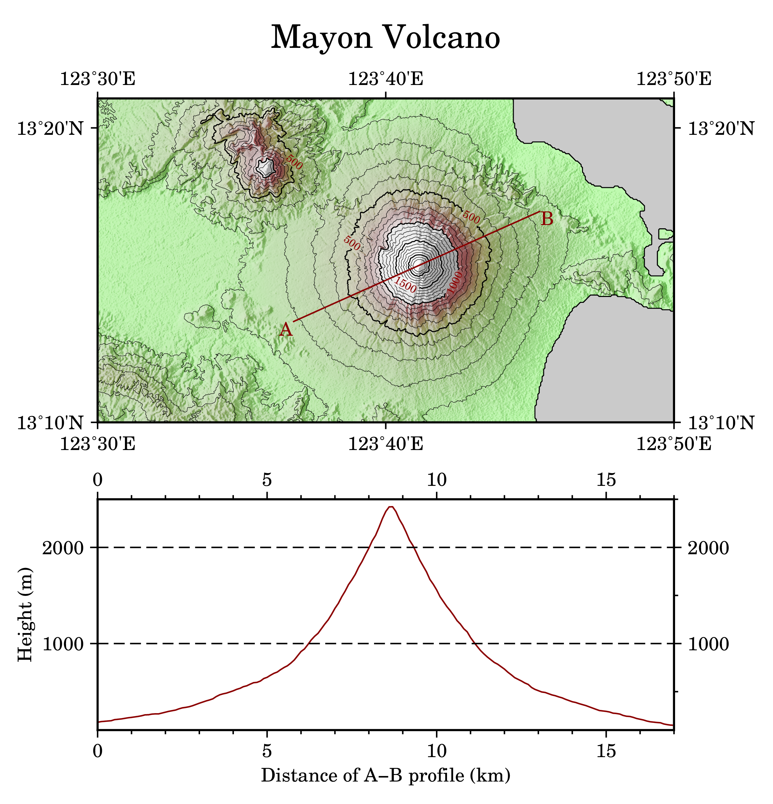

======================================
等高線地圖及地形剖面
======================================

在本章中，我們要使用 GMT 繪製等高線圖與地形剖面圖，這兩種地圖非常適合用來表示地形的\
升降起伏，以及不同地點的陡峭程度。如果你是個登山客，想必它們會是你最愛用的地圖類型。

目標
--------------------------------------

.. _最終版地圖:

直接觀看\ `指令稿`_

使用的指令與概念
--------------------------------------

前置作業
--------------------------------------

操作流程
--------------------------------------

指令稿
--------------------------------------
本地圖的最終指令稿如下：

.. code-block:: bash

    # ==== parameter ====
    out_ps="mayon.ps"
    in_tif="n13_e123_1arc_v3.tif"
    in_grd="n13_e123_1arc_v3.grd"
    master_cpt="neutral.cpt"
    in_cpt="mayon.cpt"
    in_shadow="mayon_shade.grd"
    in_track="mayon_track.xy"
    pen="thick,black"
    pen_grid="thick,black,--"
    pen_track="thick,darkred"
    font="14p,25,black"
    font_title="24p,25,black"
    font_text="14p,25,darkred"
    font_contour="8p,25,darkred"

    # ==== Transfer ====
    gdal_translate $in_tif -of NetCDF $in_grd

    # ==== Make input files ====
    grdgradient $in_grd -G$in_shadow -A280 -Nt0.5
    grd2cpt $in_grd -C$master_cpt -Z > $in_cpt

    # ==== Configuration ====
    gmtset MAP_FRAME_TYPE=plain \
           FORMAT_GEO_MAP=dddmmF \
           FONT_ANNOT_PRIMARY=$font \
           FONT_LABEL=$font \
           FONT_TITLE=$font_title \
           MAP_GRID_PEN_PRIMARY=$pen_grid \
           MAP_TICK_PEN_PRIMARY=$pen \
           MAP_TICK_PEN_SECONDARY=$pen

    # ==== Open Door ====
    psxy -R0/1/0/1 -JX1c -T -K -P > $out_ps

    # ==== Contour Map ====
    grdimage $in_grd -R123:30E/123:50E/13:10N/13:21N -JM15c -O -K -C$in_cpt -I$in_shadow -Y10c >> $out_ps
    pscoast -R -J -O -K -Df -Sgray -Wthin >> $out_ps
    grdcontour $in_grd -R -J -O -K -C100 -Q100 -A500+f$font_contour+o >> $out_ps

    project -C123.613/13.2236 -E123.756/13.2862 -G0.1 -Q |\
    grdtrack -G$in_grd > $in_track
    # You may also want to use bash built-in "cut -f3,4"

    psxy $in_track -R -J -O -K -W$pen_track >> $out_ps
    pstext -R -J -O -K -F+j+f$font_text >> $out_ps << TEXTEND
    123.613 13.2236 RT A
    123.756 13.2862 LT B
    TEXTEND
    psbasemap -R -J -O -K -Ba10m -B+t"Mayon Volcano" >> $out_ps

    # ==== Profile ====
    R=$(gmtinfo $in_track -i2,3 -I1/100)
    psxy $in_track -i2,3 $R -JX15c/6c -O -K -W$pen_track -Y-8c >> $out_ps
    psbasemap -R -J -O -K -BNE -Bxa5f1 -Bya1000f500g1000 >> $out_ps
    psbasemap -R -J -O -K -BWS -Bxa5f1+l"Distance of A-B profile (km)" -Bya1000+l"Height (m)" >> $out_ps

    # ==== Close door ====
    psxy -R -J -O -T >> $out_ps
    # rm -rf gmt.conf

.. note::

    「」

觀看\ `最終版地圖`_

習題
--------------------------------------

