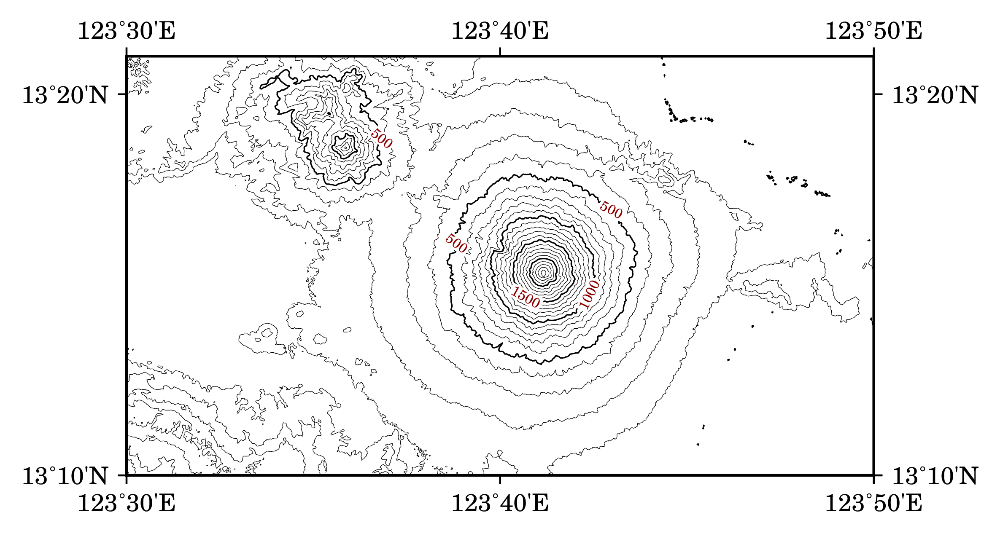

======================================
等高線地圖及地形剖面
======================================

在本章中，我們要使用 GMT 繪製等高線圖與地形剖面圖，這兩種地圖非常適合用來表示地形的\
升降起伏，以及不同地點的陡峭程度。如果你是個登山客，想必它們會是你最愛用的地圖類型。

目標
--------------------------------------
使用 `SRTM <http://www2.jpl.nasa.gov/srtm/>`_ (Shuttle Radar Topography Mission，太空梭雷達地形任務)
提供的地形資料，繪製\ `馬榮火山 <https://zh.wikipedia.org/wiki/%E9%A6%AC%E6%A6%AE%E7%81%AB%E5%B1%B1>`_
(Mayon Volcano) 的地形等高線圖，以及一條穿過火山頂部的剖面高度圖。馬榮火山是一座位於菲律賓的火山，以近乎完美的錐\
體外型聞名。在以下的等高線圖和 A-B 點之間的剖面圖中，可以大致計算出火山高度是 2400 公尺，錐體半徑則大概是 9 公里\
左右 (注意剖面並沒有完整的切穿整個錐體，尤其是在 A 點附近)。研究指出此火山的外型主要受到岩漿成份控制，上半段近似於\
拋物線，而下半段則與對數曲線非常接近\ [#]_\ 。這意味著越接近山頂，地表越陡，如果你想去登頂的話，要先做好心理準備！

馬榮火山也是一座非常活躍的火山，上次噴發是在 2009 年底，其餘因岩漿活動導致的噴氣、地表變形等等的現象也非常頻繁。\
在過去，火山噴發時常帶給周圍村莊毀滅性的災難，但拜科學研究發展所賜，近年來已經很少造成人員傷亡。

.. _最終版地圖:

.. image:: contour_and_profile/mayon.png

直接觀看\ `指令稿`_

.. figure:: contour_and_profile/contour_and_profile_fig1.jpg
    :align: center

    從鄰近區域觀看的馬榮火山，完美的外型令人震懾。Tomas Tam 的攝影作品。

使用的指令與概念
--------------------------------------
- ``grdgradient`` - 計算網格檔的梯度與照明值
- ``grd2cpt`` - 使用網格檔的資訊建立色階檔
- ``gmtset`` - 更改 GMT 的預設作圖參數
- ``psxy`` - 輸出檔頭與檔尾、繪製折線
- ``grdimage`` - 繪製暈渲圖
- ``pscoast`` - 繪製海岸線與海域填色
- ``grdcontour`` - **繪製等高線與其數值標籤**
- ``project`` - **產生以公里為單位的路徑座標**
- ``grdtrack`` - **給定座標，對網格檔取樣**
- ``pstext`` - 在地圖上加入文字
- ``psbasemap`` - 設定繪圖區、座標軸與邊框
- ``gmtinfo`` - **由數值資料的純文字檔建立** ``-R`` **設定**
- 外部指令 ``rm`` - 刪除檔案 (Windows 為 ``del``)
- 外部指令 ``cut`` - **擷取文字檔中的特定幾個欄位** (非必要)
- GDAL 指令 ``gdal_translate`` - **把 Geotiff 轉成 NetCDF 格式** (非必要)
- GMT 共用選項：``-i``
- 在 ``-R`` 參數中使用度分秒格式座標
- 設定座標軸標籤與刻度的一些技巧

前置作業
--------------------------------------
首先我們要取得 `SRTM <http://www2.jpl.nasa.gov/srtm/>`_ 的地形資料。這些資料目前可以經由美國地質調查局 (USGS)
管理的網站 `EarthExplorer <https://earthexplorer.usgs.gov/>`_ 取得。前往 EarthExplorer，然後在「Address/Place」\
搜尋的地方輸入 *Mayon*，然後按下 `show`，選擇下方出現的 *Mayon Volcano* 一欄。接著，按下下方的 `Data Sets >>`。

.. image:: contour_and_profile/contour_and_profile_fig2.png

你可以使用搜尋框或下方的分類目錄，找到並勾選 *SRTM 1 Arc-Second Global* 的資料集，然後按下 `Results >>`。

.. image:: contour_and_profile/contour_and_profile_fig3.png

接下來，應該會有一筆資料呈現在左側搜尋結果欄中。你可以按下圖示預覽此資料，如下圖所示。如要下載，請按下「下載」的圖示。\
本資料需要登入才能下載，如果你尚未有 USGS 帳號，可以花幾分鐘註冊，只需要一組電子信箱即可。登入之後，選擇
`GeoTIFF 1 Arc-second (24.8 MB)` 的資料格式。

.. image:: contour_and_profile/contour_and_profile_fig4.png

.. note::
    1 弧秒 (arc second) 的角度在地球表面大概是 30 公尺的距離，這意味著我們下載的 SRTM 資料中的每個像素代表\
    地球上的 30 x 30 平方公尺大小的區域。

    `GeoTIFF <https://en.wikipedia.org/wiki/GeoTIFF>`_ 也是一種網格地理資料儲存的格式，與 GMT 支援的
    NetCDF 格式類似。不同的是，GeoTIFF 使用 ``.tif`` 作為標誌的副檔名，而且自身帶有網格的投影法與座標系統等資料。

下載的檔案預設的命名是 ``n13_e123_1arc_v3.tif``。使用 `GDAL <software.html#id8>`_
函式庫中的 ``gdal_translate`` 指令，可以把檔案的格式轉成 GMT 支援的 NetCDF 檔案。語法如下：

.. code-block:: bash

    $ gdal_translate 輸入檔.tif -of NetCDF 輸出檔.grd

如果你的電腦沒有安裝 GDAL 或純粹為了方便起見，你也可以直接從以下連結取得本章節會使用的 SRTM ``.grd`` 檔案：

:download:`n13_e123_1arc_v3.grd <contour_and_profile/n13_e123_1arc_v3.grd>`

.. tip::

    如果你的電腦是先裝了 GDAL 然後再裝 GMT，那麼 GMT 就能使用 GDAL 直接處理 GeoTIFF 格式檔案。\
    你可以使用以下語法進行測試：

    .. code-block:: bash

        $ grdinfo n13_e123_1arc_v3.tif

    如果正確的資訊可以顯示出來，就表示你的 GMT 可以透過 GDAL 支援 GeoTIFF 檔案。因此，你也可以試著不轉檔，\
    直接使用 ``.tif`` 的檔案進行底下的操作流程。有關如何設定 GDAL 與 GMT 的相互支援，以及其他的細節說明，請參閱\
    `之後的章節`。

在本章中，我們要使用 `cpt-city`_ 的色階檔 ``neutral``。你可以\
`由此 <http://soliton.vm.bytemark.co.uk/pub/cpt-city/fme/feet/tn/neutral.png.index.html>`_\
或是以下連結下載：

:download:`neutral.cpt <contour_and_profile/neutral.cpt>`

.. image:: contour_and_profile/contour_and_profile_fig5.png
    :align: center

.. _cpt-city: http://soliton.vm.bytemark.co.uk/pub/cpt-city

操作流程
--------------------------------------
首先我們來試著繪製等高線圖。``grdcontour`` 指令是這章地圖的主角，它可以讀取一個網格檔，\
然後在地圖上繪製等高線的線條與數值。基本語法為：

.. code-block:: bash

    $ grdcontour 輸入grd檔名 -C等高線參數 -A標注數值的等高線參數 [-W畫筆]

``-C`` 有幾種參數指定方式：

1. ``-C數值`` 指定等高線間距。
2. ``-C+數值`` 繪製特定高度的等高線。
3. ``-C色階檔`` 繪製色階檔中顏色邊界數值的等高線。
4. ``-C非色階檔`` 使用檔案的第一欄當作要繪製等高線的高度，而由第二欄決定是一般等高線 (c) 或是標注數值的等高線 (a)

``-A`` 指定的是「標注數值的等高線」，你也可以把它想像成「主等高線」。使用 ``-A`` 的結果跟 ``-C`` 很像，\
差別只是在於用 ``-A`` 畫出的等高線會比較粗，而且會加上數值。它也有幾種參數指定方式：

1. ``-A數值`` 指定標注數值的等高線間距。
2. ``-A+數值`` 在特定高度繪製標注數值的等高線。
3. ``-A[數值資訊][標籤資訊]`` 設定數值標籤的字型、外框、角度等等參數 。

``-W`` 指定等高線的\ `畫筆屬性 <pen_and_painting.html>`_。如果地圖上同時有兩種等高線的話，可使用 ``-Wc畫筆`` 設定一般等高線，``-Wa畫筆``
設定標注數值的等高線。

現在讓我們來試試看以下指令：

.. code-block:: bash

    $ grdcontour n13_e123_1arc_v3.grd -C100 -A500+f8p,,darkred \
    $ -R123:30E/123:50E/13:10N/13:21N -JM15c -Ba10m -P > mayon_contour.ps
    $ # -A+f 指定字型樣式
    $ # -R 格式使用「度:分 + 方位」
    $ # -Ba 格式使用 10m 表示每 10 弧分做一標注

指令稿
--------------------------------------
本地圖的最終指令稿如下：

.. code-block:: bash

    # ==== 設定變數 ====
    out_ps="mayon.ps"
    in_tif="n13_e123_1arc_v3.tif"   # 地形資料輸入檔，Geotiff 格式 (轉檔前)
    in_grd="n13_e123_1arc_v3.grd"   # 地形資料輸入檔，NetCDF 格式 (轉檔後)
    master_cpt="neutral.cpt"        # cpt 來源
    in_cpt="mayon.cpt"              # cpt 輸入檔
    in_shadow="mayon_shade.grd"     # 陰影的輸入檔
    in_track="mayon_track.xy"       # 剖面座標的輸入檔
    pen="thick,black"               # 畫筆 - 一般
    pen_grid="thick,black,--"       # 畫筆 - 網格
    pen_track="thick,darkred"       # 畫筆 - 剖面
    font="14p,25,black"             # 字型 - 一般
    font_title="24p,25,black"       # 字型 - 標題
    font_text="14p,25,darkred"      # 字型 - 剖面
    font_contour="8p,25,darkred"    # 字型 - 等高線

    # ==== 使用 GDAL 轉檔 ====
    #     如果你的電腦有安裝 GDAL，可把底下指令的註解取消，如此一來就可從 Geotiff 檔直接轉檔繪圖
    #     如果沒有安裝 GDAL，請直接下載 NetCDF 格式 (.grd) 的輸入檔
    # gdal_translate $in_tif -of NetCDF $in_grd

    # ==== 製作輸入檔 ====
    grdgradient $in_grd -G$in_shadow -A280 -Nt0.5
    grd2cpt $in_grd -C$master_cpt -Z > $in_cpt

    # ==== 調整 GMT 預設參數 ====
    gmtset MAP_FRAME_TYPE=plain \
           FONT_ANNOT_PRIMARY=$font \
           FONT_LABEL=$font \
           FONT_TITLE=$font_title \
           MAP_GRID_PEN_PRIMARY=$pen_grid \
           MAP_TICK_PEN_PRIMARY=$pen \
           MAP_TICK_PEN_SECONDARY=$pen \
           FORMAT_GEO_MAP=dddmmF    # 此設定會讓座標刻度以「度、分、WNES」的分式顯示

    # ==== 開門 (寫入 PS 檔頭) ====
    psxy -R0/1/0/1 -JX1c -T -K -P > $out_ps

    # ==== 等高線圖 ====
    grdimage $in_grd -R123:30E/123:50E/13:10N/13:21N -JM15c -O -K -C$in_cpt -I$in_shadow -Y10c >> $out_ps
    pscoast -R -J -O -K -Df -Sgray -Wthin >> $out_ps
        # 主要等高線是 500 單位間隔，並加上數值標籤 (-A) ；次要等高線則是 100 單位間隔 (-C)
    grdcontour $in_grd -R -J -O -K -C100 -Q100 -A500+f$font_contour+o >> $out_ps

    # ==== 製作剖面然後繪製在等高線圖上 ====
        # 給定起終點的經緯度，以每 0.1 公里為距離，對輸入的網格取樣
    project -C123.613/13.2236 -E123.756/13.2862 -G0.1 -Q |\
    grdtrack -G$in_grd > $in_track
        # 輸出的檔是四欄：經度、緯度、距離、輸入網格的 z 值
        # psxy 預設使用前兩欄繪圖
    psxy $in_track -R -J -O -K -W$pen_track >> $out_ps
        # 擺上剖面兩端的編號文字，使用不同對齊方式
    pstext -R -J -O -K -F+j+f$font_text >> $out_ps << TEXTEND
    123.613 13.2236 RT A
    123.756 13.2862 LT B
    TEXTEND
    psbasemap -R -J -O -K -Ba10m -B+t"Mayon Volcano" >> $out_ps

    # ==== 剖面圖 ====
    # You may also want to use bash built-in "cut -f3,4"
        # 使用 gmtinfo 取得 -R 的適當設定
    R=$(gmtinfo $in_track -i2,3 -I1/100)
    psxy $in_track -i2,3 $R -JX15c/6c -O -K -W$pen_track -Y-8c >> $out_ps
        # 先畫 NE 兩面 (沒有座標軸標籤) 的外框，再畫 WS 兩面的外框
    psbasemap -R -J -O -K -BNE -Bxa5f1 -Bya1000f500g1000 >> $out_ps
    psbasemap -R -J -O -K -BWS -Bxa5f1+l"Distance of A-B profile (km)" -Bya1000+l"Height (m)" >> $out_ps

    # ==== 關門 (寫入 EOF) ====
    psxy -R -J -O -T >> $out_ps
    # rm -rf gmt.conf    # <---- 此行可用於消除舊的組態設定檔

.. note::

    「」

觀看\ `最終版地圖`_

習題
--------------------------------------

.. [#] Karátson, D., Favalli, M., Tarquini, S., Fornaciai, A., Wörner, G., 
       `The regular shape of stratovolcanoes: A DEM-based morphometrical approach <http://www.sciencedirect.com/science/article/pii/S0377027310001058?np=y>`_,
       Journal of Volcanology and Geothermal Research, Vol. 193, Issues 3–4, 20 June 2010, Pages 171-181, ISSN 0377-0273, 
       http://dx.doi.org/10.1016/j.jvolgeores.2010.03.012.
