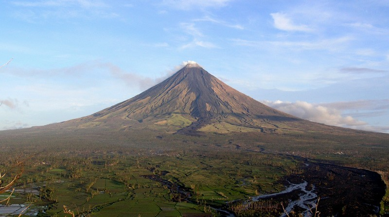
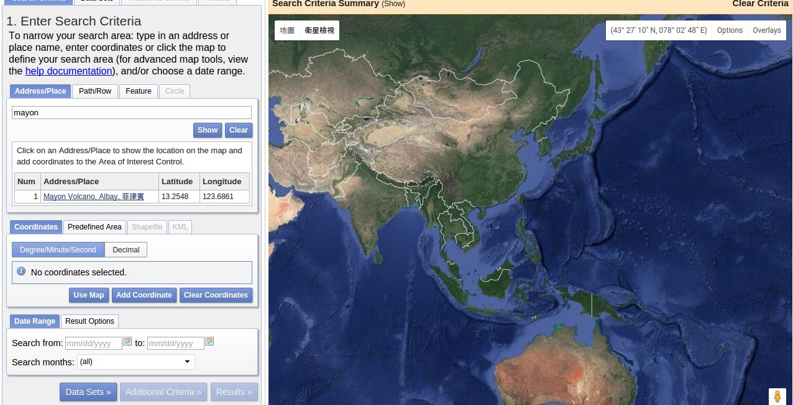

======================================
等高線地圖及地形剖面
======================================

在本章中，我們要使用 GMT 繪製等高線圖與地形剖面圖，這兩種地圖非常適合用來表示地形的\
升降起伏，以及不同地點的陡峭程度。如果你是個登山客，想必它們會是你最愛用的地圖類型。

目標
--------------------------------------
使用 `SRTM <http://www2.jpl.nasa.gov/srtm/>`_ (Shuttle Radar Topography Mission，太空梭雷達地形任務)
提供的地形資料，繪製\ `馬榮火山 <https://zh.wikipedia.org/wiki/%E9%A6%AC%E6%A6%AE%E7%81%AB%E5%B1%B1>`_
(Mayon Volcano) 的地形等高線圖，以及一條穿過火山頂部的剖面高度圖。馬榮火山是一座位於菲律賓的火山，以近乎完美的錐\
體外型聞名。在以下的等高線圖和 A-B 點之間的剖面圖中，可以大致計算出火山高度是 2400 公尺，錐體半徑則大概是 9 公里\
左右 (注意剖面並沒有完整的切穿整個錐體，尤其是在 A 點附近)。研究指出此火山的外型主要受到岩漿成份控制，上半段近似於\
拋物線，而下半段則與對數曲線非常接近\ [#]_\ 。這意味著越接近山頂，地表越陡，如果你想去登頂的話，要先做好心理準備！

馬榮火山也是一座非常活躍的火山，上次噴發是在 2009 年底，其餘因岩漿活動導致的噴氣、地表變形等等的現象也非常頻繁。\
在過去，火山噴發時常帶給周圍村莊毀滅性的災難，但拜科學研究發展所賜，近年來已經很少造成人員傷亡。

.. _最終版地圖:

.. image:: contour_and_profile/mayon_s.png
    :target: _images/mayon.png

直接觀看\ `指令稿`_

    從鄰近區域觀看的馬榮火山，完美的外型令人震懾。Tomas Tam 的攝影作品。

使用的指令與概念
--------------------------------------
- ``grdgradient`` - 計算網格檔的梯度與照明值
- ``grd2cpt`` - 使用網格檔的資訊建立色階檔
- ``gmtset`` - 更改 GMT 的預設作圖參數
- ``psxy`` - 輸出檔頭與檔尾、繪製折線
- ``grdimage`` - 繪製暈渲圖
- ``pscoast`` - 繪製海岸線與海域填色
- ``grdcontour`` - **繪製等高線與其數值標籤**
- ``project`` - **產生以公里為單位的路徑座標**
- ``grdtrack`` - **給定座標，對網格檔取樣**
- ``pstext`` - 在地圖上加入文字
- ``psbasemap`` - 設定繪圖區、座標軸與邊框
- ``gmtinfo`` - **由數值資料的純文字檔建立** ``-R`` **設定**
- 外部指令 ``rm`` - 刪除檔案 (Windows 為 ``del``)
- 外部指令 ``cut`` - **擷取文字檔中的特定幾個欄位** (非必要)
- GDAL 指令 ``gdal_translate`` - **把 Geotiff 轉成 NetCDF 格式** (非必要)
- GMT 共用選項：``-i``
- 在 ``-R`` 參數中使用度分秒格式座標
- 設定座標軸標籤與刻度的一些技巧

前置作業
--------------------------------------
首先我們要取得 `SRTM <http://www2.jpl.nasa.gov/srtm/>`_ 的地形資料。這些資料目前可以經由美國地質調查局 (USGS)
管理的網站 `EarthExplorer <https://earthexplorer.usgs.gov/>`_ 取得。前往 EarthExplorer，然後在「Address/Place」\
搜尋的地方輸入 *Mayon*，然後按下 `show`，選擇下方出現的 *Mayon Volcano* 一欄。接著，按下下方的 `Data Sets >>`。

你可以使用搜尋框或下方的分類目錄，找到並勾選 *SRTM 1 Arc-Second Global* 的資料集，然後按下 `Results >>`。

.. image:: contour_and_profile/contour_and_profile_fig3.png

接下來，應該會有一筆資料呈現在左側搜尋結果欄中。你可以按下圖示預覽此資料，如下圖所示。如要下載，請按下「下載」的圖示。\
本資料需要登入才能下載，如果你尚未有 USGS 帳號，可以花幾分鐘註冊，只需要一組電子信箱即可。登入之後，選擇
`GeoTIFF 1 Arc-second (24.8 MB)` 的資料格式。

.. image:: contour_and_profile/contour_and_profile_fig4.png

.. note::
    1 弧秒 (arc second) 的角度在地球表面大概是 30 公尺的距離，這意味著我們下載的 SRTM 資料中的每個像素代表\
    地球上的 30 x 30 平方公尺大小的區域。

    `GeoTIFF <https://en.wikipedia.org/wiki/GeoTIFF>`_ 也是一種網格地理資料儲存的格式，與 GMT 支援的
    NetCDF 格式類似。不同的是，GeoTIFF 使用 ``.tif`` 作為標誌的副檔名，而且自身帶有網格的投影法與座標系統等資料。

下載的檔案預設的命名是 ``n13_e123_1arc_v3.tif``。使用 `GDAL <software.html#id8>`_
函式庫中的 ``gdal_translate`` 指令，可以把檔案的格式轉成 GMT 支援的 NetCDF 檔案。語法如下：

.. code-block:: bash

    $ gdal_translate 輸入檔.tif -of NetCDF 輸出檔.grd

如果你的電腦沒有安裝 GDAL 或純粹為了方便起見，你也可以直接從以下連結取得本章節會使用的 SRTM ``.grd`` 檔案：

:download:`n13_e123_1arc_v3.grd <contour_and_profile/n13_e123_1arc_v3.grd>`

.. tip::

    如果你的電腦是先裝了 GDAL 然後再裝 GMT，那麼 GMT 就能使用 GDAL 直接處理 GeoTIFF 格式檔案。\
    你可以使用以下語法進行測試：

    .. code-block:: bash

        $ grdinfo n13_e123_1arc_v3.tif

    如果正確的資訊可以顯示出來，就表示你的 GMT 可以透過 GDAL 支援 GeoTIFF 檔案。因此，你也可以試著不轉檔，\
    直接使用 ``.tif`` 的檔案進行底下的操作流程。有關如何設定 GDAL 與 GMT 的相互支援，以及其他的細節說明，請參閱\
    `之後的章節`。

在本章中，我們要使用 `cpt-city`_ 的色階檔 ``neutral``。你可以\
`由此 <http://soliton.vm.bytemark.co.uk/pub/cpt-city/fme/feet/tn/neutral.png.index.html>`_\
或是以下連結下載：

:download:`neutral.cpt <contour_and_profile/neutral.cpt>`

.. image:: contour_and_profile/contour_and_profile_fig5.png
    :align: center

.. _cpt-city: http://soliton.vm.bytemark.co.uk/pub/cpt-city

操作流程
--------------------------------------
首先我們來試著繪製等高線圖。``grdcontour`` 指令是這章地圖的主角，它可以讀取一個網格檔，\
然後在地圖上繪製等高線的線條與數值。基本語法為：

.. code-block:: bash

    $ grdcontour 輸入grd檔名 -C等高線參數 -A標注數值的等高線參數 [-W畫筆]

``-C`` 有幾種參數指定方式：

1. ``-C數值`` 指定等高線間距。
2. ``-C+數值`` 繪製特定高度的等高線。
3. ``-C色階檔`` 繪製色階檔中顏色邊界數值的等高線。
4. ``-C非色階檔`` 使用檔案的第一欄當作要繪製等高線的高度，而由第二欄決定是一般等高線 (c) 或是標注數值的等高線 (a)

``-A`` 指定的是「標注數值的等高線」，你也可以把它想像成「主等高線」。使用 ``-A`` 的結果跟 ``-C`` 很像，\
差別只是在於用 ``-A`` 畫出的等高線會比較粗，而且會加上數值。它也有幾種參數指定方式：

1. ``-A數值`` 指定標注數值的等高線間距。
2. ``-A+數值`` 在特定高度繪製標注數值的等高線。
3. ``-A[數值資訊][標籤資訊]`` 設定數值標籤的字型、外框、角度等等參數 。

``-W`` 指定等高線的\ `畫筆屬性 <pen_and_painting.html>`_。如果地圖上同時有兩種等高線的話，可使用 ``-Wc畫筆`` 設定一般等高線，``-Wa畫筆``
設定標注數值的等高線。

現在讓我們來試試看以下指令：

.. code-block:: bash

    $ grdcontour n13_e123_1arc_v3.grd -C100 -A500+f8p,,darkred \
                 -R123:30E/123:50E/13:10N/13:21N -JM15c -Ba10m -P > mayon_contour.ps
    # 等高線每 100 單位 (公尺) 畫一個，每 500 單位則是標注數值的等高線
    # -A+f 指定字型樣式
    # -R 格式使用「度:分 + 方位」
    # -Ba 格式使用 10m 表示每 10 弧分做一標注

出圖會如下所示：

.. image:: contour_and_profile/contour_and_profile_fig6.png

.. note::

    上圖使用 GMT 的預設版面設定，因此與最終的剖面圖外觀有些不同。\
    本章中將不會說明如何調整字型、線條粗細或顏色等的細節，\
    請自行參考\ `指令稿`_ 中的變數與 ``gmtset`` 的設定調整。有關 ``gmtset`` 詳細的說明，\
    請參閱\ :doc:`layout_design`。

看起來效果相當不錯！值得注意的是，地圖上有些非常小的斑點，這些斑點在小比例尺的地圖上反而會減少地圖的辨識度。\
因此，我們可以使用 ``-Q`` 選項，使 ``grdcontour`` 略過非常小的等高線環。以下的範例會使用 ``-Q100``，\
但你也可以自行增減數值，數值越大，表示被略過的等高線長度就越大，反之亦然。

.. note::

    SRTM 的海拔資料是使用雷達波 (也就是特定頻率的微波) 測量出來的，而雷達波和可見光一樣，都無法有效穿越水體。\
    因此，SRTM 的海拔並不包含水底高度，在海面上的高度不是 0 m 就是無資料。因此，在上圖中基本上是無法看到 0 m
    等高線的，就算有也是可以忽略的小環。這也就是為什麼我們在最終出圖中要使用 ``pscoast`` 把海面全塗上藍色的原因。

完成了本章的第一個重點後，接下來的問題是要怎麼製造出剖面線段、取得剖面的高度，最後把剖面的位置和剖面圖都\
加到地圖上。如果我們要預計要畫火山的剖面，最簡單的方式\
就是設定一條直線切穿山腳與山頂。如此一來，我們得先決定直線的起點與終點。以下是在本例中要採用的座標，但你也可以\
隨自己喜歡變更起點與終點的位置，製造出不同的地形剖面。

- 起點：``123.613/13.2236``
- 終點：``123.756/13.2862``

接下來，我們要使用 ``project`` 這個指令來產生從起點到終點的路徑座標。在「:doc:`layout_design`」中，\
我們初次介紹了 ``project`` 的用法，不過那是平面直角座標的狀況。在本例中為求精確，我們要沿著\ **大圓路徑**\ 
規劃剖面。由於剖面上的每個點，就是等一下我們要計算高度的位置，因此密度也得足夠高才行。試試看在終端機中輸入以下指令，\
會看到隨後的輸出：

.. code-block:: bash

    $ project -C123.613/13.2236 -E123.756/13.2862 -G0.1 -Q
    123.613        13.2236        0
    123.613842421  13.2239691076  0.1
    123.614684845  13.2243382124  0.2
    123.615527271  13.2247073145  0.3
    123.6163697    13.2250764138  0.4
    123.617212132  13.2254455104  0.5
    .... # (以下略)
    # -Q: 設定 -G 的間隔單位為公里 (地理座標專用，如果不設的話，-G 的單位會與起終點座標相同，也就是角度)
    # -G: 間隔 0.1 單位取樣
    # project 預設就是沿著大圓路徑取樣，不需要額外的參數。

輸出第一欄與第二欄是經緯度，第三欄是與起點的距離 (以公里為單位)。接下來，我們要介紹一個新的指令 ``grdtrack``，\
這個指令會接受一連串的「取樣點」，然後對目標的網格檔取樣。因此，把 ``project`` 的輸出座標丟給這個指令後，\
它就會幫我們找出網格檔在這些地方的數值 (在本例中也就是高度)。``grdtrack`` 的語法如下所示

.. code-block:: bash

    $ grdtrack [至少二欄的檔案或是標準輸入(stdin)] -G輸入網格檔

``grdtrack`` 預設會讀取輸入資料的前兩欄作為座標。利用管線指令，可以直接把 ``project`` 的輸出傳遞給 ``grdtrack``：

.. code-block:: bash

    $ project -C123.613/13.2236 -E123.756/13.2862 -G0.1 -Q | grdtrack -Gn13_e123_1arc_v3.grd
    123.613        13.2236        0    181.307738624
    123.613842421  13.2239691076  0.1  188.260577788
    123.614684845  13.2243382124  0.2  191.580201564
    123.615527271  13.2247073145  0.3  195.183921513
    123.6163697    13.2250764138  0.4  197.771070118
    123.617212132  13.2254455104  0.5  208.638871238
    .... # (以下略)

輸出中新增的第四欄，就是網格檔在給定的座標點上之數值。我們只要把標準輸出利用 ``>`` 轉存到檔案中，就能使用其他的\
指令 (如 ``psxy``) 繪製這些數值。我們現在就來在等高線圖上面畫上剖面：

.. code-block:: bash

    out_ps="mayon.ps"
    in_grd="n13_e123_1arc_v3.grd"   # 地形資料輸入檔，NetCDF 格式 (轉檔後)
    in_track="mayon_track.xy"       # 剖面座標的輸入檔

    # ==== 等高線圖 ====
    psxy -R0/1/0/1 -JX1c -T -K -P > $out_ps    # 純寫入 PS 檔頭
        # 繪製海岸線，然後把海面著色
    pscoast -R123:30E/123:50E/13:10N/13:21N -JM15c -O -K -Df -Sgray -Wthin >> $out_ps
        # 主要等高線是 500 單位間隔，並加上數值標籤 (-A)；次要等高線則是 100 單位間隔 (-C)
        # -A+o 數值標籤周圍留白的部份是圓角長方形 (不加 +o 的話是尖角長方形)
    grdcontour $in_grd -R -J -O -K -C100 -Q100 -A500+f8p,25,darkred+o >> $out_ps

    # ==== 製作剖面然後繪製在等高線圖上 ====
        # 給定起終點的經緯度，以每 0.1 公里為距離，對輸入的網格取樣
    project -C123.613/13.2236 -E123.756/13.2862 -G0.1 -Q |\
    grdtrack -G$in_grd > $in_track
        # 輸出的檔是四欄：經度、緯度、距離、輸入網格的 z 值
        # psxy 預設使用前兩欄繪圖，所以儘管檔案有四欄資料，我們仍然不用加上任何指定欄位的參數
    psxy $in_track -R -J -O -K -Wthick,darkred >> $out_ps
        # 擺上剖面兩端的編號文字，使用不同對齊方式
        # RT：右側靠頂
        # LT：左側靠頂
    pstext -R -J -O -K -F+j+f14p,25,darkred >> $out_ps << TEXTEND
    123.613 13.2236 RT A
    123.756 13.2862 LT B
    TEXTEND
        # 加上外框與座標軸標籤
    psbasemap -R -J -O -K -Ba10m >> $out_ps
    psxy -R -J -O -T >> $out_ps    # 純寫入 PS 檔尾

.. image:: contour_and_profile/contour_and_profile_fig7.png

等高線圖就完成了！

下一步是使用剛才 ``grdtrack`` 取樣的資料，繪製沿著 AB 線的剖面圖。這個相對簡單，只要使用
``psxy``，指定直角座標 ``-Jx`` 或 ``-JX`` 即可。但我們可能會遇到 2 個問題需要克服：

1. 如何指定 ``psxy`` 的 ``-R``？要手動輸入資料的最大最小值嗎？
2. 我們要使用剛剛儲存的資料的第 3 與第 4 欄，但這不是 ``psxy`` 預設讀取的資料欄位。

要解決第一個問題，需要用到一個好用的新指令 ``gmtinfo``。它的功用很類似 ``grdinfo``，只不過
``grdinfo`` 用來查看網格檔的資訊，而 ``gmtinfo`` 則用來查看文字檔的資訊。如果你已經把 ``grdtrack``
的輸出資訊存到了 ``mayon_track.xy``，那麼請輸入以下指令

.. code-block:: bash

    $ gmtinfo mayon_track.xy
      mayon_track.xy: N = 171    <123.613/123.756>    <13.2236/13.2862>
      <0/16.9705410195>    <150.632902656/2422.78332276>

它的預設輸出是「行數 (N)」以及各欄的最大與最小值。這裡我們需要的是第 3 與第 4 欄的最大最小值，\
你可以手動輸入到 ``psxy`` 的 ``-R`` 選項，或是使用下列指令取得：

.. code-block:: bash

    $ gmtinfo mayon_track.xy -i2,3 -I1/100
      -R0/17/100/2500
      # -i: 選擇欄 2 與欄 3 (因為它從 0 開始編號，所以這也就是第 3 與第 4 欄)
      # -I: 傳回與給定的級距最接近的數值。因此，欄 2 的回傳數值會被四捨五入至整數，
      #     欄 3 的回傳數值則會是 100 的倍數。

注意當選項 ``-I`` 設定後，輸出值整個大改變了，符合 -R 的格式，方便之後的運用。因此，我們可以這樣寫腳本：

.. code-block:: bash

    R=$(gmtinfo $in_track -i2,3 -I1/100)
    psxy $R -J -O -K 其他設定...

這樣一來就不用煩惱手動找尋 ``-R`` 選項的問題。

.. attention::

    在舊的 GMT 腳本中，這個功能是由 ``minmax`` 指令負責執行，但在 GMT 5 中，``minmax`` 預計會被 ``gmtinfo``
    逐步取代。因此，如果你使用以下指令取得 ``-R`` 資訊，會出現警告訊息，提醒你要把 ``minmax`` 換成 ``gmtinfo``。

    .. code-block:: bash

        minmax mayon_track.xy -i2,3 -I1/100

另外，注意到 ``-i`` 選項是用來指定欄位的，這其實是個共通選項，\
意味著你也可以在 ``psxy`` 中使用 ``-i`` 來指定作圖時所需的欄位數值。如此一來，第二個問題也迎刃而解了！完整的\
腳本片段如下所示：

.. code-block:: bash

    out_ps="mayon.ps"
    in_grd="n13_e123_1arc_v3.grd"   # 地形資料輸入檔，NetCDF 格式 (轉檔後)
    in_track="mayon_track.xy"       # 剖面座標的輸入檔

    # ==== 剖面圖 ====
    psxy -R0/1/0/1 -JX1c -T -K -P > $out_ps    # 純寫入 PS 檔頭
        # 使用 gmtinfo 取得 -R 的適當設定
    R=$(gmtinfo $in_track -i2,3 -I1/100)
    psxy $in_track -i2,3 $R -JX15c/6c -O -K -Wthick,darkred >> $out_ps
    psbasemap -R -J -O -K -Bxa5f1+l"Distance of A-B profile (km)" -Bya1000+l"Height (m)" >> $out_ps
    psxy -R -J -O -T >> $out_ps    # 純寫入 PS 檔尾

.. note::

    另一個可能 (但為 Linux 限定) 的辦法是使用 shell 的指令 ``cut``，這個指令用來擷取文字檔中的指定欄位。\
    在本例中，如果不用 ``-i`` 選項，也可以這樣寫：

    .. code-block:: bash

        cut -f3,4 $in_track | psxy $R -JX15c/6c ...

    至於哪一種比較好，就請讀者依需要自行判斷。

.. image:: contour_and_profile/contour_and_profile_fig8.png

看起來非常不錯！如果你覺得在剖面圖中，座標軸標籤在四側都有出現實在是非常多餘，想要依照慣例只把座標軸標籤放在左側與下側的話，\
必須要使用兩次的 ``psbasemap`` 才行：

.. code-block:: bash

        # 先畫 NE 兩面 (沒有座標軸標籤) 的外框，再畫 WS 兩面的外框
    psbasemap -R -J -O -K -BNE -Bxa5f1  >> $out_ps
    psbasemap -R -J -O -K -BWS -Bxa5f1+l"Distance of A-B profile (km)" -Bya1000+l"Height (m)" >> $out_ps

掌握了如上技巧，就可以把兩個子地圖合起來，完成本章的目標地圖了。最後，為了要讓地理座標的顯示方式和目標地圖一樣，\
我們必須要在腳本中使用 ``gmtset`` 來指定地理座標在地圖上的格式：

.. code-block:: bash

    gmtset FORMAT_GEO_MAP=dddmmF

這個設定會讓座標刻度以「度、分、方位標 (WNES)」的方式顯示。

指令稿
--------------------------------------
本地圖的最終指令稿如下：

.. code-block:: bash

    # ==== 設定變數 ====
    out_ps="mayon.ps"
    in_tif="n13_e123_1arc_v3.tif"   # 地形資料輸入檔，Geotiff 格式 (轉檔前)
    in_grd="n13_e123_1arc_v3.grd"   # 地形資料輸入檔，NetCDF 格式 (轉檔後)
    master_cpt="neutral.cpt"        # cpt 來源
    in_cpt="mayon.cpt"              # cpt 輸入檔
    in_shadow="mayon_shade.grd"     # 陰影的輸入檔
    in_track="mayon_track.xy"       # 剖面座標的輸入檔
    pen="thick,black"               # 畫筆 - 一般
    pen_grid="thick,black,--"       # 畫筆 - 網格
    pen_track="thick,darkred"       # 畫筆 - 剖面
    font="14p,25,black"             # 字型 - 一般
    font_title="24p,25,black"       # 字型 - 標題
    font_text="14p,25,darkred"      # 字型 - 剖面
    font_contour="8p,25,darkred"    # 字型 - 等高線

    # ==== 使用 GDAL 轉檔 ====
    #     如果你的電腦有安裝 GDAL，可把底下指令的註解取消，如此一來就可從 Geotiff 檔直接轉檔繪圖
    #     如果沒有安裝 GDAL，請直接下載 NetCDF 格式 (.grd) 的輸入檔
    # gdal_translate $in_tif -of NetCDF $in_grd

    # ==== 製作輸入檔 ====
    grdgradient $in_grd -G$in_shadow -A280 -Nt0.5
    grd2cpt $in_grd -C$master_cpt -Z > $in_cpt

    # ==== 調整 GMT 預設參數 ====
    gmtset MAP_FRAME_TYPE=plain \
           FONT_ANNOT_PRIMARY=$font \
           FONT_LABEL=$font \
           FONT_TITLE=$font_title \
           MAP_GRID_PEN_PRIMARY=$pen_grid \
           MAP_TICK_PEN_PRIMARY=$pen \
           MAP_TICK_PEN_SECONDARY=$pen \
           FORMAT_GEO_MAP=dddmmF    # 此設定會讓座標刻度以「度、分、WNES」的方式顯示

    # ==== 開門 (寫入 PS 檔頭) ====
    psxy -R0/1/0/1 -JX1c -T -K -P > $out_ps

    # ==== 等高線圖 ====
        # 繪製底圖，順便使用 -Y 把地圖上移 10 公分，預留空間給之後的剖面圖
    grdimage $in_grd -R123:30E/123:50E/13:10N/13:21N -JM15c -O -K -C$in_cpt -I$in_shadow -Y10c >> $out_ps
    pscoast -R -J -O -K -Df -Sgray -Wthin >> $out_ps
        # 主要等高線是 500 單位間隔，並加上數值標籤 (-A) ；次要等高線則是 100 單位間隔 (-C)
    grdcontour $in_grd -R -J -O -K -C100 -Q100 -A500+f$font_contour+o >> $out_ps

    # ==== 製作剖面然後繪製在等高線圖上 ====
        # 給定起終點的經緯度，以每 0.1 公里為距離，對輸入的網格取樣
    project -C123.613/13.2236 -E123.756/13.2862 -G0.1 -Q |\
    grdtrack -G$in_grd > $in_track
        # 輸出的檔是四欄：經度、緯度、距離、輸入網格的 z 值
        # psxy 預設使用前兩欄繪圖
    psxy $in_track -R -J -O -K -W$pen_track >> $out_ps
        # 擺上剖面兩端的編號文字，使用不同對齊方式
    pstext -R -J -O -K -F+j+f$font_text >> $out_ps << TEXTEND
    123.613 13.2236 RT A
    123.756 13.2862 LT B
    TEXTEND
    psbasemap -R -J -O -K -Ba10m -B+t"Mayon Volcano" >> $out_ps

    # ==== 剖面圖 ====
        # 使用 gmtinfo 取得 -R 的適當設定
    R=$(gmtinfo $in_track -i2,3 -I1/100)
        # 使用 -Y 把剖面圖下移 8 公分
    psxy $in_track -i2,3 $R -JX15c/6c -O -K -W$pen_track -Y-8c >> $out_ps
        # 先畫 NE 兩面 (沒有座標軸標籤) 的外框，再畫 WS 兩面的外框
    psbasemap -R -J -O -K -BNE -Bxa5f1 -Bya1000f500g1000 >> $out_ps
    psbasemap -R -J -O -K -BWS -Bxa5f1+l"Distance of A-B profile (km)" -Bya1000+l"Height (m)" >> $out_ps

    # ==== 關門 (寫入 EOF) ====
    psxy -R -J -O -T >> $out_ps
    # rm -rf gmt.conf    # <---- 此行可用於消除舊的組態設定檔

.. note::

    「繪製等高線圖與地形剖面圖。使用 SRTM 從 Geotiff 格式轉檔為 NetCDF 的 1 弧秒解析度高程資料，先製作陰影檔和色階檔，再使用
    ``grdimage`` 製作底圖。接下來，使用 ``grdcontour`` 把等高線也疊加上去。只要設定剖面的起點和終點，就可以使用 ``project``
    和 ``grdtrack`` 產生剖面路徑和剖面高度，最後再把剖面也一併畫到底圖上。至於剖面圖，使用 ``psxy`` 繪製即可，但使用一些小技巧，
    例如 ``gmtinfo`` 取得 xy 的範圍，可讓作圖更有效率。最後，地圖上也展示了一些繪製座標軸標籤時常使用的技巧。」

觀看\ `最終版地圖`_

習題
--------------------------------------

1. 請自行下載 SRTM 地形資料，繪製美國大理石峽谷 (Marble Canyon: **36.816 N, 111.638 W**) 週邊的等高線地形暈渲圖。
   這個地方是科羅拉多大峽谷的起點，河川下切作用\
   強烈，但側向發育的狀況才剛起步。選擇一條切穿峽谷的剖面，繪製剖面地圖並找出原本的地形面 (河川兩側平坦的地形) 海拔。注意地形面\
   可能會有好幾組！最後，找出目前科羅拉多河的河床高度，估計河川至少把原本的地形面下切了多少公尺。

.. figure:: contour_and_profile/MarbleCanyon.png
    :align: center

    大理石峽谷的 Google Maps 衛星影像。注意那條深色的「東西」，這是峽谷的斜坡，科羅拉多河從中央流過，但細得你看不到。如果繪製等高線，
    在深色區域裡線的密度將會極高。好好享受這大自然的藝術作品！

.. [#] Karátson, D., Favalli, M., Tarquini, S., Fornaciai, A., Wörner, G., 
       `The regular shape of stratovolcanoes: A DEM-based morphometrical approach <http://www.sciencedirect.com/science/article/pii/S0377027310001058?np=y>`_,
       Journal of Volcanology and Geothermal Research, Vol. 193, Issues 3–4, 20 June 2010, Pages 171-181, ISSN 0377-0273, 
       http://dx.doi.org/10.1016/j.jvolgeores.2010.03.012.
