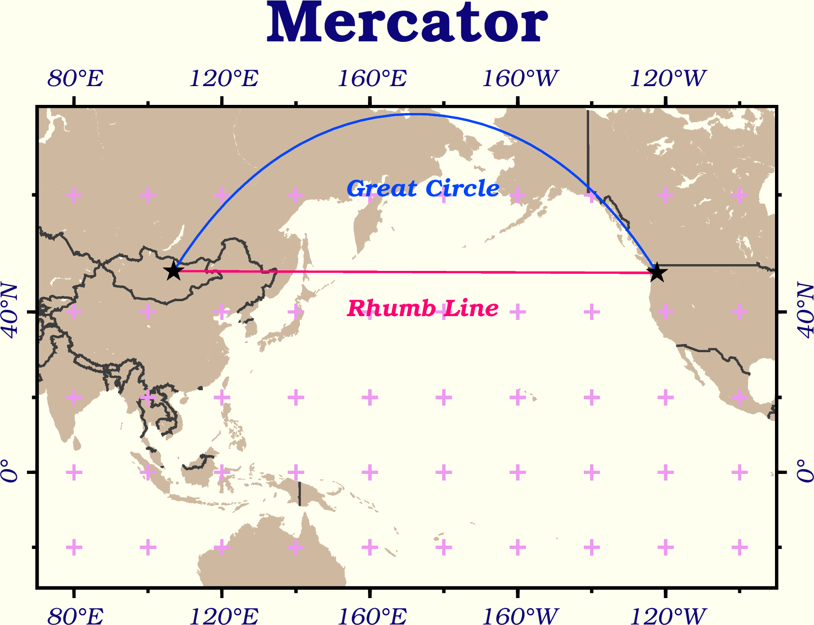
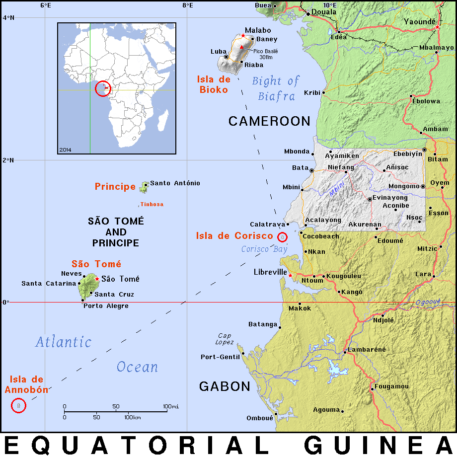

======================================
版面設計與地圖的幾何布局
======================================

.. attention::

    本教學適用於 GMT 6 的現代模式。如須參閱 GMT 6 (傳統模式) 與 GMT 4-5 繪製相似地圖的教程，\ `請至這裡 <layout_design_gmt5.html>`_。

接下來讓我們來探討一下 GMT 的版面設計功能。GMT 使用了許多預設選項，讓使用者不需做太多設定就能產生想要的地圖。如果我們想設計比較複雜的配置，例如版面分割、邊框樣式調整、字型與字體樣式，就需要調整 GMT 的「使用者組態設定」。另外，我們也會在這裡介紹地理空間資料常用的兩大類座標：平面與球面，以及 GMT 作圖時的相關設定。

目標
--------------------------------------
繪製從蒙古\ *烏蘭巴托* (Ulaanbaatar) 到美國\ *西雅圖* (Seattle) 的\ `大圓路徑 <https://en.wikipedia.org/wiki/Great-circle_distance>`_ (**Great Circle** Route) 與\ `恆向線 <https://en.wikipedia.org/wiki/Rhumb_line>`_ (**Rhumb Line**)。大圓路徑指的是沿著大圓 (半徑為地球半徑的的圓) 前進的路徑，恆向線則是對於所有的子午線，交角皆相等的路線。本章地圖使用了兩個不同的投影方法，上圖為「蘭伯特等積方位投影」 (**Lambert** azimuthal equal-area projection) ，下圖為「麥卡托投影」(**Mercator** Projection)。圖中說明了幾個特點：

- 恆向線在麥卡托投影中會以直線呈現，而大圓路徑在相同的圖中則是曲線。不過，大圓路徑才是兩地之間實際較短的路徑。
- 連接到蘭伯特等積方位投影中心點 (本例中為烏蘭巴托) 的大圓路徑會是直線，恆向線則變成曲線。這是比較能直觀連結它們的實際長度的一種方法，也是投影名稱的「方位」二字緣由 (大圓路徑保持在相同方位)。

另外，本地圖也替換了 GMT 的預設字型、顏色與版面配置。這些細節將會在以下部份一一解說。

.. _最終版地圖:

.. image:: layout_design/ulaanbaatar_seattle_gmt6.png
    :width: 800px
    :align: center

直接觀看\ `指令稿`_

使用的指令與概念
--------------------------------------
- ``defaults`` - **查看 GMT 的預設作圖參數**
- ``set`` - **更改 GMT 的預設作圖參數**
- ``plot`` - **在地理座標系統上畫點和線**
- ``text`` - **詳細的設定標記在圖上的文字**
- ``basemap`` - 設定繪圖區、座標軸與邊框
- ``coast`` - 繪製海岸線與國界
- 外部指令 ``rm`` - **刪除檔案** (Windows 為 ``del``)
- 外部指令 ``echo`` - 把資料輸入到管線命令中
- GMT 共用選項：``-X`` ``-Y`` ``-:``
- GMT 的預設參數與 ``gmt.conf`` 檔案
- 地理座標的給定方式
- 地圖版面的設定
- 文字風格設定
- GMT 針對不同投影座標系統的不同處理方式

.. ``project`` - **產生路徑座標**

前置作業
--------------------------------------
我們要先取得烏蘭巴托與西雅圖兩地的經緯度座標。從 *Wikipedia* 的條目頁面中，可以找到「經緯度」的資訊欄位，點選連結後，可以看到不同座標系統的位置資訊，如下所示 (以烏蘭巴托為例)。

.. image:: layout_design/layout_design_fig1.png
    :width: 1000px
    :align: center

注意在「\ **WGS84**\ 」欄位中，有兩種座標的格式。你要使用哪種都可以，GMT 都有支援。另外也請注意這裡的座標是「緯度在前，經度在後」。在下表中，也蒐集了兩地的經緯座標 (十進位制四捨五入至小數點第二位)：

=============== ============================== =================================
城市             烏蘭巴托                        西雅圖
=============== ============================== =================================
經緯度 (度分秒)   47° 55′ 0″ N, 106° 55′ 0″ E        47° 36′ 35″ N, 122° 19′ 59″ W
經緯度 (十進位)   47.92, 106.92                  47.61, -122.33
=============== ============================== =================================

為了方便使用這些資料，我們可以建立一個純文字文件 ``coord.txt``，再把兩地的座標資訊複製到文件中存檔，如此一來供 GMT 使用的資料表就建立完成。以下是使用十進位制座標的 ``coord.txt`` 內容：

.. code-block:: bash

    47.92, 106.92
    47.61, -122.33

再次強調，資料中的第一欄現在是緯度 (y 值)，第二欄是經度 (x 值)。這與我們在「\ :doc:`scatter_plot`\ 」一章中所使用的 xy 順序相反，不過只要適當的指定欄位意義，GMT 仍然可以讀取。另外，兩個欄位中間使用了「逗號」分隔，在 GMT 中也是可以接受的。

以下是使用度分秒制座標的 ``coord.txt`` 內容：

.. code-block:: bash

    47:55:0N, 106:55:0E
    47:36:35N, 122:19:59W

注意我把所有的度分秒符號都統一成「冒號」，而且座標字串中間的空白都被移除了。這種格式是 GMT 接受的標準地理座標 (度分秒) 格式，如果你有一串地理座標資料是以度分秒格式儲存，記得在輸入 GMT 之前，把所有的度分秒符號都改為冒號，如上所示。

你也可以從這裡下載資料檔：\ :download:`coord.txt <layout_design/coord.txt>`\，這個版本使用度分秒制座標。

.. tip::

    簡單小結 GMT 對於文字輸入檔與地理座標格式的要求：

    1. 欄位的分隔符號可以是\ **空白**\ 、\ **逗號** (``.csv`` 檔) 與 **Tab** (``.tsv`` 檔) 三者之一，但不能在同一個檔案中使用超過一種的分隔符號來分隔欄位。欄位代表的意義預設是第一欄 x 值、第二欄 y 值，不過可以在下指令時逐一指定。
    2. 地理座標可以採用\ **十進位**\ 或\ **度分秒**：

       - 以十進位系統表示時，南緯要表示為負緯度，西經則表示為負經度或是東經 180 度之後持續累加，如經度 243 和 -63 都代表西經 63 度。
       - 以度分秒系統表示時，使用 ``ddd:mm:ssF`` 的方法，``ddd`` 為度，``mm`` 為分，``ss`` 為秒，``F`` 則是 NEWS 四個字母之一。

操作流程
--------------------------------------

讓我們從目標地圖的下半部 (麥卡托投影的部份) 開始吧。先來畫出海岸線與國界：

.. code-block:: bash

    land_color="#CEB9A0" # 陸域填色

    gmt begin ulaanbaatar_seattle png
        gmt basemap -R70/270/30S/70N -JM13c -B+tMercator
        gmt coast -Dl -A1000 -G$land_color -N1/thick,60 -Ba40f20g20
        # -D: 調整海岸線解析度。因為我們畫的是全球資料，用不著高解析度的海岸線，所以設定為 l (low) 即可。
    gmt end

.. image:: layout_design/layout_design_gmt6_fig2.png
    :width: 1000px
    :align: center

這張地圖的細節設定，例如字體大小、格線粗細等等，採用的是 GMT 的預設參數。你可以使用 ``defaults`` 指令在終端機中查看所有的參數值：

.. code-block:: bash

    $ gmt defaults -D

螢幕的輸出如下所示：

.. code-block:: bash

    #
    # GMT 6.0.0 Defaults file
    #
    # COLOR Parameters
    #
    COLOR_BACKGROUND               = black
    COLOR_FOREGROUND               = white
    COLOR_NAN                      = 127.5
    COLOR_MODEL                    = none
    ... #(以下省略)

所有不以 ``#`` 號開頭的每一行都是一個 GMT 參數，參數的名稱就是在這裡出現的大寫字串。所有參數的意思，都可以在 `GMT 的官方手冊 <https://docs.generic-mapping-tools.org/6.0/gmt.conf.html>`_\ 中找到。我們可以使用兩種方式更改預設的參數：

1. 在下 GMT 指令時，使用 ``--參數=設定值`` (\ **長指令**\ 語法)。在「\ :doc:`cpt_colormap`\ 」中，我們就是使用此方法調整 ``COLOR_NAN`` 的設定，讓地圖無資料的區域顯示為灰色。**使用此方法改變的參數只對這個指令有效**，其他指令仍然會使用原先的預設值。

2. 使用 ``set`` 指令設定參數的預設值。它的語法如下：

   .. code-block:: bash

       $ gmt set 參數名1 參數值1 [參數名2 參數值2 參數名3 參數值3...]
       # ---- 或是 ----
       $ gmt set 參數名1=參數值1 [參數名2=參數值2 參數名3=參數值3...]

   在本教學中我會使用第一種語法以方便對齊參數值。這種方法與前一種方法的主要差異是，GMT 會紀錄改變的預設值，只要紀錄不被覆蓋或刪除，**改變的參數對接下來的所有指令都有效**。第一次下達 ``set`` 指令時，GMT 會在當前目錄下建立 ``gmt.conf`` 檔案，並把所有更動儲存在內。之後所有的 GMT 指令都會讀取此檔案，這就是為什麼使用 ``set`` 設定參數會有永久性效用的原因。

.. tip::

    如果你的資料夾中已經有了上一次繪圖時產生的 ``gmt.conf``，而你又不想讓上一次的設定選項「干擾」到你這一次要畫的地圖，則你可以簡單的把 ``gmt.conf`` 刪掉，這樣 GMT 會重新使用系統預設值，然後就可以從頭使用 ``set`` 來設定新的繪圖參數。

.. 在「\ :doc:`scatter_plot`\ 」一章中，我們已經介紹了如何使用 ``psxy -T`` 來設定腳本結尾。這裡我們可以沿用相同的概念，來設定腳本開頭。因此，整個腳本的基礎設計大概會是這樣：

..    # ==== 設定腳本的變數與參數 ====
..    out_ps="ulaanbaatar_seattle.ps"
..    其他設定......

..    # ==== 開門 (寫入 PS 檔頭) ====
..         # 因為只寫檔頭，所以 -R 和 -J 的設定並不重要，你可以隨意指定。
..    psxy -R0/1/0/1 -JX1c -T -K > $out_ps

..    # ==== 繪圖 ====
..    主要的繪圖指令......

..    # ==== 關門 (寫入 EOF) ====
..    psxy -R -J -O -T >> $out_ps

.. 在前面的章節中，我們會把 ``-P`` 加入第一個 GMT 指令中，以指定紙張採用直向排版。這裡我們要嘗試使用另一種方式：\ **調整 GMT 的預設參數**\ 。在終端機中輸入

.. 在這麼多的參數中，應該會有一行如下所示
.. PS_PAGE_ORIENTATION		= landscape

.. 這個選項其實就是控制版面的排版方向，它解釋了為什麼不加 ``-P`` 時，GMT 會使用橫向 (landscape) 排版。

.. psxy -R0/1/0/1 -JX1c -T -K --PS_PAGE_ORIENTATION=portrait > $out_ps

..       $ gmtset PS_PAGE_ORIENTATION=portrait
..       $ psxy -R0/1/0/1 -JX1c -T -K > $out_ps

.. 由於第一種方法已經在\ `之前的篇章 <editing_cpt_colorbar.html>`_\ 介紹過了，因此這裡讓我們進一步看看第二種方法的細節。``gmt.conf`` 的內容與 ``gmtdefaults`` 的輸出相同，事實上當 ``gmt.conf`` 存在於資料夾中時，``gmtdefaults`` 就只是把它的內容印在螢幕上的指令。 因此，如果要修改 GMT 的預設設定，我們還有一種方法：

.. 直接修改資料夾中的 ``gmt.conf`` 檔案。如果你想要測試不同參數的效果或是頻繁的更改參數，這種方法會比 gmtset 還要快一點。如果你想使用之前建立但放在別的資料夾的 ``gmt.conf`` 設定，只要把它複製到當前的資料夾即可。

.. 資料夾中沒有 ``gmt.conf`` 時，``gmtdefaults`` 和其他 GMT 選項讀取的設定檔位於 ``GMT根目錄/share/conf/gmt.conf``。你當然也可以修改此檔案，但建議修改之前先留個備份，萬一改錯的話，至少你還可以使用備份檔還原 GMT 安裝時的「初始設定」。

介紹完 ``set`` 後，讓我們馬上來做個測試。在剛剛目標地圖下半部的腳本中加入此指令：

.. code-block:: bash

    land_color="#CEB9A0"
    gmt set MAP_FRAME_TYPE plain
    # MAP_FRAME_TYPE：地圖邊框樣式。預設是 fancy，就是上圖的黑白相間邊框。改成 plain 的話，邊框會變成最基本的樣式。

    gmt begin ulaanbaatar_seattle png
        gmt basemap -R70/270/30S/70N -JM13c -B+tMercator
        gmt coast -Dl -A1000 -G$land_color -N1/thick,60 -Ba40f20g20
    gmt end

.. image:: layout_design/layout_design_gmt6_fig3.png
    :width: 1000px
    :align: center

可以看出地圖的邊緣從斑馬框變成一條線了。運用相同的方式，我們還要逐一修改以下預設參數：

..    # ==== 設定變數 ====
..    out_ps="ulaanbaatar_seattle.ps"
..    land_color="#CEB9A0"

..    # ==== 調整 GMT 預設參數 ====
..    gmtset PS_PAGE_ORIENTATION=portrait

..    # ==== 開門 (寫入 PS 檔頭) ====
..    psxy -R0/1/0/1 -JX1c -T -K > $out_ps

..    # ==== 繪圖 ====
..    psbasemap -R70/270/30S/70N -JM13c -O -K -B+tMercator >> $out_ps
..    pscoast -R -J -O -K -Dl -A1000 -G$land_color -N1/thick,60 -Ba40f20g20 >> $out_ps

..    # ==== 關門 (寫入 EOF) ====
..    psxy -R -J -O -T >> $out_ps

.. 出圖如下所示，左側的部份是地圖在整張 A4 紙中的位置，紅色外框即是紙的範圍。

- ``FONT_TITLE``：標題字型。在 GMT 中，**字型與畫筆類似，由三個部份組成**：``尺寸,字型,顏色``。「尺寸」可為任意數值，預設單位為點 (points)；「樣式」則可參考 `PostScript 的字型樣式表 <https://docs.generic-mapping-tools.org/6.0/cookbook/postscript_fonts.html>`_，可以使用字型的代號或是字型的名稱來表示。「顏色」則是 GMT 通用的顏色格式。我們想要的設定是 ``30,Bookman-Demi,#0D057A`` (30 點字的 Bookman-Demi，顏色是 #0D057A)。
- ``FONT_ANNOT_PRIMARY``：座標軸主格點標示的字型，使用 ``12p,20,#0D057A`` (12點字的 Bookman-LightItalic，顏色與標題一樣)。
- ``FORMAT_GEO_MAP``：(地理作圖的) 座標刻度標示的格式，使用英文代號的搭配組合表示，``d`` 代表度，``m`` 代表分，``s`` 代表秒，``F`` 代表數值後面會加的「NEWS」後綴符號，詳細設定可\ `在此查閱 <https://docs.generic-mapping-tools.org/6.0/gmt.conf.html>`_。我們要使用的是 ``dddF``，如此一來可令所有座標只以至多三位數的度來表示，並搭配後綴符號。
- ``MAP_GRID_CROSS_SIZE_PRIMARY``：地圖格線的十字交叉符號大小。使用 ``8p``。
- ``MAP_GRID_PEN_PRIMARY``：地圖格線的畫筆屬性。使用 ``thinner,#ED99F0``。
- ``MAP_TICK_PEN_PRIMARY``：地圖座標刻度的畫筆屬性。使用 ``thicker,black``。
- ``MAP_TITLE_OFFSET``：地圖標題與座標軸刻度的垂直距離。使用 ``0.5c``。
- ``MAP_ANNOT_OBLIQUE``：座標軸刻度的「擺放模式」。在上圖中，經度和緯度的刻度都是水平顯示的，我們要使用的設定代號是 ``32``，意謂著「經度保持原樣，緯度與地圖的邊框平行顯示」。
- ``PS_PAGE_COLOR``：紙張的底色。使用 ``ivory`` (象牙色)。

.. MAP_ORIGIN_X：地圖邊框左下角 (**地圖基準**) 距離紙張左下角的水平距離，預設值是 ``1i``，這裡我們來試試看改成 ``0``。
.. PS_CHAR_ENCODING：PostScript 特殊符號的編碼集，請參閱「\ :doc:`scatter_plot`\ 」。使用 ``ISOLatin1+``。

因此，在原腳本中 ``set`` 的設定可以擴展成：

.. code-block:: bash

    # (前略)
    gmt set FONT_ANNOT_PRIMARY          12p,20,#0D057A \
            FONT_TITLE                  30,Bookman-Demi,#0D057A \
            FORMAT_GEO_MAP              dddF \
            MAP_ANNOT_OBLIQUE           32 \
            MAP_FRAME_TYPE              plain \
            MAP_GRID_CROSS_SIZE_PRIMARY 8p \
            MAP_GRID_PEN_PRIMARY        thinner,#ED99F0 \
            MAP_TICK_PEN_PRIMARY        thicker,black \
            MAP_TITLE_OFFSET            0.5c \
            PS_PAGE_COLOR               ivory 
    # 注意我在每一行結尾使用了 "\" 符號，意味著下一行仍然是 gmt set 的內容。
    # (後略)

.. note::

    有許多參數名稱都有 ``PRIMARY``，這是由於 GMT 的某些邊框 (尤其是 ``fancy`` 類型的邊框) 會使用不同的設定來指定主格線 (刻度) 與副格線 (刻度)。在我們的例子中，只設定了主格線，副格線皆已省略。你也可以換成 ``fancy`` 類型的邊框，指定副格線的樣式 (帶有 ``SECONDARY`` 的參數名稱)，看看出圖會是什麼樣的感覺！

.. tip::

    如要使用不是 GMT 預先定義的 PostScript 字型，請參閱 `這個例子 <https://docs.generic-mapping-tools.org/6.0/gallery/ex31.html>`_。

以上腳本出圖如下：

.. image:: layout_design/layout_design_gmt6_fig4.png
    :width: 1000px
    :align: center

.. 值得一提的是，由於 ``MAP_ORIGIN_X=0`` 的關係，地圖的左側邊框緊貼著紙張的左緣，這顯然不是我們想要的狀況。要解決這個問題，除了把 ``MAP_ORIGIN_X`` 設成大一點的數值之外，GMT 也提供了一個通用選項 ``-X`` 來設定地圖在紙張上的水平位置，它的用法為

..    -X與地圖左緣或與上一張地圖定位點的距離

.. 在我們的例子中，看起來最協調的設計是地圖擺在紙張正中間的位置。由於 A4 的短邊長度是 21 公分，我們的地圖寬是 13 公分，因此 ``-X4c`` 可以讓地圖左側空上 4 公分的距離，正好讓地圖置中於紙張。因此，加上 ``-X`` 選項後的腳本為

..    # (前略)
..    # ==== 繪圖 ====
..    psbasemap -R70/270/30S/70N -JM13c -O -K -X4c -B+tMercator >> $out_ps    # 調整水平位置
..    pscoast -R -J -O -K -Dl -A1000 -G$land_color -N1/thick,60 -Ba40f20g20 \
..            --MAP_GRID_PEN_PRIMARY=thicker >> $out_ps    # 這可以讓我們的十字符號粗一點
..    # (後略)

.. 在以上指令中，``-X`` 加在 ``psbasemap`` 內，永久改變了地圖在紙張上呈現的位置。如果我們在之後的指令中再次加上 ``-X``，移動的距離就是\ **從目前的地圖位置起算，而不是紙張左緣**。因此，我們不必也不能在 ``pscoast`` 中加上 ``-X``，不然兩個圖層就會無法疊在同一個位置。

大部分的改動都如我們所預期：所有的字體樣式都換了、地圖邊框改了、顏色和格線也換成比較舒服的搭配。接下來讓我們補完這張地圖上的城市位置和兩條不同的路徑。由於在 ``coord.txt`` 中，座標欄位是「先緯度再經度」，因此在使用 ``plot`` 時，需要加上 ``-:`` 選項，「告訴」GMT 第一欄是 Y 值，第二欄是 X 值。``plot`` 在地圖上畫線時的預設模式是「畫出大圓路徑」，如果加上 ``-A`` 選項，可以改成「畫出投影系統中的直線路徑」，在麥卡托投影中，這條路徑就是恆向線。因此，運用 ``plot`` 與 ``text``，就可以畫出以上目標，並且標注兩條路徑的名稱：

.. code-block:: bash

    # ==== 設定變數 ====
    input_xy="coord.txt"
    land_color="#CEB9A0" # 陸域填色
    rl_color="#FF0073"   # 恆向線顏色
    gc_color="#0044FF"   # 大圓路徑顏色

    # ==== 設定作圖參數 ====
    gmt set FONT_ANNOT_PRIMARY          12p,20,#0D057A \
            FONT_TITLE                  30,Bookman-Demi,#0D057A \
            FORMAT_GEO_MAP              dddF \
            MAP_ANNOT_OBLIQUE           32 \
            MAP_FRAME_TYPE              plain \
            MAP_GRID_CROSS_SIZE_PRIMARY 8p \
            MAP_GRID_PEN_PRIMARY        thinner,#ED99F0 \
            MAP_TICK_PEN_PRIMARY        thicker,black \
            MAP_TITLE_OFFSET            0.5c \
            PS_PAGE_COLOR               ivory 

    # ==== 開始繪圖 ====
    gmt begin ulaanbaatar_seattle png
        gmt basemap -R70/270/30S/70N -JM13c -B+tMercator
        gmt coast -Dl -A1000 -G$land_color -N1/thick,60 -Ba40f20g20 --MAP_GRID_PEN_PRIMARY=thicker
        # 調整 MAP_GRID_PEN_PRIMARY 讓十字符號粗一點
        gmt plot $input_xy -: -A -W1p,$rl_color    # 恆向線
        gmt plot $input_xy -:    -W1p,$gc_color    # 大圓路徑
        gmt plot $input_xy -:    -Sa0.4c -Gblack   # 城市的位置，-Sa0.4c 是外接圓為 0.4 公分的星形符號。
        # 以下是兩條線的說明文字
        echo "174 41 Rhumb Line"    | gmt text -F+f,18,$rl_color
        echo "174 61 Great Circle"  | gmt text -F+f,18,$gc_color
    gmt end

..    xy_ulaanbaatar="47:55:0N, 106:55:0E"       # 烏蘭巴托的座標
..    xy_seattle="47:36:35N, 122:19:59W"         # 西雅圖的座標
..        # 把兩個城市的 xy 座標寫入 $input_xy 檔案中。
..        # 如果你已經下載了 coord.txt，以下兩行可以註解掉。
..    echo $xy_ulaanbaatar > $input_xy
..    echo $xy_seattle    >> $input_xy

如此一來，目標地圖的下半部就完成了！

接下來讓我們進入上半部，蘭伯特投影的地圖。為了不讓地圖彼此重疊，我們必須把第二個地圖呈現的位置往上移。GMT 的通用選項 ``-X`` 和 ``-Y`` 就是用來設定地圖的相對位置，它的用法為

.. code-block:: bash

    -X水平偏移量 (向右為正)
    -Y垂直偏移量 (向上為正)

在這裡我們只需要垂直偏移，因此使用 ``-Y`` 即可。例如 ``-Y12c`` 就是向上偏移 12 公分。或是你也可以使用 ``h`` 以及 ``w`` 代表前一張地圖的作圖高度與寬度，例如 ``-Yh+3c`` 就是向上偏移上一張地圖的高度再加 3 公分。``-X`` 和 ``-Y`` 會永久改變地圖在紙張上呈現的位置，因此只需要在\ **下一張地圖的第一個繪圖指令**\ 附上這些選項就可以以了。

.. 負責水平方向的基準移動，如果要垂直移動，須使用 ``-Y``。由於 ``MAP_ORIGIN_Y`` 的預設值是 ``1i``，因此原本的地圖基準距離地圖的底部已經有 2.54 公分，考量到 A4 紙的長度是 29.7 公分，只要把地圖的基準再上移 12 公分左右，也就是 ``-Y12c``，就能讓新的地圖位於 A4 紙的上半部。至於 ``-X``，則可以繼續維持原基準，保持水平置中的設定。

接下來我們來看看蘭伯特等積方位投影使用的 ``-R`` 與 ``-J`` 選項。此投影法限定使用全球的作圖範圍，也就是 ``-R-180/180/-90/90``。你也可以使用比較短的特殊代號 ``-Rg``，它的效果與前者相同。``-J`` 語法則為：

.. code-block:: bash

    -JA中心點經度/中心點緯度/尺寸

選擇烏蘭巴托的座標當作投影的中心點，就可以畫出地圖、海岸線、大圓路徑與城市位置：

.. code-block:: bash

    # (前略)
    # ==== 開始繪圖 ====
    gmt begin ulaanbaatar_seattle png
        # (上述麥卡托地圖的部份)
        # ==== 繪圖 (蘭伯特) ====
        gmt basemap -Rg -JA106:55/47:55/13c -Yh+3c -B+tLambert --MAP_TITLE_OFFSET=0c    # 把標題與地圖邊框弄靠近一點
	gmt coast -Dl -A1000 -G$land_color -N1/thick,60 -Bxg60 -Byg30 --MAP_GRID_CROSS_SIZE_PRIMARY=0p
        # 我們不要十字符號出現在此地圖中所以 MAP_GRID_CROSS_SIZE_PRIMARY 設為 0
	gmt plot $input_xy -:     -W1p,$gc_color    # 大圓路徑
	gmt plot $input_xy -: -Sa0.4c -Gblack       # 城市位置

    gmt end

.. image:: layout_design/layout_design_gmt6_fig6.png
    :width: 800px
    :align: center

注意 GMT 無法透過 ``-B`` 選項為蘭伯特地圖設定座標刻度，我們稍後得自行使用 ``text`` 額外標上去。現在烏蘭巴托已經被置於地圖正中間了，這時大圓路徑在地圖上就是一直線前往西雅圖，如果我們把 ``-A`` 選項打開，也只會得到相同的路徑。那麼，**該如何畫出在這張地圖上的恆向線？**\ 由於西雅圖和烏蘭巴托的緯度非常相近，因此恆向線相當於沿著緯線前進的線段。對於這種狀況，我們可以使用 ``-Ap`` 選項，強制讓兩點之間沿著緯線和經線連接：

.. code-block:: bash

    gmt plot $input_xy -: -Ap -W1p,$rl_color    # (第二個地圖上的) 恆向線

.. 這是目前 GMT 的一個未修復 bug (？)，某些圓形的地圖投影會無法顯示座標刻度。

.. tip::

    以上繪製恆向線的技巧在兩地處在不同的緯度下無法適用。更一般性的作法是呼叫 GMT 中一個多功能的指令：``project``。這個指令可以用來進行座標轉換或是產生在某個特定的座標系統下的兩點間移動路徑。使用 ``project`` 在平面直角座標下產生直線路徑，再送給 ``plot`` 繪圖，就可以畫出恆向線：

    .. code-block:: bash

        gmt project -C106.92/47.92 -E237.67/47.61 -G10 -N | gmt plot -W1p,$rl_color    # (第二個地圖上的) 恆向線
        # -C: 起點座標 (烏蘭巴托)
        # -E: 終點座標 (西雅圖, 經度要比烏蘭巴托大，因此加上 360)
        # -G: 每個取樣點的距離 (單位與起終點座標相同)
        # -N: 設定座標系為平面直角座標

    歡迎自行使用此行取代腳本中畫恆向線的指令。有關 ``project`` 指令的詳細說明，請參閱「\ :doc:`contour_and_profile`\ 」。

.. 它的語法為

..    project -C起點座標 -E終點座標 -G每個取樣點的距離(單位與起終點座標的相同) -N
..    # -N: 設定座標系為平面直角座標

..     $ project -C106.92/47.92 -E237.67/47.61 -G10 -N
..    106.92	47.92	0
..    116.919971893	47.8962906976	10
..    126.919943787	47.8725813952	20
..    136.91991568	47.8488720928	30
..    146.919887574	47.8251627905	40
..    156.919859467	47.8014534881	50
..    166.91983136	47.7777441857	60
..    176.919803254	47.7540348833	70
..    -173.080224853	47.7303255809	80
..    # (以下略)

.. 輸出部份的第一欄與第二欄很明顯是經度與緯度，第三欄則是與起點的距離 (以度為單位)。因此，我們可以簡單的利用管線指令，把 ``project`` 的輸出傳遞給 ``psxy`` 使用：

.. 把以上指令加在腳本內 ``# ==== 繪圖 (蘭伯特) ====`` 的段落中，就可以成功畫出恆向線。

.. image layout_design/layout_design_fig6.png

本地圖的最後一步，就是替兩條線與經緯格線加上文字標籤。換 ``text`` 上場了！這次要標的文字比較複雜，因為每個標籤的角度都不一樣，使用 ``echo`` 一一指定的話會變得有點麻煩。幸好，``text`` 和 ``plot`` 一樣，都可以利用重導向符號 ``<<`` 一次輸入以上這些不同資訊。它的具體語法為：

.. code-block:: bash

    gmt text -F+欄位a+欄位b+.... [其他選項] << EOF
    第一欄(固定為X) 第二欄(固定為Y) 第三欄(欄位a) 第四欄(欄位b) ... 最後一欄(固定為標籤文字)
    ...           ...           ...          ...          ... ...
    ...           ...           ...          ...          ... ...
    EOF

也就是說，``text`` 要求輸入最少為 3 欄 (X、Y、標籤文字)，而透過 ``-F`` 選項，可以指定更多的欄位。如果要加上經緯格線的文字標籤，我們可以使用 ``-F+a``，如此一來第 3 欄就會是每個文字的角度 (從水平開始往逆時針旋轉)，標籤文字則會被擠到第 4 欄，如下所示：

.. code-block:: bash

    gmt text -F+a << ANNOTEND
    106.92 -30 0   30@.S
    106.92 30  0   30@.N
    60     15  70  60@.E
    180    15  305 180@.
    ANNOTEND
    # 經度  緯度  角度  文字
    # "@." 會被解讀成度數符號

如果要加上大圓路徑和恆向線的標籤，我們除了要指定旋轉角度外，也要指定不同的字型。在前面的麥卡托地圖中，指定字型的方式是 ``-F+f字型樣式`` ，如果不給 ``字型樣式`` 的話，就代表 ``text`` 必需要在輸入資料中尋找對應的欄位。因此，我們也可使用 ``-F+a+f`` 來指定第 3 欄為角度、第 4 欄為字型樣式，而標籤文字這次則被放到了第 5 欄：

.. code-block:: bash

    gmt text -F+a+f << LABELEND
    180    40  58  ,Bookman-DemiItalic,$rl_color   Rhumb Line
    180    80  58  ,Bookman-DemiItalic,$gc_color   Great Circle
    LABELEND
    # 經度  緯度  角度  字型樣式  文字

把以上兩段指令加在腳本內 ``# ==== 繪圖 (蘭伯特) ====`` 的段落中，就能加上我們想要的標籤。

恭喜！我們終於完成本章目標的地圖了。最後再次提醒：使用 ``set`` 修改的預設參數，都會被存在 ``gmt.conf`` 中。如果你下次要在同一個資料夾作圖，但是又不想使用這次的設定，那麼在地圖完成後，請自行刪除 ``gmt.conf`` 或是把刪除指令放在腳本中的最後一行：

.. code-block:: bash

    # (前略)
    gmt end
    rm -rf gmt.conf    # <---- 消除舊的組態設定檔

指令稿
--------------------------------------

本地圖的最終指令稿如下：

.. code-block:: bash

    # ==== 設定變數 ====
    input_xy="coord.txt"
    land_color="#CEB9A0"
    rl_color="#FF0073"        # 恆向線顏色
    gc_color="#0044FF"        # 大圓路徑顏色
    # 把兩個城市的 xy 座標寫入 $input_xy 檔案中
    # 如果你已經下載了 coord.txt，以下四行可以註解掉。
    xy_ulaanbaatar="47:55:0N, 106:55:0E"       # 烏蘭巴托的座標
    xy_seattle="47:36:35N, 122:19:59W"         # 西雅圖的座標
    echo $xy_ulaanbaatar > $input_xy
    echo $xy_seattle    >> $input_xy

    # ==== 設定作圖參數 ====
    gmt set FONT_ANNOT_PRIMARY          12p,20,#0D057A \
            FONT_TITLE                  30,Bookman-Demi,#0D057A \
            FORMAT_GEO_MAP              dddF \
            MAP_ANNOT_OBLIQUE           32 \
            MAP_FRAME_TYPE              plain \
            MAP_GRID_CROSS_SIZE_PRIMARY 8p \
            MAP_GRID_PEN_PRIMARY        thinner,#ED99F0 \
            MAP_TICK_PEN_PRIMARY        thicker,black \
            MAP_TITLE_OFFSET            0.5c \
            PS_PAGE_COLOR               ivory 

    # ==== 開始繪圖 ====
    gmt begin ulaanbaatar_seattle_gmt6 png

        # ==== 下圖 (麥卡托) ====
        gmt basemap -R70/270/30S/70N -JM13c -B+tMercator
        gmt coast -Dl -A1000 -G$land_color -N1/thick,60 -Ba40f20g20 --MAP_GRID_PEN_PRIMARY=thicker
        gmt plot $input_xy -: -A -W1p,$rl_color    # 恆向線
        gmt plot $input_xy -:    -W1p,$gc_color    # 大圓路徑
        gmt plot $input_xy -:    -Sa0.4c -Gblack
        echo "174 41 Rhumb Line"    | gmt text -F+f,18,$rl_color
        echo "174 61 Great Circle"  | gmt text -F+f,18,$gc_color

        # ==== 上圖 (蘭伯特) ====
        gmt basemap -Rg -JA106:55/47:55/13c -Yh+3c -B+tLambert --MAP_TITLE_OFFSET=0c
        gmt coast -Dl -A1000 -G$land_color -N1/thick,60 -Bxg60 -Byg30 --MAP_GRID_CROSS_SIZE_PRIMARY=0p
        gmt plot $input_xy -: -Ap -W1p,$rl_color    # 恆向線
        gmt plot $input_xy -:     -W1p,$gc_color    # 大圓路徑
        gmt plot $input_xy -: -Sa0.4c -Gblack

        gmt text -F+a   << ANNOTEND
    106.92 -30 0   30@.S
    106.92 30  0   30@.N
    60     15  70  60@.E
    180    15  305 180@.
    ANNOTEND

        gmt text -F+a+f << LABELEND
    180    40  58  ,Bookman-DemiItalic,$rl_color   Rhumb Line
    180    80  58  ,Bookman-DemiItalic,$gc_color   Great Circle
    LABELEND

    gmt end

    # rm -rf gmt.conf   # 消除舊的 GMT 參數檔

.. note::

    「繪製大圓路徑與恆向線。版面與地圖框線、標示的外貌與位置皆經過微調，先畫下圖 (麥卡托投影) 再畫上圖 (蘭伯特投影)。在腳本中也額外標上了上圖的格線經緯度。」

觀看\ `最終版地圖`_

習題
--------------------------------------
畫出跟下圖越相似越好的赤道幾內亞 (Equatorial Guinea) 地圖\ [#]_，但不用標上道路、鄉鎮市名稱、地理名稱與比例尺，紅色圓圈與連接紅色圓圈的黑色虛線則須標明，喀麥隆 (Cameroon)、加彭 (Gabon) 與聖多美普林西比 (São Tomé e Príncipe) 的國名也必須標出，地圖中的五個大島嶼的名稱也要顯示在地圖上。地圖左上方的位置示意圖，可看待為第二張地圖，利用 ``-X`` 與 ``-Y`` 選擇位置並疊在第一張地圖上。

.. [#] `Public domain country maps <http://ian.macky.net/pat/map/gq/gq.html>`_.
