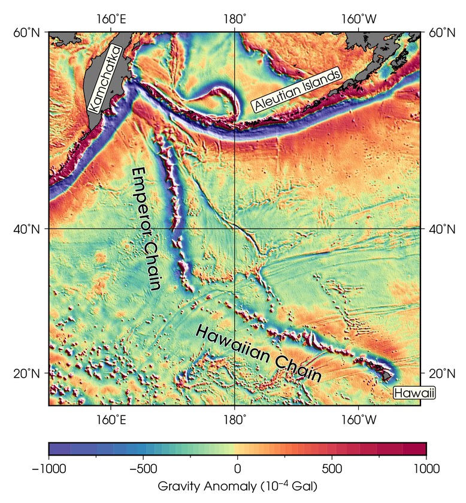

======================================
暈渲地圖
======================================

暈渲 (Hillshading) 是一種視覺化呈現地理數值資料的高低起伏的方式。其概念為把資料想成類似地形的起伏狀態，\
再假設有某個光源投射在此起伏的平面上，有些地方會被照亮，而有些地方則會有陰影出現。把光照與陰影區域一同描繪在\
地圖上，就是所謂的暈渲地圖。GMT 當然也支援如此重要的地圖繪製技術，其細節將在以下內容中一一描述。

目標
--------------------------------------
我們要使用全球海洋的\ `重力異常 <https://zh.wikipedia.org/wiki/%E9%87%8D%E5%8A%9B%E5%BC%82%E5%B8%B8>`_
(gravity anomaly) 資料，繪製\
`夏威夷-天皇海山鏈 <https://zh.wikipedia.org/wiki/%E5%A4%8F%E5%A8%81%E5%A4%B7-%E5%A4%A9%E7%9A%87%E6%B5%B7%E5%B1%B1%E9%93%BE>`_
(Hawaiian–Emperor seamount chain) 週邊區域的\
`自由空間重力異常 <https://en.wikipedia.org/wiki/Free-air_gravity_anomaly>`_
(free-air gravity anomaly) 地圖。圖中標示了幾個重要的地點，包括夏威夷島鏈 (Hawaiian Chain)、天皇島鏈 (Emperor Chain)、\
夏威夷 (Hawaii)、堪察加 (Kamchatka) 以及阿留申群島 (Aleutian Islands)。在阿留申群島與堪察加半島附近的低重力異常 (藍紫色) 區域，\
直接與板塊隱沒帶海溝的地形相關；但有趣的是，夏威夷-天皇海山鏈的島嶼兩側，竟然也出現了與島嶼平行的低重力異常條帶。這條島鏈目前認為是由\
太平洋板塊上的熱點持續的噴發岩漿所形成，所以島鏈兩側不應該會有任何像是海溝般的地形起伏才對。此處的低重力異常，較有可能的解釋是\
火山島的巨大質量，把此處的地殼壓成凹陷的表面，就像拿一個很重的砝碼壓在軟墊上，軟墊也會向下凹陷一樣。這裡的低重力異常條帶，能夠讓我們\
藉由壓彎量 (負重力異常值) 的計算，推知地殼與部份岩石圈的物理特性\ [#]_\ 。

.. _最終版地圖:

直接觀看\ `指令稿`_

使用的指令與概念
--------------------------------------
- ``img2grd`` - **把 Sandwell/Smith 麥卡托 .img 檔轉成 NetCDF 格式**
- ``grdgradient`` - **計算網格檔的梯度與照明值**
- ``grd2cpt`` - **使用網格檔的資訊建立離散色階檔**
- ``gmtset`` - **更改 GMT 的預設作圖參數**
- ``psxy`` - 輸出檔頭與檔尾
- ``grdimage`` - **繪製暈渲圖**
- ``pscoast`` - 繪製海岸線與陸域填色
- ``psbasemap`` - 設定繪圖區、座標軸與邊框
- ``pstext`` - **在圖上標記不同類型的文字**
- ``psscale`` - 繪製色階條
- 外部指令 ``rm`` - 刪除檔案 (Windows 為 ``del``)
- 如何混用海岸線的經緯度資料與 Web Mercator 投影的網格檔
- 進階文字風格設定
- 移動繪圖區起始點的影響

前置作業
--------------------------------------
本次所使用的資料，是從衛星數據中分析製作而成的全球海洋重力地圖\ [#]_。資料的下載和預覽可以從\
`這個網站 <http://topex.ucsd.edu/grav_outreach/>`_\ 取得。網站中的「Gridded Data for Research Use」\
一欄提供了三種不同資料，在本教學中，我們需要的是「Free-Air Marine Gravity Anomaly」(自由空間重力異常)。\
檔案除了從網站上下載之外，也可以從\
`此 ftp 網址 <ftp://topex.ucsd.edu/pub/global_grav_1min/grav.img.23.1>`_\ 直接下載。\

這個檔案與我們之前使用的 `ETOPO`_ 不太一樣：首先，它不是以 NetCDF 格式編碼的檔案，因此副檔名也就不是 ``.grd`` 或
``.nc``。事實上，這是一種特殊的格式，專為海床地形與重力的資料量身打造。在 GMT 的官方範例中，稱為\
「Sandwell/Smith Mercator img grids」\ [#]_。此外，數值資料的地理座標也不是經緯度，而是
`Web Mercator 投影 <https://en.wikipedia.org/wiki/Web_Mercator>`_\ [#]_。這種投影基本上是麥卡托投影法，\
只是投影模型中地球的形狀從一般麥卡托投影的「橢球形」變成了「正球形」。不管如何，GMT 很貼心的為這種檔案格式提供了轉檔的指令
``img2grd``，用法大致如下：

.. code-block:: bash

    $ img2grd 輸入img檔名 -G輸出grd檔名 -R欲轉換的區域 [-M]

如果不加 ``-M`` 選項，程式會進行座標轉換，使輸出檔以經緯度表示；如果加上 ``-M`` 選項，程式不會進行座標轉換，\
輸出檔仍然是 Web Mercator 投影座標。由於 Web Mercator 投影和一般的麥卡托投影只差在地球的形狀不同，如果我們\
**最終的地圖要採用任何一種麥卡托投影法的話，可以加上** ``-M`` **以節省運算時間和避免網格重新取樣產生的誤差**\ 。\
考慮我們要用的投影是 ``-Jm`` (麥卡托投影)，這裡我們選擇加上 ``-M``。完整的轉檔及簡略的繪圖指令大概就如下所示：

.. code-block:: bash

    # ==== 設定變數 ====
    out_ps="hawaiian-emperor.ps"
    in_img="grav.img.23.1"              # 重力資料的來源
    in_grd="grav_hawaiian.grd"          # 重力資料的 grd 轉檔

    # ==== 轉檔 ====
    img2grd $in_img -M -G$in_grd -R150/210/15/60
        # 150/210/15/60 為本次的製圖區域，我們只需要此區域的 grd 檔即可

    # ==== 繪圖 ====
    grdimage $in_grd -Jx0.25c -P > $out_ps
        # 注意：1. 因為已經是麥卡托投影的網格了，不用再投影一次，所以使用 -Jx (直角座標) 即可。
        #      2. 注意這裡我們沒有加上 -R 指令，這樣會以網格檔本身的四邊區域進行繪圖
        #         (也就是繪製整個網格)。
        #      3. 這裡我們使用小寫的 -Jx，意味著每度距離是 0.25 公分。由於地圖水平橫跨 60 度，
        #         橫向的寬度就會是 15 公分。

.. image:: hillshading/hillshading_fig1_s.png
    :target: _images/hillshading_fig1.png

``grdimage`` 預設的色階是 ``rainbow``，地圖會一片藍的原因是網格檔中有幾個地方的數值特別高。\
因此，我們要換上從 `cpt-city`_ 找來的色階檔 ``Spectral``，並且調整色階讓地圖能夠傳達更多資訊。``Spectral`` 色階檔可以\
`由此 <http://soliton.vm.bytemark.co.uk/pub/cpt-city/jjg/polarity/tn/Spectral.png.index.html>`_\
或是以下連結下載：

:download:`Spectral.cpt <hillshading/Spectral.cpt>`

.. image:: hillshading/hillshading_fig2.png
    :align: center

.. _ETOPO: https://www.ngdc.noaa.gov/mgg/global/global.html

.. _cpt-city: http://soliton.vm.bytemark.co.uk/pub/cpt-city

操作流程
--------------------------------------
我們先使用 ``grd2cpt`` 製作合適的色階檔，再重畫一次剛才的網格：(如果你對 ``grd2cpt`` 不熟悉，\
在「\ :doc:`editing_cpt_colorbar`\ 」可以找到更多介紹。)

.. code-block:: bash

    # ==== 設定變數 ====
    out_ps="hawaiian-emperor.ps"
    in_grd="grav_hawaiian.grd"
    master_cpt="Spectral.cpt"           # cpt 的來源
    in_cpt="hawaiian-emperor.cpt"       # cpt 輸入檔

    # ==== 製作 cpt 檔 ====
    grd2cpt $in_grd -C$master_cpt -S44 -I > $in_cpt
        # -S: 依照網格檔的像素分佈，對應累積常態分佈 (CDF of Normal Distribution) 的機率值，
        #     把色階分成 n 種顏色。色階中段的顏色在地圖上所佔的比例，會比色階兩端的顏色來得多一點。
        # -I: 反轉色階。原本的色階紅色對應低值，藍色對應高值，但這與地形圖常見的慣例相反。
        #     加上 -I 之後，藍色會被用於較低的值，紅色會被用於較高的值。

    # ==== 繪圖 ====
    grdimage $in_grd -Jx0.25c -P -C$in_cpt > $out_ps

.. image:: hillshading/hillshading_fig3_s.png
    :target: _images/hillshading_fig3.png

這次的輸出看起來好多了，更多細節透過不同的顏色呈現在圖中。這張地圖或許已經可以滿足某些目的，例如找出重力異常值\
特別高或特別低的地區；但對於相同顏色區塊中數值的變化情形就較無法掌握，例如我們很難判斷在深藍色或深紅色的區塊中，\
哪裡是數值變化特別劇烈的地區？重力異常的「脊線」與「谷線」的精確所在位置又在哪裡？

為了在地圖上表示更多資訊，我們可以把這張網格檔假想成「地形面」，當陽光在凹凸不平的「地形」上投射時，有的地方會變得更明亮，\
而有的地方會產生陰影。也就是說，\ **我們只要為地圖加上「明暗程度」，就能適當的在地圖上表達數值的起伏情況**，\
這種技術稱之為「暈渲」(Hillshading)。

.. note::

    如果要表示的網格就是地形資料，這類型的地圖又可稱之為「陰影地形圖」(shaded relief map)。

GMT 的暈渲技術要透過 ``grdgradient`` 來完成。顧名思義，``grdgradient`` 原始的功能其實是計算網格檔的「梯度」，\
但由於「明暗程度」也是梯度的函數，因此現在 ``grdgradient`` 更常用於製造陰影圖。它的基本語法非常簡單：

.. code-block:: bash

    $ grdgradient 輸入grd檔名 -G輸出陰影檔名 -A光源的方位角 -N常態化參數

注意 ``-A`` 的單位是\ `方位角 <https://zh.wikipedia.org/wiki/%E6%96%B9%E4%BD%8D%E8%A7%92>`_。\
``-N`` 是把梯度值常態化，也就是透過函數把數值規範在某個範圍，好讓輸出檔的數值能夠被 GMT 理解成「陰影的濃淡程度」。\

.. note::

    其實 ``-A`` 參數的原本意義是計算特定方位角的梯度值，光源在此方向投射的陰影量值就是透過\
    此梯度值換算 (常態化) 而來。

``-N`` 的常態化函數有三種選擇，分別是 ``-N``、``-Ne`` 與 ``-Nt``。``-N`` 的調整函數是

.. math:: f(x) = a \frac{x - \bar{x}}{\max{| x - \bar{x} |}}

其中 :math:`x` 是原本的梯度數值，:math:`\bar{x}` 是原本數值的平均值，:math:`a` 是給定的振幅，也就是 ``-N`` 之後\
接續的常態化參數的數值。``-Ne`` 與 ``-Nt`` 的調整函數則為

.. math::

    Ne \Rightarrow f(x) = a (1 - e^{\sqrt{2} \frac{x - \bar{x}}{\sigma_{1}}})

    Nt \Rightarrow f(x) = \frac{2a}{\pi} \arctan{\frac{x - \bar{x}}{\sigma_{2}}}

其中 :math:`\sigma_{1}` 和 :math:`\sigma_{2}` 分別是 :math:`(x - \bar{x})` 的 L-1 範數 (Norm) 與 L-2 範數。\
在這裡，我們要使用 ``-N10`` 來調整梯度數值，你也可以嘗試使用較大或較小的數值，或是別種調整法來試試看。

.. note::

    你也可以自訂 :math:`\bar{x}` 和 :math:`\sigma` 的數值。因此，完整的 ``-N`` 語法為

    .. code-block:: bash

        -N[e或t]常態化參數(a)[/sigma[/xbar]]

.. tip::

    一般來說，:math:`a` 值越大，渲染的效果會越明顯。而在相同的 :math:`a` 值之下，\
    ``-N`` 要比 ``-Nt`` 或 ``-Ne`` 來的柔和許多，而 ``-Ne`` 會比 ``-Nt``
    更加強化網格數值非常陡峭的區域。在粗略的觀察下，``-N10`` 大概與 ``-Ne1``
    或 ``-Nt1`` 的效果相同。

讓我們來製作陰影檔，並且透過 ``grdimage`` 呈現看看陰影檔的內容，色階檔就使用 ``gray`` (灰階)：

.. code-block:: bash

    in_grd="grav_hawaiian.grd"
    in_shadow="grav_hawaiian_shade.grd"         # 陰影檔檔名
    grdgradient $in_grd -G$in_shadow -A45 -N10
    grdimage $in_shadow -Jx0.25c -P -Cgray > shadow.ps

.. image:: hillshading/hillshading_fig4_s.png
    :target: _images/hillshading_fig4.png

這就是陰影檔本身的樣子，透過顏色深淺的不同，清楚的呈現了地形的起伏，像是在海洋地殼上面的火山島，或是\
海溝的延伸方向等等。暈渲的技術，大致上就是把這層陰影檔圖層，以半透明的方式套疊在原本的網格上，使原本的\
網格輸出不只可以靠顏色色調判別數值的高低，更可以用顏色深淺來表現細節及鄰近像素的變化。在 GMT 中要繪製暈渲\
地圖非常的容易，只要透過 ``grdimage`` 的 ``-I`` 指令，指定陰影檔即可：

.. code-block:: bash

    $ grdimage 輸入網格 -I輸入網格的陰影檔 -C色階檔 -(其他指令...)

現在，就讓我們來畫畫看暈渲地圖，並且使用 ``pstext`` 在地圖上加入標籤，以及 ``psscale`` 在地圖上加入\
色階條：

.. code-block:: bash

    # ==== 設定變數 ====
    out_ps="hawaiian-emperor.ps"
    in_grd="grav_hawaiian.grd"          # 重力資料輸入檔 (由 img2grd 製作)
    in_shadow="grav_hawaiian_shade.grd" # 陰影的輸入檔 (由 grdgradient 製作)
    in_cpt="hawaiian-emperor.cpt"       # cpt 輸入檔 (由 grd2cpt 製作)
    pen="thin,black"                    # 格線的畫筆
    font="14p,13,black"                 # 座標刻度的字型

    # ==== 調整 GMT 預設參數 ====
    gmtset MAP_FRAME_TYPE=plain \
           MAP_GRID_PEN_PRIMARY=$pen \
           MAP_TICK_PEN_PRIMARY=$pen \
           FONT_ANNOT_PRIMARY=$font \
           FONT_LABEL=$font \
           FORMAT_GEO_MAP=dddF
    # FONT_LABEL: 地圖上文字標籤的字型設定
    # 其他參數請參考「版面設計與地圖的幾何布局」

    # ==== 開門 (寫入 PS 檔頭) ====
    psxy -R0/1/0/1 -JX1c -T -K -P > $out_ps

    # ==== 暈渲地圖 ====
    grdimage $in_grd -Jx0.25c -O -K -C$in_cpt -I$in_shadow -Y3c >> $out_ps
        # 因為在 grdimage 中我們沒指定 -R，因此在畫外框的 psbasemap 中，就必須要指定。
    psbasemap -R150/210/15/60 -J -O -K -Bxa20g180 -Bya20g40 >> $out_ps

        # 接下來，我們要標示島鏈的名字。
        # 可以使用描邊字以清楚呈現字的內容，語法為
        # -F+f(字本體的字型)=(描邊的設定，只有「寬度,顏色」)
    pstext -R -J -O -K -F+a+jCM+f20p,15,black=0.5p,white >> $out_ps << TEXT1END
    166 40 -81 Emperor Chain     
    184 23 -21 Hawaiian Chain
    TEXT1END

        # 接下來，我們要標示特殊的地點，為了使這些地點醒目，
        # 可以使用矩形框把背景蓋住。
    pstext -R -J -O -K -F+a+jCM+f$font -Givory -Wthin -N -TO >> $out_ps << TEXT2END
    209 17 0  Hawaii     
    159 56 70 Kamchatka
    190 55 22 Aleutian Islands
    TEXT2END
        # -G: 繪製文字標籤的矩形框，並以指定的顏色填色。
        # -W: 指定矩形框邊線的畫筆屬性。
        # -N: 當矩形框或文字超出地圖邊界時，保持顯示 (不加的話，會切掉所有超出地圖邊界的內容)。
        # -T: 指定矩形框的角落樣式，-TO 是圓角框。

        # 最後在底部畫上色階條，細節請參閱「色階檔的編修與呈現」，
        # 標籤文字的上下標格式說明請參閱「XY 點散佈圖」。
        # 數值的單位請參考資料來源網站。
    psscale -O -K -C$in_cpt -D3i/-1.5c/6i/0.5ch -G-1000/1000 \
            -Bxa500f250+l"Gravity Anomaly (10@+-4@+ Gal)" >> $out_ps
        # 注意這裡的 -D 選項，作圖點移至 3i/-1.5c 的位置。
        # 這意味著色階條的繪圖原點會在上一個繪圖原點 (也就是地圖左下角)
        # 的右方 3 英吋、下方 1.5 公分處，因此色階條就會在地圖下方呈現。

    # ==== 關門 (寫入 EOF) ====
    psxy -R -J -O -T >> $out_ps

.. image:: hillshading/hillshading_fig5_s.png
    :target: _images/hillshading_fig5.png

加上了渲染效果、邊框、文字標籤以及色階條後，地圖看起來變得專業許多。不過你或許會發現還有兩點值得改進：

1. 地圖北側邊框跑錯位置，看起來像是緯度被壓扁了，而且也不是經緯度格式。
2. 如果能加上海岸線，就更能知道此地圖的地理位置與區域背景。

造成第一點問題的原因，是 ``psbasemap`` 在繪製地圖邊框時，仍然採用 ``grdimage`` 中的 ``-Jx`` 舊設定。\
因此，我們勢必要使用另一種地理投影方法，而且這種方法還能讓 ``psbasemap`` 繪製的經緯度座標能夠與目前使用 ``-Jx`` 繪製的\
座標重合才行。同樣的，如果我們要加上海岸線，就要使用 ``pscoast`` 指令，但是 ``pscoast`` 的輸入資料是以經緯度編排的，\
我們也要提供正確的投影座標系統，才能夠讓海岸線疊在圖上正確的位置。要怎麼設定投影座標系統？我們回想一下重力異常的網格檔是怎麼製造的：

- 原始資料是以 Web Mercator 投影座標系統儲存。
- 轉成 ``.grd`` 檔時。我們設定為不轉換投影法，所以這時資料的投影法不變，不過座標換成以經緯度進行編排。

因此，我們繪製海岸線資料或邊框的經緯度標示時，必須也要使用 Web Mercator 投影法。猶記這種方法與一般的麥卡托投影法基本相等，只差在\
參考橢球的設定不同。Web Mercator 投影法使用的是正球體，因此，我們只需要使用 ``gmtset`` 把以下的參數修改為

.. code-block:: bash

    PROJ_ELLIPSOID=Sphere

即可。使用此設定搭配 ``-Jm`` 投影，並指定相同的比例尺大小 (``0.25c``)，就可以正確的把外框，或是使用 ``pscoast`` 畫的\
海岸線疊合。因此，「暈渲地圖」部份的腳本可以改為

.. code-block:: bash

    # (前略)
    gmtset PROJ_ELLIPSOID=Sphere

    # ==== 開門 (寫入 PS 檔頭) ====
    # (略)

    # ==== 暈渲地圖 ====
    grdimage $in_grd -Jx0.25c -O -K -C$in_cpt -I$in_shadow -Y3c >> $out_ps
    pscoast -R150/210/15/60 -Dh -A50 -Jm0.25c -O -K -G100 -Wthin \
            >> $out_ps
    psbasemap -R -J -O -K -Bxa20g180 -Bya20g40 >> $out_ps
    # (後略)

就可以正確的把海岸線和邊框疊加到使用 Web Mercator 投影的重力異常地圖上。

.. attention::

    由於 ``img2grd`` 在轉檔的時候，緯度方向會出現一點誤差，因此當你使用 ``grdinfo`` 
    查看 ``grav_hawaiian.grd`` 的時候應該會看到一行說明：

    .. code-block:: bash

        grav_hawaiian.grd: Remark: Spherical Mercator Projected with -Jm1 -R0/60/14.9925850705/60.0052682687

    在 ``-R`` 的後兩個數字就是實際上 ``grav_hawaiian.grd`` 的緯度實際範圍，我們在使用 ``pscoast`` 畫海岸線的時候，\
    如要求精確，應使用 ``-R150/210/14.9925850705/60.0052682687``，而不是 ``-R150/210/15/60``，\
    不過這兩個設定看起來會非常接近就是了。

.. error::

    本章我們在 ``-J`` 後一律使用小寫的英文字母 (例如 ``-Jm``) 來指定比例尺，也就是每一個網格單位在地圖上的長度。\
    **當資料來源包含不同的投影方式時，應避免使用大寫英文字母** (例如 ``-JM``)。這是因為大寫字母指定的是地圖的全寬，\
    而目前 GMT 似乎還沒有辦法很精準的使用地圖全寬來對齊使用不同投影法編排的資料。

指令稿
--------------------------------------
本地圖的最終指令稿如下：

.. code-block:: bash

    # ==== 設定變數 ====
    out_ps="hawaiian-emperor.ps"
    in_img="grav.img.23.1"              # 重力資料的來源
    in_grd="grav_hawaiian.grd"          # 重力資料輸入檔
    in_shadow="grav_hawaiian_shade.grd" # 陰影的輸入檔
    master_cpt="Spectral.cpt"           # cpt 的來源
    in_cpt="hawaiian-emperor.cpt"       # cpt 輸入檔
    pen="thin,black"                    # 格線的畫筆
    font="14p,13,black"                 # 座標刻度的字型

    # ==== 製作輸入檔 ====
    img2grd $in_img -M -G$in_grd -R150/210/15/60
    grdgradient $in_grd -G$in_shadow -A45 -N10
    grd2cpt $in_grd -C$master_cpt -S44 -I > $in_cpt

    # ==== 調整 GMT 預設參數 ====
    gmtset MAP_FRAME_TYPE=plain \
           MAP_GRID_PEN_PRIMARY=$pen \
           MAP_TICK_PEN_PRIMARY=$pen \
           FONT_ANNOT_PRIMARY=$font \
           FONT_LABEL=$font \
           FORMAT_GEO_MAP=dddF \
           PROJ_ELLIPSOID=Sphere    # 對應重力資料輸入檔的投影方式

    # ==== 開門 (寫入 PS 檔頭) ====
    psxy -R0/1/0/1 -JX1c -T -K -P > $out_ps

    # ==== 暈渲地圖 ====
    grdimage $in_grd -Jx0.25c -O -K -C$in_cpt -I$in_shadow -Y3c >> $out_ps
        # -R 選項是為了與前面的 grdimage 作圖精準重合
    pscoast -R150/210/14.9925850705/60.0052682687 -Dh -A50 -Jm0.25c -O -K -G100 -Wthin \
            >> $out_ps
    psbasemap -R -J -O -K -Bxa20g180 -Bya20g40 >> $out_ps
        # 使用描邊字以清楚呈現字的內容
    pstext -R -J -O -K -F+a+jCM+f20p,15,black=0.5p,white >> $out_ps << TEXT1END
    166 40 -81 Emperor Chain     
    184 23 -21 Hawaiian Chain
    TEXT1END
        # 比較不重要的區域，可以直接使用矩形框把背景蓋住
    pstext -R -J -O -K -F+a+jCM+f$font -Givory -Wthin -N -TO >> $out_ps << TEXT2END
    209 17 0  Hawaii     
    159 56 70 Kamchatka
    190 55 22 Aleutian Islands
    TEXT2END
    psscale -O -K -C$in_cpt -D3i/-1.5c/6i/0.5ch -G-1000/1000 \
            -Bxa500f250+l"Gravity Anomaly (10@+-4@+ Gal)" >> $out_ps

    # ==== 關門 (寫入 EOF) ====
    psxy -R -J -O -T >> $out_ps
    # rm -rf gmt.conf    # <---- 此行可用於消除舊的組態設定檔

.. note::

    「繪製暈渲地圖。使用以特殊格式編排的重力異常資料，先經由 ``img2grd`` 轉成 NetCDF 格式檔案，\
    再藉由 ``grdgradient`` 產生對應的陰影檔，最後把陰影檔套疊至重力異常地圖上即完成暈渲地圖。為了疊加海岸線與地圖邊框，\
    須調整 GMT 參考橢球體的參數，改成正球體之後，利用一般的麥卡托投影，指定相同的比例尺，就可以正確的疊加新圖層。\
    最後，地圖上也展示了一些文字標籤常使用的技巧。」

觀看\ `最終版地圖`_

習題
--------------------------------------

1. 使用 `ETOPO`_ Bedrock 或其他類似的地形高程資料，繪製義大利全區的陰影地形圖。座標可嘗試
   ``-R6/19/36/47``。你可以透過陰影地形圖找到幾座火山？

.. _ETOPO: https://www.ngdc.noaa.gov/mgg/global/global.html

.. [#] 進一步的解釋與說明，可參閱 A. B. Watts (2001) 所著之 *Isostasy and Flexure of the Lithosphere*
       的第 4.3 節 (pp. 125-150)。

.. [#] Sandwell, D. T., R. D. Müller, W. H. F. Smith, E. Garcia, R. Francis,
       `New global marine gravity model from CryoSat-2 and Jason-1 reveals buried tectonic structure <http://www.sciencemag.org/content/346/6205/65>`_,
       Science, Vol. 346, no. 6205, pp. 65-67, 
       `doi: 10.1126/science.1258213 <http://dx.doi.org/10.1126/science.1258213>`_, 2014.

.. [#] `GMT 官方範例 #27 <http://gmtrac.soest.hawaii.edu/doc/5.1.0/gallery/ex27.html>`_

.. [#] 事實上這個投影很常見，由於計算速度較快，它是許多線上地圖如 Google Maps 或開放街圖 (OSM) 採用的投影座標。
