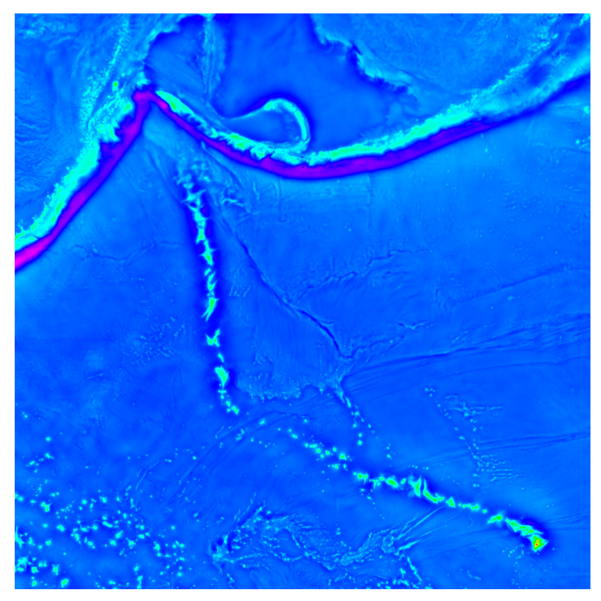

======================================
暈渲地圖
======================================

暈渲 (Hillshading) 是一種視覺化呈現地理數值資料的高低起伏的方式。其概念為把資料想成類似地形的起伏狀態，\
再假設有某個光源投射在此起伏的平面上，有些地方會被照亮，而有些地方則會有陰影出現。把光照與陰影區域一同描繪在\
地圖上，就是所謂的暈渲地圖。GMT 當然也支援如此重要的地圖繪製技術，其細節將在以下內容中一一描述。

目標
--------------------------------------
我們要使用全球海洋的\ `重力異常 <https://zh.wikipedia.org/wiki/%E9%87%8D%E5%8A%9B%E5%BC%82%E5%B8%B8>`_
(gravity anomaly) 資料，繪製\
`夏威夷-天皇海山鏈 <https://zh.wikipedia.org/wiki/%E5%A4%8F%E5%A8%81%E5%A4%B7-%E5%A4%A9%E7%9A%87%E6%B5%B7%E5%B1%B1%E9%93%BE>`_
(Hawaiian–Emperor seamount chain) 週邊區域的\
`自由空間重力異常 <https://en.wikipedia.org/wiki/Free-air_gravity_anomaly>`_
(free-air gravity anomaly) 地圖。圖中標示了幾個重要的地點，包括夏威夷島鏈 (Hawaiian Chain)、天皇島鏈 (Emperor Chain)、\
夏威夷 (Hawaii)、堪察加 (Kamchatka) 以及阿留申群島 (Aleutian Islands)。在阿留申群島與堪察加半島附近的低重力異常 (藍紫色) 區域，\
直接與板塊隱沒帶海溝的地形相關；但有趣的是，夏威夷-天皇海山鏈的島嶼兩側，竟然也出現了與島嶼平行的低重力異常條帶。這條島鏈目前認為是由\
太平洋板塊上的熱點持續的噴發岩漿所形成，所以島鏈兩側不應該會有任何像是海溝般的地形起伏才對。此處的低重力異常，較有可能的解釋是\
火山島的巨大質量，把此處的地殼壓成凹陷的表面，就像拿一個很重的砝碼壓在軟墊上，軟墊也會向下凹陷一樣。這裡的低重力異常條帶，能夠讓我們\
藉由壓彎量 (負重力異常值) 的計算，推知地殼與部份岩石圈的物理特性\ [#]_\ 。

.. _最終版地圖:

.. image:: hillshading/hawaiian-emperor.png

直接觀看\ `指令稿`_

使用的指令與概念
--------------------------------------
- ``img2grd`` - **把 Sandwell/Smith 麥卡托 .img 檔轉成 NetCDF 格式**
- ``grdgradient`` - **計算網格檔的梯度與照明值**
- ``grd2cpt`` - **使用網格檔的資訊建立離散色階檔**
- ``gmtset`` - **更改 GMT 的預設作圖參數**
- ``psxy`` - 輸出檔頭與檔尾
- ``grdimage`` - **繪製暈渲圖**
- ``pscoast`` - 繪製海岸線與陸域填色
- ``psbasemap`` - 設定繪圖區、座標軸與邊框
- ``pstext`` - **在圖上標記不同類型的文字**
- ``psscale`` - 繪製色階條
- 外部指令 ``rm`` - 刪除檔案 (Windows 為 ``del``)
- 如何混用海岸線的經緯度資料與 Web Mercator 投影的網格檔
- 進階文字風格設定
- 移動繪圖區起始點的影響

前置作業
--------------------------------------
本次所使用的資料，是從衛星數據中分析製作而成的全球海洋重力地圖\ [#]_。資料的下載和預覽可以從\
`這個網站 <http://topex.ucsd.edu/grav_outreach/>`_\ 取得。網站中的「Gridded Data for Research Use」\
一欄提供了三種不同資料，在本教學中，我們需要的是「Free-Air Marine Gravity Anomaly」(自由空間重力異常)。\
檔案除了從網站上下載之外，也可以從\
`此 ftp 網址 <ftp://topex.ucsd.edu/pub/global_grav_1min/grav.img.23.1>`_\ 直接下載。\

這個檔案與我們之前使用的 `ETOPO`_ 不太一樣：首先，它不是以 NetCDF 格式編碼的檔案，因此副檔名也就不是 ``.grd`` 或
``.nc``。事實上，這是一種特殊的格式，專為海床地形與重力的資料量身打造。在 GMT 的官方範例中，稱為\
「Sandwell/Smith Mercator img grids」\ [#]_。此外，數值資料的地理座標也不是經緯度，而是
`Web Mercator 投影 <https://en.wikipedia.org/wiki/Web_Mercator>`_\ [#]_。這種投影基本上是麥卡托投影法，\
只是投影模型中地球的形狀從一般麥卡托投影的「橢球形」變成了「正球形」。不管如何，GMT 很貼心的為這種檔案格式提供了轉檔的指令
``img2grd``，用法大致如下：

.. code-block:: bash

    $ img2grd 輸入img檔名 -G輸出grd檔名 -R欲轉換的區域 [-M]

如果不加 ``-M`` 選項，程式會進行座標轉換，使輸出檔以經緯度表示；如果加上 ``-M`` 選項，程式不會進行座標轉換，\
輸出檔仍然是 Web Mercator 投影座標。由於 Web Mercator 投影和一般的麥卡托投影只差在地球的形狀不同，如果我們\
**最終的地圖要採用任何一種麥卡托投影法的話，可以加上** ``-M`` **以節省運算時間和避免網格重新取樣產生的誤差**\ 。\
考慮我們要用的投影是 ``-JM`` (麥卡托投影)，這裡我們選擇加上 ``-M``。完整的轉檔及簡略的繪圖指令大概就如下所示：

.. code-block:: bash

    # ==== 設定變數 ====
    out_ps="hawaiian-emperor.ps"
    in_img="grav.img.23.1"              # 重力資料的來源
    in_grd="grav_hawaiian.grd"          # 重力資料的 grd 轉檔

    # ==== 轉檔 ====
    img2grd $in_img -M -G$in_grd -R150/210/15/60
        # 150/210/15/60 為本次的製圖區域，我們只需要此區域的 grd 檔即可

    # ==== 繪圖 ====
    grdimage $in_grd -JX6i -P > $out_ps
        # 注意：1. 因為已經是麥卡托投影的網格了，不用再投影一次，所以使用 -JX (直角座標) 即可。
        #      2. 注意這裡我們沒有加上 -R 指令，這樣會以網格檔本身的四邊區域進行繪圖
        #         (也就是繪製整個網格)。

``grdimage`` 預設的色階是 ``rainbow``，地圖會一片藍的原因是網格檔中有幾個地方的數值特別高。\
因此，我們要換上從 `cpt-city`_ 找來的色階檔 ``Spectral``，並且調整色階讓地圖能夠傳達更多資訊。``Spectral`` 色階檔可以\
`由此 <http://soliton.vm.bytemark.co.uk/pub/cpt-city/jjg/polarity/tn/Spectral.png.index.html>`_\
或是以下連結下載：

:download:`Spectral.cpt <hillshading/Spectral.cpt>`

.. image:: hillshading/hillshading_fig2.png

.. _ETOPO: https://www.ngdc.noaa.gov/mgg/global/global.html

.. _cpt-city: http://soliton.vm.bytemark.co.uk/pub/cpt-city

操作流程
--------------------------------------
我們先使用 ``grd2cpt`` 製作合適的色階檔，再重畫一次網格：

指令稿
--------------------------------------
本地圖的最終指令稿如下：

.. code-block:: bash

    # ==== 設定變數 ====
    out_ps="hawaiian-emperor.ps"
    in_img="grav.img.23.1"              # 重力資料的來源
    in_grd="grav_hawaiian.grd"          # 重力資料輸入檔
    in_shadow="grav_hawaiian_shade.grd" # 陰影的輸入檔
    master_cpt="Spectral.cpt"           # cpt 的來源
    in_cpt="hawaiian-emperor.cpt"       # cpt 輸入檔
    pen="thin,black"                    # 格線的畫筆
    font="14p,13,black"                 # 座標刻度的字型

    # ==== 製作輸入檔 ====
    img2grd $in_img -M -G$in_grd -R150/210/15/60
    grdgradient $in_grd -G$in_shadow -A45 -N10
    grd2cpt $in_grd -C$master_cpt -S44 -I > $in_cpt

    # ==== 調整 GMT 預設參數 ====
    gmtset MAP_FRAME_TYPE=plain \
           MAP_GRID_PEN_PRIMARY=$pen \
           MAP_TICK_PEN_PRIMARY=$pen \
           FONT_ANNOT_PRIMARY=$font \
           FONT_LABEL=$font \
           FORMAT_GEO_MAP=dddF

    # ==== 開門 (寫入 PS 檔頭) ====
    psxy -R0/1/0/1 -JX1c -T -K -P > $out_ps

    # ==== 暈渲地圖 ====
    grdimage $in_grd -JX6i -O -K -C$in_cpt -I$in_shadow -Y3c >> $out_ps
        # -R 選項和加上 PROJ_ELLIPSOID=Sphere 是為了與前面的 grdimage 作圖重合
    pscoast -R150/210/14.9925850705/60.0052682687 -Dh -A50 -JM6i -O -K -G100 -Wthin \
            --PROJ_ELLIPSOID=Sphere >> $out_ps
    psbasemap -R -J -O -K -Bxa20g180 -Bya20g40 >> $out_ps
        # 使用描邊字以清楚呈現字的內容
    pstext -R -J -O -K -F+a+jCM+f20p,15,black=0.5p,white >> $out_ps << TEXT1END
    166 40 -81 Emperor Chain     
    184 23 -21 Hawaiian Chain
    TEXT1END
        # 比較不重要的區域，可以直接使用矩形框把背景蓋住
    pstext -R -J -O -K -F+a+jCM+f$font -Givory -Wthin -N -TO >> $out_ps << TEXT2END
    209 17 0  Hawaii     
    159 56 70 Kamchatka
    190 55 22 Aleutian Islands
    TEXT2END
    psscale -O -K -C$in_cpt -D3i/-1.5c/6i/0.5ch -G-1000/1000 \
            -Bxa500f250+l"Gravity Anomaly (10@+-4@+ Gal)" >> $out_ps

    # ==== 關門 (寫入 EOF) ====
    psxy -R -J -O -T >> $out_ps
    # rm -rf gmt.conf    # <---- 此行可用於消除舊的組態設定檔

.. note::

    「」

觀看\ `最終版地圖`_

習題
--------------------------------------

.. [#] 進一步的解釋與說明，可參閱 A. B. Watts (2001) 所著之 *Isostasy and Flexure of the Lithosphere*
       的第 4.3 節 (pp. 125-150)。

.. [#] Sandwell, D. T., R. D. Müller, W. H. F. Smith, E. Garcia, R. Francis,
       `New global marine gravity model from CryoSat-2 and Jason-1 reveals buried tectonic structure <http://www.sciencemag.org/content/346/6205/65>`_,
       Science, Vol. 346, no. 6205, pp. 65-67, 
       `doi: 10.1126/science.1258213 <http://dx.doi.org/10.1126/science.1258213>`_, 2014.

.. [#] `GMT 官方範例 #27 <http://gmtrac.soest.hawaii.edu/doc/5.1.0/gallery/ex27.html>`_

.. [#] 事實上這個投影很常見，由於計算速度較快，它是許多線上地圖如 Google Maps 或開放街圖 (OSM) 採用的投影座標。
