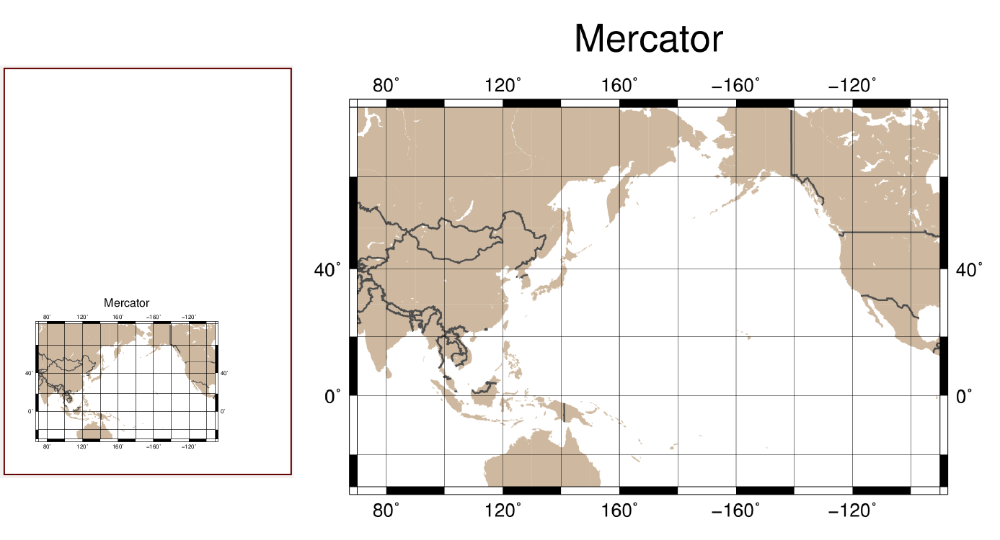
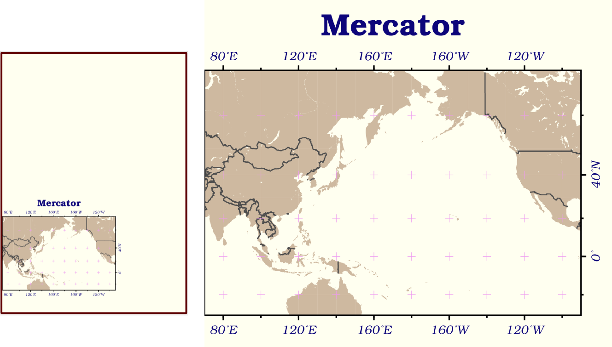
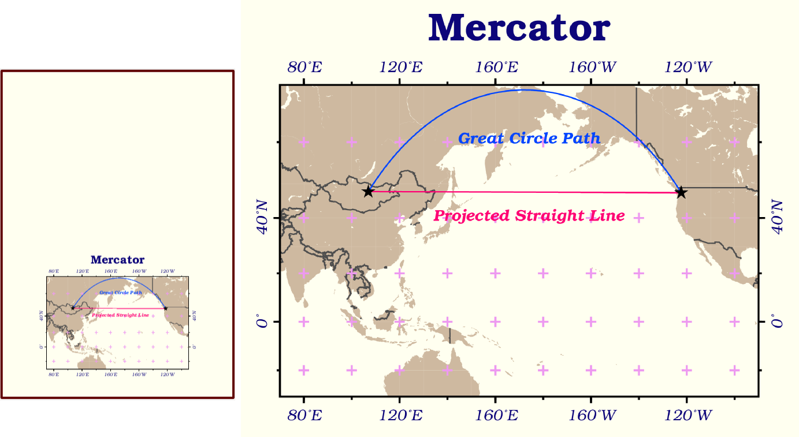
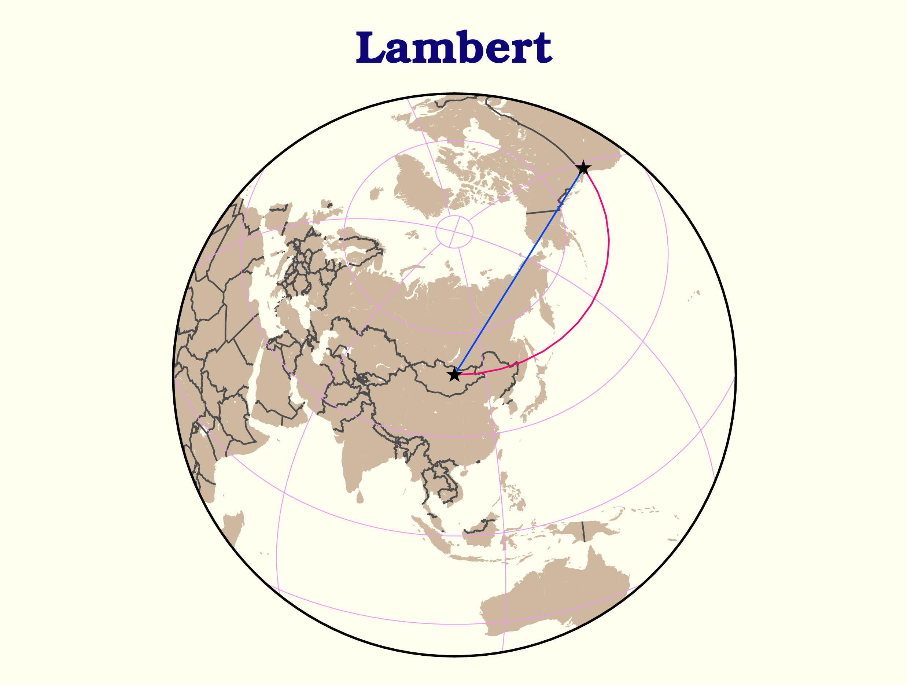

======================================
版面設計與地圖的幾何布局
======================================

接下來讓我們來探討一下 GMT 的版面設計功能。在一般的情形下，GMT 會使用許多預設選項，\
讓使用者不需做太多設定，甚至是下達簡單的一行指令，就能產生想要的地圖。如果我們想設計比較複雜的配置，\
例如版面分割、邊框樣式調整、字型與字體樣式，就需要調整 GMT 的「使用者組態設定」。另外，\
我們也會在這裡介紹地理空間資料常用的兩大類座標：平面與球面，以及 GMT 如何處理這兩種座標混用時的情況。

目標
--------------------------------------
繪製從蒙古國\ *烏蘭巴托* (Ulaanbaatar) 到美國\ *西雅圖* (Seattle) 的\
`大圓路徑 <https://en.wikipedia.org/wiki/Great-circle_distance>`_ 
(**Great Circle** Route) 與\
`恆向線 <https://en.wikipedia.org/wiki/Rhumb_line>`_
(**Rhumb Line**)。大圓路徑指的是沿著大圓 (半徑為地球半徑的的圓) 前進的路徑，\
恆向線則是對於所有的子午線，交角皆相等的路線。本章地圖使用了兩個不同的投影方法，上圖為\
「蘭伯特等積方位投影」 (**Lambert** azimuthal equal-area projection) ，下圖為「麥卡托投影」\
(**Mercator** Projection)。圖中說明了幾個特點：

- 恆向線在麥卡托投影中會以直線呈現，而大圓路徑在相同的圖中則是曲線。有趣的是，大圓路徑才是兩地之間\
  實際較短的路徑。
- 連接到蘭伯特等積方位投影中心點 (本例中為烏蘭巴托) 的大圓路徑會是直線，恆向線則變成曲線。\
  這是比較能直觀連結它們的實際長度的一種方法，也是投影名稱的「方位」二字緣由 (大圓路徑保持在相同方位)。

另外，本地圖也替換了 GMT 的預設字型、顏色與版面配置。這些細節將會在以下部份一一解說。

.. _最終版地圖:

.. image:: layout_design/ulaanbaatar_seattle.png

直接觀看\ `指令稿`_

使用的指令與概念
--------------------------------------
- ``gmtdefaults`` - **查看 GMT 的預設作圖參數**
- ``gmtset`` - **更改 GMT 的預設作圖參數**
- ``psxy`` - **在地理座標系統上畫點和線**
- ``pstext`` - **詳細的設定標記在圖上的文字**
- ``project`` - **產生路徑座標**
- ``psbasemap`` - 設定繪圖區、座標軸與邊框
- ``pscoast`` - 繪製海岸線與國界
- 外部指令 ``rm`` - **刪除檔案** (Windows 為 ``del``)
- 外部指令 ``echo`` - 把資料輸入到管線命令中
- GMT 共用選項：``-X`` ``-Y`` ``-:``
- GMT 的預設參數與 ``gmt.conf`` 檔案
- 地理座標的給定方式
- 地圖版面的設定
- 文字風格設定
- GMT 針對不同投影座標系統的不同處理方式

前置作業
--------------------------------------
我們要先取得烏蘭巴托與西雅圖兩地的經緯度座標。從 *Wikipedia* 的條目頁面中，可以找到「經緯度」的資訊欄位，
點選連結後，可以看到不同座標系統的位置資訊，如下所示 (以烏蘭巴托為例)。

.. image:: layout_design/layout_design_fig1.png

注意在「\ **WGS84**\ 」欄位中，有兩種座標的格式。你要使用哪種都可以，GMT 都有支援。\
另外也請注意這裡的座標是「緯度在前，經度在後」。在下表中，也蒐集了兩地的經緯座標
(十進位制四捨五入至小數點第二位)：

=============== ============================== =================================
城市             烏魯木齊                        西雅圖
=============== ============================== =================================
經緯度 (度分秒)   47° 55′ 0″ N, 106° 55′ 0″ E        47° 36′ 35″ N, 122° 19′ 59″ W
經緯度 (十進位)   47.92, 106.92                  47.61, -122.33
=============== ============================== =================================

為了方便使用這些資料，我們可以建立一個純文字文件 ``coord.txt``，再把兩地的座標資訊複製到文件中存檔，\
如此一來供 GMT 使用的資料表就建立完成。以下是使用十進位制座標的 ``coord.txt`` 內容：

.. code-block:: bash

    47.92, 106.92
    47.61, -122.33

再次強調，資料中的第一欄現在是緯度 (y 值)，第二欄是經度 (x 值)。這與我們在「\ :doc:`scatter_plot`\ 」一章中\
所使用的 xy 順序相反，不過只要適當的指定欄位意義，GMT 仍然可以讀取。另外，兩個欄位中間使用了「逗號」分隔，\
在 GMT 中也是可以接受的。

以下是使用度分秒制座標的 ``coord.txt`` 內容：

.. code-block:: bash

    47:55:0N, 106:55:0E
    47:36:35N, 122:19:59W

注意我把所有的度分秒符號都統一成「冒號」，而且座標字串中間的空白都被移除了。\
這種格式是 GMT 5 建議的標準地理座標 (度分秒) 格式，如果你有一串地理座標資料是以度分秒格式儲存，\
建議在輸入 GMT 之前，把所有的度分秒符號都改為冒號，如上所示。

你也可以從這裡下載資料檔：\ :download:`coord.txt <layout_design/coord.txt>`\ ，這個版本\
使用度分秒制座標。

.. tip::

    簡單小結 GMT 對於文字輸入檔與地理座標格式的要求：

    1. 欄位的分隔符號可以是\ **空白**\ 、\ **逗號** (``.csv`` 檔) 與 **Tab** (``.tsv`` 檔) 三者之一，\
       但不能在同一個檔案中使用超過一種的分隔符號來分隔欄位。欄位代表的意義預設是第一欄 x 值、第二欄 y 值，\
       不過可以在下指令時逐一指定。
    2. 地理座標可以採用\ **十進位**\ 或\ **度分秒**：

       - 以十進位系統表示時，南緯要表示為負緯度，西經則表示為負經度或是東經 180 度之後持續累加，\
         如經度 243 和 -63 都代表西經 63 度。
       - 以度分秒系統表示時，使用 ``ddd:mm:ssF`` 的方法，\ ``ddd`` 為度，\ ``mm`` 為分，\
         ``ss`` 為秒，\ ``F`` 則是 NEWS 四個字母之一。
       - 事實上，GMT 也讀得懂 ``dd°mm′ss″F`` 的表示方法，因此你如果不把這些符號換成冒號，\
         指令還是可以順利執行，不過個人仍然建議換成冒號，使用比較常見的字元，較能避免一些不必要的麻煩，\
         如不正確的螢幕顯示模式或 GMT 再次改版之後可能帶來的困擾。

操作流程
--------------------------------------
在「\ :doc:`scatter_plot`\ 」一章中，我們已經介紹了如何使用 ``psxy -T`` 來設定腳本結尾。這裡\
我們可以沿用相同的概念，來設定腳本開頭。因此，整個腳本的基礎設計大概會是這樣：

.. code-block:: bash

    # ==== 設定腳本的變數與參數 ====
    out_ps="ulaanbaatar_seattle.ps"
    其他設定......

    # ==== 開門 (寫入 PS 檔頭) ====
         # 因為只寫檔頭，所以 -R 和 -J 的設定並不重要，你可以隨意指定。
    psxy -R0/1/0/1 -JX1c -T -K > $out_ps

    # ==== 繪圖 ====
    主要的繪圖指令......

    # ==== 關門 (寫入 EOF) ====
    psxy -R -J -O -T >> $out_ps

在前面的章節中，我們會把 ``-P`` 加入第一個 GMT 指令中，以指定紙張採用直向排版。這裡我們要嘗試使用\
另一種方式：\ **調整 GMT 的預設參數**\ 。在終端機中輸入

.. code-block:: bash

    $ gmtdefaults

會看到螢幕中輸出一大串如下的文字：

.. code-block:: bash

    #
    # GMT 5.2.1 Defaults file
    # vim:sw=8:ts=8:sts=8
    # $Revision: 15178 $
    # $LastChangedDate: 2015-11-06 11:45:03 +0100 (Fri, 06 Nov 2015) $
    #
    # COLOR Parameters
    #
    COLOR_BACKGROUND		= black
    COLOR_FOREGROUND		= white
    COLOR_NAN			= 127.5
    COLOR_MODEL			= none
    ..... #(太多了，以下省略)

其中不以 ``#`` 號開頭的每一行，都是 GMT 在畫圖的時候會使用的預設參數。\
所有參數的意思，都可以在 `GMT 的官方手冊 <http://gmt.soest.hawaii.edu/doc/5.1.0/gmt.conf.html>`_\ 中找到。\
在這麼多的參數中，應該會有一行如下所示

.. code-block:: bash

    PS_PAGE_ORIENTATION		= landscape

這個選項其實就是控制版面的排版方向，它解釋了為什麼不加 ``-P`` 時，GMT 會使用橫向 (landscape) 排版。\
我們可以使用兩種方式更改預設的參數：

1. 在下 GMT 指令時，使用 ``--長參數`` 的語法，參數的名稱就是在這裡出現的大寫字串，例如：

   .. code-block:: bash

       $ psxy -R0/1/0/1 -JX1c -T -K --PS_PAGE_ORIENTATION=portrait > $out_ps

   在這裡 ``--PS_PAGE_ORIENTATION=portrait`` 的效果與 ``-P`` 一樣，指定版面為直向 (portrait)。\
   這種方法並不會影響預設值，\ **改變的參數只對這個指令有效**\ ，其他指令仍然會使用預設設定。

2. 使用 ``gmtset`` 設定 ``PS_PAGE_ORIENTATION`` 的預設值。它的語法如下：

   .. code-block:: bash

       $ gmtset 參數名1 參數值1 [參數名2 參數值2 參數名3 參數值3...]
       # ---- 或是 ----
       $ gmtset 參數名1=參數值1 [參數名2=參數值2 參數名3=參數值3...]

   個人推薦使用第二種語法，因為它與 ``--長參數`` 的語法格式一致。如使用這種方法，以上的例子可改為

   .. code-block:: bash

       $ gmtset PS_PAGE_ORIENTATION=portrait
       $ psxy -R0/1/0/1 -JX1c -T -K > $out_ps

   這種方法與前一種方法的主要差異是，GMT 會紀錄改變的預設值，只要紀錄不被覆蓋或刪除，\
   **改變的參數對接下來的所有指令都有效**\ 。

由於第一種方法已經在\ `之前的篇章 <editing_cpt_colorbar.html>`_\ 介紹過了，因此這裡讓我\
們進一步看看第二種方法的細節。``gmtset`` 指令會把所有的設定值存到當前目錄下的 ``gmt.conf`` 檔案，\
如果你之前並沒有下過任何 ``gmtset`` 指令，在第一次下達指令完畢後，應該也會看到 ``gmt.conf`` 出現在\
當前資料夾中。``gmt.conf`` 的內容與 ``gmtdefaults`` 的輸出相同，事實上當 ``gmt.conf`` 存在於資料夾中時，\
``gmtdefaults`` 就只是把它的內容印在螢幕上的指令。 因此，如果要修改 GMT 的預設設定，我們還有一種方法：

3. 直接修改資料夾中的 ``gmt.conf`` 檔案。如果你想要測試不同參數的效果或是頻繁的更改參數，\
   這種方法會比 gmtset 還要快一點。如果你想使用之前建立但放在別的資料夾的 ``gmt.conf`` 設定，只要把它複製到\
   當前的資料夾即可。

.. tip::

    資料夾中沒有 ``gmt.conf`` 時，``gmtdefaults`` 和其他 GMT 選項讀取的設定檔位於
    ``GMT根目錄/share/conf/gmt.conf``。你當然也可以修改此檔案，但建議修改之前先留個備份，\
    萬一改錯的話，至少你還可以使用備份檔還原 GMT 安裝時的「初始設定」。

    另外，如果你的資料夾中已經有了上一次繪圖時產生的 ``gmt.conf``，而你又不想讓上一次的設定選項\
    「干擾」到你這一次要畫的地圖，則你可以簡單的把 ``gmt.conf`` 刪掉，這樣 GMT 會重新使用\
    ``GMT根目錄/share/conf/gmt.conf`` 的預設值，然後就可以從頭使用 ``gmtset`` 來設定新的繪圖參數。

介紹完 ``gmtset`` 後，讓我們實際在本例中做個測試。先畫出目標地圖的下半部 (麥卡托投影的部份)：

.. code-block:: bash

    # ==== 設定變數 ====
    out_ps="ulaanbaatar_seattle.ps"
    land_color="#CEB9A0"

    # ==== 調整 GMT 預設參數 ====
    gmtset PS_PAGE_ORIENTATION=portrait

    # ==== 開門 (寫入 PS 檔頭) ====
    psxy -R0/1/0/1 -JX1c -T -K > $out_ps

    # ==== 繪圖 ====
    psbasemap -R70/270/30S/70N -JM13c -O -K -B+tMercator >> $out_ps
    pscoast -R -J -O -K -Dl -A1000 -G$land_color -N1/thick,60 -Ba40f20g20 >> $out_ps

    # ==== 關門 (寫入 EOF) ====
    psxy -R -J -O -T >> $out_ps

出圖如下所示，左側的部份是地圖在整張 A4 紙中的位置，紅色外框即是紙的範圍。

為了讓它變好看一點，我們還要修改以下預設指令：

- FONT_TITLE: 標題字型。在 GMT 中，**字型與畫筆類似，由三個部份組成**\ ：``尺寸,字型,顏色``。\
  「尺寸」可為任意數值，預設單位為點 (points)；「樣式」則可參考
  `PostScript 的字型樣式表 <http://gmt.soest.hawaii.edu/doc/5.1.0/GMT_Docs.html#g-postscript-fonts-used-by-gmt>`_，\
  可以使用字型的代號或是字型的名稱來表示。「顏色」則是 GMT 通用的顏色格式。我們想要的設定是
  ``30,Bookman-Demi,#0D057A`` (30 點字的 Bookman-Demi，顏色是 #0D057A)。
- FONT_ANNOT_PRIMARY：座標軸主格點標示的字型，使用 ``12p,20,#0D057A`` (12點字的 Bookman-LightItalic，顏色與標題一樣)。
- FORMAT_GEO_MAP：(地理作圖的)座標刻度標示的格式，使用英文代號的搭配組合表示，``d`` 代表度，``m`` 代表分，``s`` 代表秒，``F`` 代表\
  數值後面會加的「NEWS」後綴符號，詳細設定可\ `在此查閱 <http://gmt.soest.hawaii.edu/doc/5.1.0/gmt.conf.html>`_。\
  我們要使用的是 ``dddF``，如此一來可令所有座標只以至多三位數的度來表示，並搭配後綴符號。
- MAP_FRAME_TYPE：地圖邊框樣式。預設是 ``fancy``，就是上圖的黑白相間邊框。改成 ``plain`` 的話，邊框會變成最基本的樣式。
- MAP_GRID_CROSS_SIZE_PRIMARY：地圖格線的十字交叉符號大小。使用 ``8p``。
- MAP_GRID_PEN_PRIMARY：地圖格線的畫筆屬性。使用 ``thinner,#ED99F0``。
- MAP_TICK_PEN_PRIMARY：地圖座標刻度的畫筆屬性。使用 ``thicker,black``。
- MAP_TITLE_OFFSET：地圖標題與座標軸刻度的垂直距離。使用 ``0.5c``。
- MAP_ORIGIN_X：地圖邊框左下角 (**地圖基準**) 距離紙張左下角的水平距離，預設值是 ``1i``，這裡我們來試試看改成 ``0``。
- MAP_ANNOT_OBLIQUE：座標軸刻度的「擺放模式」。在上圖中，經度和緯度的刻度都是水平顯示的，我們要使用的設定代號是 ``32``，\
  意謂著「經度保持原樣，緯度與地圖的邊框平行顯示」。
- PS_CHAR_ENCODING：PostScript 特殊符號的編碼集，請參閱「\ :doc:`scatter_plot`\ 」。使用 ``ISOLatin1+``。
- PS_PAGE_COLOR：紙張的底色。使用 ``ivory`` (象牙色)。

因此，在原腳本中 ``# ==== 調整 GMT 預設參數 ====`` 的一節，可以擴展成：

.. code-block:: bash

    # (前略)
    # ==== 調整 GMT 預設參數 ====
    gmtset FONT_TITLE=30,Bookman-Demi,#0D057A \
           FONT_ANNOT_PRIMARY=12p,20,#0D057A \
           FORMAT_GEO_MAP=dddF \
           MAP_FRAME_TYPE=plain \
           MAP_GRID_CROSS_SIZE_PRIMARY=8p \
           MAP_GRID_PEN_PRIMARY=thinner,#ED99F0 \
           MAP_TICK_PEN_PRIMARY=thicker,black \
           MAP_TITLE_OFFSET=0.5c \
           MAP_ORIGIN_X=0 \
           MAP_ANNOT_OBLIQUE=32 \
           PS_CHAR_ENCODING=ISOLatin1+ \
           PS_PAGE_ORIENTATION=portrait \
           PS_PAGE_COLOR=ivory
    # (後略)

.. note::

    有許多參數名稱都有 ``PRIMARY``，這是由於 GMT 的某些邊框 (尤其是 ``fancy`` 類型的邊框) 會使用不同的設定來指定主格線 (刻度)
    與副格線 (刻度)。在我們的例子中，只設定了主格線 (刻度)，副格線皆已省略。你也可以換成 ``fancy`` 類型的邊框，指定副格線的樣式 
    (帶有 ``SECONDARY`` 的參數名稱)，看看出圖會是什麼樣的感覺！詳細的解說與參數影響的具體內容，也可參閱
    `GMT 官方說明手冊 <http://gmt.soest.hawaii.edu/doc/5.1.0/GMT_Docs.html#gmt-defaults>`_。

.. tip::

    如要使用不是 GMT 預先定義的 PostScript 字型，作法請參閱\ **之後的章節**。

以上腳本出圖如下：

大部分的改動都如我們所預期：所有的字體樣式都換了、地圖邊框改了、顏色和格線也換成比較舒服的搭配。值得一提的是，由於
``MAP_ORIGIN_X=0`` 的關係，地圖的左側邊框緊貼著紙張的左緣，這顯然不是我們想要的狀況。要解決這個問題，除了把
``MAP_ORIGIN_X`` 設成大一點的數值之外，GMT 也提供了一個通用選項 ``-X`` 來設定地圖在紙張上的水平位置，它的用法為

.. code-block:: bash

    -X與地圖左緣或與上一張地圖定位點的距離

在我們的例子中，看起來最協調的設計是地圖擺在紙張正中間的位置。由於 A4 的短邊長度是 21 公分，我們的地圖寬是 13 公分，\
因此 ``-X4c`` 可以讓地圖左側空上 4 公分的距離，正好讓地圖置中於紙張。因此，加上 ``-X`` 選項後的腳本為

.. code-block:: bash

    # (前略)
    # ==== 繪圖 ====
    psbasemap -R70/270/30S/70N -JM13c -O -K -X4c -B+tMercator >> $out_ps    # 調整水平位置
    pscoast -R -J -O -K -Dl -A1000 -G$land_color -N1/thick,60 -Ba40f20g20 \
            --MAP_GRID_PEN_PRIMARY=thicker >> $out_ps    # 這可以讓我們的十字符號粗一點
    # (後略)

在以上指令中，``-X`` 加在 ``psbasemap`` 內，永久改變了地圖在紙張上呈現的位置。如果我們在之後的指令中再次加上
``-X``，移動的距離就是\ **從目前的地圖位置起算，而不是紙張左緣**。因此，我們不必也不能在 ``pscoast`` 中加上 ``-X``，\
不然兩個圖層就會無法疊在同一個位置。

接下來讓我們補完這張地圖上的城市位置和兩條不同的路徑。由於在 ``coord.txt`` 中，座標欄位是「先緯度再經度」，因此在使用
``psxy`` 時，需要加上 ``-:`` 選項，「告訴」GMT 第一欄是 Y 值，第二欄是 X 值。``psxy`` 在地圖上畫線時的預設模式是\
「畫出大圓路徑」，如果加上 ``-A`` 選項，可以改成「畫出投影系統中的直線路徑」，在麥卡托投影中，這條路徑就是恆向線。因此，\
運用 ``psxy`` 與 ``pstext``，就可以畫出以上目標，並且標注兩條路徑的名稱：

.. code-block:: bash

    # ==== 設定變數 ====
    out_ps="ulaanbaatar_seattle.ps"
    input_xy="coord.txt"
    xy_ulaanbaatar="47:55:0N, 106:55:0E"       # 烏蘭巴托的座標
    xy_seattle="47:36:35N, 122:19:59W"         # 西雅圖的座標
    land_color="#CEB9A0"                       # pscoast 的陸域填色
    gcp_color="#0044FF"                        # 大圓路徑的顏色
    psl_color="#FF0073"                        # 恆向線的顏色
        # 把兩個城市的 xy 座標寫入 $input_xy 檔案中。
        # 如果你已經下載了 coord.txt，以下兩行可以註解掉。
    echo $xy_ulaanbaatar > $input_xy
    echo $xy_seattle    >> $input_xy

    # ==== 調整 GMT 預設參數 ====
    # (同上，略)
    # ==== 開門 (寫入 PS 檔頭) ====
    # (同上，略)

    # ==== 繪圖 (麥卡托) ====
    psbasemap -R70/270/30S/70N -JM13c -O -K -X4c -B+tMercator >> $out_ps 
    pscoast -R -J -O -K -Dl -A1000 -G$land_color -N1/thick,60 -Ba40f20g20 \
            --MAP_GRID_PEN_PRIMARY=thicker >> $out_ps 
    psxy $input_xy -R -J -O -K -: -A -W1p,$psl_color >> $out_ps    # 恆向線
    psxy $input_xy -R -J -O -K -:    -W1p,$gcp_color >> $out_ps    # 大圓路徑
    psxy $input_xy -R -J -O -K -:    -Sa0.4c -Gblack >> $out_ps    # 城市的位置，-Sa0.4c 是外接圓為 0.4 公分的星形符號。
        # 兩條線的說明文字
    echo "174 41 Projected Straight Line" | pstext -R -J -O -K -F+f,18,$psl_color >> $out_ps
    echo "174 61 Great Circle Path"       | pstext -R -J -O -K -F+f,18,$gcp_color >> $out_ps

    # ==== 關門 (寫入 EOF) ====
    # (同上，略)
    

如此一來，目標地圖的下半部就完成了！

接下來讓我們進入上半部，蘭伯特投影的地圖。為了畫第二個地圖，我們必須把地圖在紙張上呈現的基準位置往上移。前述的 ``-X`` 只能\
負責水平方向的基準移動，如果要垂直移動，須使用 ``-Y``。由於 ``MAP_ORIGIN_Y`` 的預設值\
是 ``1i``，因此原本的地圖基準距離地圖的底部已經有 2.54 公分，考量到 A4 紙的長度是 29.7 公分，只要把地圖的基準再上移 12 公分\
左右，也就是 ``-Y12c``，就能讓新的地圖位於 A4 紙的上半部。至於 ``-X``，則可以繼續維持原基準，保持水平置中的設定。

蘭伯特等積方位投影限定使用全球的作圖範圍，也就是 ``-R-180/180/-90/90``。你也可以使用比較短的特殊代號 ``-Rg``，\
它的效果與前者相同。``-J`` 語法則為：

.. code-block:: bash

    -JA中心點經度/中心點緯度/尺寸

讓我們選擇烏蘭巴托的座標當作投影的中心點，畫出地圖、海岸線、大圓路徑與城市位置：

.. code-block:: bash

    # (前略)
    # ==== 繪圖 (麥卡托) ====
    # (同上，略)

    # ==== 繪圖 (蘭伯特) ====
    psbasemap -Rg -JA106:55/47:55/13c -O -K -Y12c -B+tLambert \
            --MAP_TITLE_OFFSET=0c >> $out_ps      # 把標題與地圖邊框弄靠近一點
    pscoast -R -J -O -K -Dl -A1000 -G$land_color -N1/thick,60 -Bxg60 -Byg30 \
            --MAP_GRID_CROSS_SIZE_PRIMARY=0p >> $out_ps      # 這次我們不要十字符號出現在此地圖中
    psxy $input_xy -R -J -O -K -: -W1p,$gcp_color >> $out_ps    # 大圓路徑
    psxy $input_xy -R -J -O -K -: -Sa0.4c -Gblack >> $out_ps    # 城市位置

    # ==== 關門 (寫入 EOF) ====
    # (同上，略)

.. image:: layout_design/layout_design_fig5.png

你會發現在上圖中，地圖是沒有刻度座標的。這是目前 GMT 的一個未修復 bug (？)，某些圓形的地圖投影會無法顯示座標刻度。\
如果我們要加上刻度座標，得利用 ``pstext`` 額外標上去，我們可以稍候再處理。\
另外，烏蘭巴托已經被置於地圖正中間了，這時大圓路徑在地圖上\
就是一直線前往西雅圖，如果我們把 ``-A`` 選項打開，也只會得到相同的路徑。那麼，\ **該如何畫出在這張地圖上的恆向線？**

要解決這個問題，得呼叫 GMT 中一個多功能的指令：``project``。這個指令可以用來進行許多關於座標轉換或是在某個特定的\
座標系統下產生路徑的工作，這裡我們要使用 ``project`` 最簡單的應用之一，也就是在平面直角座標下產生直線路徑，也就是恆向線 
(麥卡托投影中的直線)。它的語法為

.. code-block:: bash

    project -C起點座標 -E終點座標 -G每個取樣點的距離(公里) -N
    # -N: 設定座標系為平面直角座標

起點設為 ``106.92/47.92`` (烏蘭巴托)，終點設為 ``237.67/47.61`` 
(西雅圖，注意這邊的經度要比烏蘭巴托大，因此不能使用負值)，每個取樣點間隔設為 10 度，\
在終端機中的指令與輸出就像以下所示：

.. code-block:: bash

    $ project -C106.92/47.92 -E237.67/47.61 -G10 -N
    106.92	47.92	0
    116.919971893	47.8962906976	10
    126.919943787	47.8725813952	20
    136.91991568	47.8488720928	30
    146.919887574	47.8251627905	40
    156.919859467	47.8014534881	50
    166.91983136	47.7777441857	60
    176.919803254	47.7540348833	70
    -173.080224853	47.7303255809	80
    .... # (以下略)

輸出部份的第一欄與第二欄很明顯是經度與緯度，第三欄則是與起點的距離 (以度為單位)。因此，我們可以簡單的利用\
管線指令，把 ``project`` 的輸出傳遞給 ``psxy`` 使用：

.. code-block:: bash

    project -C106.92/47.92 -E237.67/47.61 -G10 -N |\
    psxy           -R -J -O -K    -W1p,$psl_color >> $out_ps    # 在蘭伯特投影中的恆向線

把以上指令加在腳本內 ``# ==== 繪圖 (蘭伯特) ====`` 的段落中，就可以成功畫出恆向線。

本地圖的最後一步，就是替兩條線與經緯格線加上文字標籤。換 ``pstext`` 上場了！這次要標的文字比較複雜，因為\
每個標籤的角度都不一樣，使用 ``echo`` 一一指定的話會變得有點麻煩。幸好，``pstext`` 和 ``psxy`` 一樣，都可以\
利用重導向符號 ``<<`` 一次輸入以上這些不同資訊。它的具體語法為：

.. code-block:: bash

    pstext 選項們 -F+欄位a+欄位b+.... >> 輸出檔 << EOF
    第一欄(固定為X) 第二欄(固定為Y) 第三欄(欄位a) 第四欄(欄位b) ... 最後一欄(固定為標籤文字)
    ...           ...           ...          ...          ... ...
    ...           ...           ...          ...          ... ...
    EOF 

也就是說，``pstext`` 要求輸入最少為 3 欄 (X、Y、標籤文字)，而透過 ``-F`` 選項，可以指定更多的欄位。\
如果要加上經緯格線的文字標籤，我們可以使用 ``-F+a``，如此一來第 3 欄就會是每個文字的角度 (從水平開始往\
逆時針旋轉)，標籤文字則會被擠到第 4 欄，如下所示：

.. code-block:: bash

    pstext -R -J -O -K -F+a   >> $out_ps << ANNOTEND
    106.92 -30 0   30\260S
    106.92 30  0   30\260N
    60     15  70  60\260E
    180    15  305 180\260
    ANNOTEND
    # 經度  緯度  角度  文字

如果要加上大圓路徑和恆向線的標籤，我們除了要指定旋轉角度外，也要指定不同的字型。\
在前一章麥卡托地圖中，指定字型的方式是 ``-F+f字型樣式`` ，如果不給 ``字型樣式`` 的話，\
就代表 ``pstext`` 必需要在輸入資料中尋找對應的欄位。在本例中，我們可使用 ``-F+a+f`` 來指定\
第 3 欄為角度、第 4 欄為字型樣式，而標籤文字這次則被放到了第 5 欄：

.. code-block:: bash

    pstext -R -J -O -K -F+a+f >> $out_ps << LABELEND
    180    40  58  ,Bookman-DemiItalic,$psl_color   Rhumb Line
    180    80  58  ,Bookman-DemiItalic,$gcp_color   Great Circle Path
    LABELEND
    # 經度  緯度  角度  字型樣式  文字

把以上兩段指令加在腳本內 ``# ==== 繪圖 (蘭伯特) ====`` 的段落中，就能加上我們想要的標籤。

恭喜！我們終於完成本章目標的地圖了。最後請記得我們這次使用 ``gmtset`` 修改的所有選項，都會被存在 ``gmt.conf`` 中。\
如果你下次要在同一個資料夾作圖，但是又不想使用這次的設定，那麼在地圖完成後，請自行刪除 ``gmt.conf``，\
或是你也可以把刪除指令放在腳本中的最後一行：

.. code-block:: bash

    # (前略)
    # ==== 關門 (寫入 EOF) ====
    psxy -R -J -O -T >> $out_ps
    rm -rf gmt.conf    # <---- 消除舊的組態設定檔

指令稿
--------------------------------------

本地圖的最終指令稿如下：

.. code-block:: bash

    # ==== 設定變數 ====
    out_ps="ulaanbaatar_seattle.ps"
    input_xy="coord.txt"
    xy_ulaanbaatar="47:55:0N, 106:55:0E"
    xy_seattle="47:36:35N, 122:19:59W"
    land_color="#CEB9A0"
    gcp_color="#0044FF"        # 大圓路徑的顏色
    psl_color="#FF0073"        # 恆向線的顏色
        # 把兩個城市的 xy 座標寫入 $input_xy 檔案中。
        # 如果你已經下載了 coord.txt，以下兩行可以註解掉。
    echo $xy_ulaanbaatar > $input_xy
    echo $xy_seattle    >> $input_xy

    # ==== 調整 GMT 預設參數 ====
    gmtset FONT_TITLE=30,Bookman-Demi,#0D057A \
           FONT_ANNOT_PRIMARY=12p,20,#0D057A \
           FORMAT_GEO_MAP=dddF \
           MAP_FRAME_TYPE=plain \
           MAP_GRID_CROSS_SIZE_PRIMARY=8p \
           MAP_GRID_PEN_PRIMARY=thinner,#ED99F0 \
           MAP_TICK_PEN_PRIMARY=thicker,black \
           MAP_TITLE_OFFSET=0.5c \
           MAP_ORIGIN_X=0 \
           MAP_ANNOT_OBLIQUE=32 \
           PS_CHAR_ENCODING=ISOLatin1+ \
           PS_PAGE_ORIENTATION=portrait \
           PS_PAGE_COLOR=ivory

    # ==== 開門 (寫入 PS 檔頭) ====
    psxy -R0/1/0/1 -JX1c -T -K > $out_ps

    # ==== 下圖 (麥卡托) ====
    psbasemap -R70/270/30S/70N -JM13c -O -K -X4c -B+tMercator >> $out_ps
    pscoast -R -J -O -K -Dl -A1000 -G$land_color -N1/thick,60 -Ba40f20g20 \
            --MAP_GRID_PEN_PRIMARY=thicker >> $out_ps
    psxy $input_xy -R -J -O -K -: -A -W1p,$psl_color >> $out_ps    # 恆向線
    psxy $input_xy -R -J -O -K -:    -W1p,$gcp_color >> $out_ps    # 大圓路徑
    psxy $input_xy -R -J -O -K -:    -Sa0.4c -Gblack >> $out_ps    # 點
        # 線的說明文字
    echo "174 41 Rhumb Line"              | pstext -R -J -O -K -F+f,18,$psl_color >> $out_ps
    echo "174 61 Great Circle Path"       | pstext -R -J -O -K -F+f,18,$gcp_color >> $out_ps

    # ==== 上圖 (蘭伯特) ====
    psbasemap -Rg -JA106:55/47:55/13c -O -K -Y12c -B+tLambert \
            --MAP_TITLE_OFFSET=0c >> $out_ps
    pscoast -R -J -O -K -Dl -A1000 -G$land_color -N1/thick,60 -Bxg60 -Byg30 \
            --MAP_GRID_CROSS_SIZE_PRIMARY=0p >> $out_ps
    project -C106.92/47.92 -E237.67/47.61 -G10 -N |\
    psxy           -R -J -O -K    -W1p,$psl_color >> $out_ps    # 恆向線
    psxy $input_xy -R -J -O -K -: -W1p,$gcp_color >> $out_ps    # 大圓路徑
    psxy $input_xy -R -J -O -K -: -Sa0.4c -Gblack >> $out_ps    # 點
        # 加座標
    pstext -R -J -O -K -F+a   >> $out_ps << ANNOTEND
    106.92 -30 0   30\260S
    106.92 30  0   30\260N
    60     15  70  60\260E
    180    15  305 180\260
    ANNOTEND
        # 線的說明文字
    pstext -R -J -O -K -F+a+f >> $out_ps << LABELEND
    180    40  58  ,Bookman-DemiItalic,$psl_color   Rhumb Line
    180    80  58  ,Bookman-DemiItalic,$gcp_color   Great Circle Path
    LABELEND

    # ==== 關門 (寫入 EOF) ====
    psxy -R -J -O -T >> $out_ps
    # rm -rf gmt.conf    # <---- 此行可用於消除舊的組態設定檔

.. note::

    「繪製大圓路徑與恆向線。版面與地圖框線、標示的外貌與位置皆經過微調，\
    先畫下圖 (麥卡托投影) 再畫上圖 (蘭伯特投影)，而在上圖中，恆向線的路徑須經由
    ``project`` 產生，在腳本中也額外標上了上圖的格線經緯度。」

觀看\ `最終版地圖`_

習題
--------------------------------------
畫出跟下圖越相似越好的赤道幾內亞 (Equatorial Guinea) 地圖\ [#]_，\
但不用標上道路、鄉鎮市名稱、地理名稱與比例尺，\
紅色圓圈與連接紅色圓圈的黑色虛線則須標明，喀麥隆 (Cameroon)、加彭 (Gabon) 與聖多美普林西比
(São Tomé e Príncipe) 的國名也必須標出，地圖中的五個大島嶼的名稱也要顯示在地圖上。\
地圖左上方的位置示意圖，請作為第二張地圖疊在第一張地圖上，並用 ``-X`` 與 ``-Y`` 繪製。

.. image:: layout_design/gq_blu.gif

.. [#] `Public domain country maps <http://ian.macky.net/pat/map/gq/gq.html>`_.
