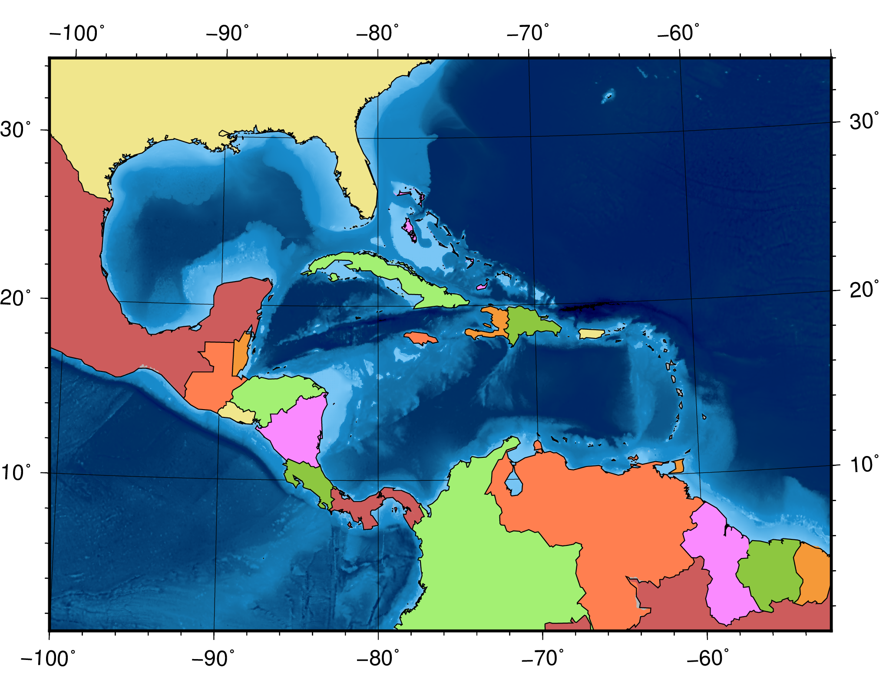
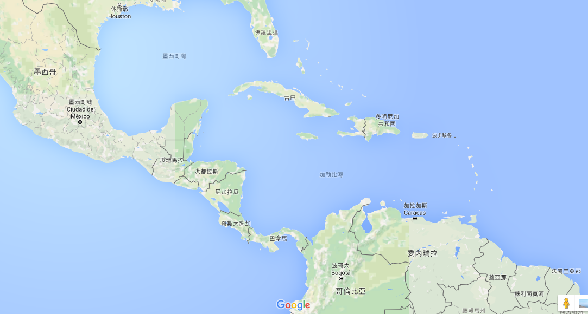
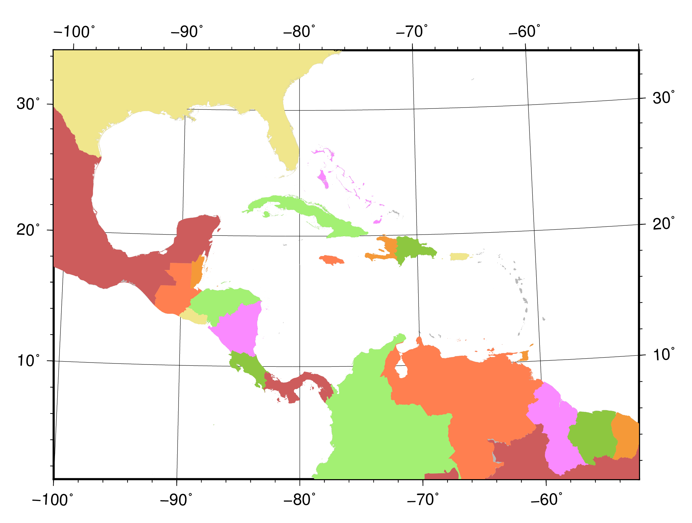
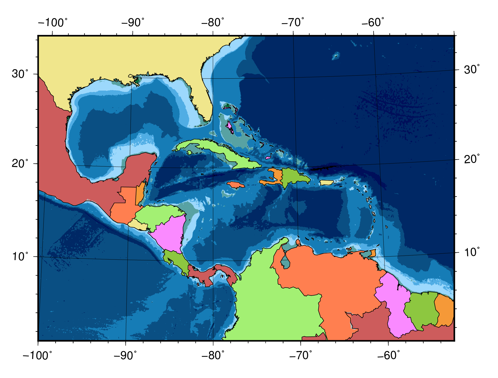

======================================
畫筆與調色技巧
======================================

為了有效的在地圖上呈現資料，顏色與線條樣式應要謹慎選擇。為地圖挑選\
合適的配色是門藝術，地圖製作者通常都會花上許多時間，把地圖調整成看起來\
最調和、最舒服的外觀。這裡我們要介紹如何在 GMT 中操作相關設定，\
讓你能夠更快的找到心目中的完美配色。

目標
--------------------------------------
製作一張中美洲的地圖，海域部份為分層設色地形圖，陸域部份則依國家來著色，\
如下圖所示。被中美地峽與島嶼群圍起來的區域為\
`加勒比海 <https://zh.wikipedia.org/wiki/%E5%8A%A0%E5%8B%92%E6%AF%94%E6%B5%B7>`_，\
而左上方的海灣則為\ `墨西哥灣 <https://zh.wikipedia.org/wiki/%E5%A2%A8%E8%A5%BF%E5%93%A5%E6%B9%BE>`_。\
圖中可以找到此區域的十幾個比較大的國家，也可以發現加勒比海和墨西哥灣，\
都比東北方的大西洋要淺得多。

.. _最終版地圖:

直接觀看\ `指令稿`_

使用的指令與概念
--------------------------------------
- ``makecpt`` - **製作或調整色階檔**
- ``pscoast`` - **為國家上色**
- ``grdimage`` - **繪製著色影像**
- 如何指定作圖顏色
- 畫筆的屬性設定
- 如何製作與修改色階檔
- 疊加多個圖層
- 在腳本中使用變數以美化排版

前置作業
--------------------------------------
在本章中，我們一樣會使用 `ETOPO`_ Bedrock 資料庫來繪製海底地形。有關 `ETOPO`_ 的詳細說明，\
請參閱「\ :doc:`coloring_topography`\ 」。檔案可以在 `ETOPO`_ 的網站下載 (ETOPO1 Bedrock -> 
grid-registered: netCDF)，或是使用如下快速連結下載：

`下載 ETOPO1 Bedrock netCDF 檔`_ (383M，解壓後約 891M)

.. _ETOPO: https://www.ngdc.noaa.gov/mgg/global/global.html
.. _下載 ETOPO1 Bedrock netCDF 檔: https://www.ngdc.noaa.gov/mgg/global/relief/ETOPO1/data/bedrock/grid_registered/netcdf/ETOPO1_Bed_g_gmt4.grd.gz

本次的作圖區域，是 ``-R-100/1/-50/34r``，如以下 *Google Map* 截圖所示。\
有關 ``-R`` 的詳細說明，請參閱「\ :doc:`making_first_map`\ 」。

另外，我們這次也會使用到 `cpt-city`_ 的 ``mby`` 色階。你可以從\
`cpt-city 網頁 <http://soliton.vm.bytemark.co.uk/pub/cpt-city/mby/tn/mby.png.index.html>`_\ 上下載，\
也可以直接從\ :download:`這邊 <coloring_topography/mby.cpt>`\ 下載。

.. _cpt-city: http://soliton.vm.bytemark.co.uk/pub/cpt-city

操作流程
--------------------------------------
我們先來分析一下目標的地圖。在此地圖中有很多不同的元素，依照固定的順序疊加。\
如果認真檢查，這些元素可以分成三群，由底層到頂層分別為

- 地形圖
- 格線，它覆蓋在海底地形上面
- 國家的著色，它把格線和海底地形都覆蓋掉了

因此，我們的 GMT 繪圖腳本，應該也要照如上的順序進行繪圖，也就是說程式碼看起來會長這樣

.. code-block:: bash

    第一段：海底地形圖 (psimage)
    第二段：格線 (可以併在 psimage -B 的選項來畫)
    第三段：國家邊界與著色 (pscoast)

海底地形圖和國家著色，都必需要指定繪圖的顏色或色階，所以這裡我們先來看看單一的顏色要怎麼指定。\
最簡單，並也在之前的章節使用的一種方法，就是指定顏色的名稱。GMT 支援了超過百種顏色的名稱，\
可以在\ `這邊 <http://gmt.soest.hawaii.edu/doc/5.2.1/gmtcolors.html#list-of-colors>`_\
查看並使用。例如說以下指令

.. code-block:: bash

    pscoast -Ggreen    # ...後續省略

可以把陸域染成綠色。由於這裡我們要著色的是國家，所以得先介紹另外一個 ``pscoast``
的選項 ``-F`` 才行。``-F`` 會讀取一個稱為 `DCW <https://www.soest.hawaii.edu/pwessel/dcw/>`_ 
的資料庫，使用內含的國家邊界資料進行著色。``-F`` 的語法大致為

.. code-block:: bash

    -F代碼1,代碼2,...+g填色+p畫筆

其中的\ ``代碼``\ 指的是 `ISO 3166-1 alpha-2 <https://en.wikipedia.org/wiki/ISO_3166-1_alpha-2>`_
國家名稱的二位字母代碼，例如 ``TW`` 代表台灣，``US`` 代表美國等等。除了可以從維基百科查詢這些代碼以外，\
也可以輸入以下指令，直接在 GMT 中查詢：

.. code-block:: bash

    $ pscoast -F+l    # 在螢幕中列出二位字母國碼
    # 或
    $ pscoast -F+L    # 在螢幕中列出二位字母國碼與幾個大國家的省份碼

這邊順便舉個方便的技巧：如果你想查詢特定國家 (已經知道英文國名) 的代碼，可以使用 ``sh`` 內建的
``grep`` 指令來輔助查詢。如下這樣：

.. code-block:: bash

    $ pscoast -F+l | grep -i japan
    List of ISO 3166-1 alpha-2 codes for DCW supported countries:

    Africa [AF]:
    Antarctica [AN]:
    Asia [AS]:
    Europe [EU]:
    Oceania [OC]:
    North America [NA]:
    South America [SA]:
      JP    Japan

這邊的 ``-i`` 選項是「大小寫視為相同」之意。你會看到在最後一行中，就出現了日本的代碼 ``JP``。

.. attention::

    1. 在 GMT 5.2 之後的版本，``-F`` 換成了 ``-E``，但選項內容不變。
    2. 如果你的作業系統是 **Windows**，內建會沒有 ``grep``，但你可以使用替代的指令
       ``findstr`` 來操作，如下：

       .. code-block:: bash

           $ pscoast -F+l | findstr /i japan

.. tip::

    如果你想要使用 ``grep`` 一次查詢多個國家，可以使用如下語法：

    .. code-block:: bash

       $ pscoast -F+l | grep -i 'japan\|singapore\|zealand'

    這樣程式會一次把日本、新加坡跟紐西蘭的代碼找出來。

接下來就是\ ``填色``。GMT 實際上支援了六種顏色表達方式，分別為

.. code-block:: bash

    「green」         # 1. 使用顏色名稱
    「255/99/71」     # 2. 使用 R/G/B 值 (從 0 到 255)，左邊這是蕃茄色
    「#87CEEE」       # 3. 使用 HTML 標記的顏色表示法 (#RRGGBB，十六進位)，左邊這是天藍色
    「25-0.86-0.82」  # 4. 使用 H-S-V 值 (前者從 0 到 255，後兩者從 0 到 1)，左邊這是巧克力色
    「8/8/0/2」       # 5. 使用 C/M/Y/K 值 (百分比表示)，左邊這是薰衣草色
    「169」           # 6. 灰階號碼，此例相當於 R/G/B 的 169/169/169

你可以使用你喜歡的表達方式給定顏色。這邊我們要試著幫墨西哥 (代碼 ``MX``) 塗上磚紅色，\
使用 HTML 標記的代碼 ``#CD5C5C``，語法如下：

.. code-block:: bash

    $ pscoast -R-100/1/-50/34r -JM6i -FMX+g#CD5C5C -P > central_america.ps

成品就會看到有個磚紅色的區塊，這就是墨西哥的國土。

因為我們等一下會為不同的國家塗上不同的顏色，為了程式碼的美觀，可以把顏色和對應的國家先以變數的\
方式存放，之後執行 ``pscoast`` 再使用這些變數。這種方式除了可以整齊排版，更利於之後的編輯修改。\
每個 shell 指定變數的方式略有不同，這裡以 ``bash`` 為示範，變數的指定與取方式為：

.. code-block:: bash

    變數名稱='變數內容'     # 指定變數
    ${變數名稱}            # 存取變數 (這串文字會被'變數內容'取代掉)

把上述語法套用到我們的例子中，就像是這樣：

.. code-block:: bash

    color1='#CD5C5C'
    colorgroup1='MX,BR,PA'
    pscoast -R-100/1/-50/34r -JM6i -F${colorgroup1}+g${color1} -P > central_america.ps

以上腳本可以把墨西哥 (``MX``)、巴拿馬 (``BR``)、巴西 (``PA``) 一次塗上磚紅色。如果你想要更改\
顏色或國家，只要修改變數 ``colorgroup1`` 或 ``color1`` 的內容即可，不需要動到 ``pscoast``
的指令。

.. tip::

    1. 由於不同的指令列環境有不同的變數設定方式，而且是值得另闢章節討論的話題，在此我們先略過這些內容以\
       集中精神在 GMT 指令上。有關於變數指定的細節，請參考你所使用的 shell 如 cmd、bash 或 csh 
       等的技術專書或網頁。
    2. 有許多不錯的網頁調色盤，如 `HTML color codes <http://html-color-codes.info/>`_，可以\
       幫助你用視覺化的方式挑選你想要的顏色，然後再把色碼貼到腳本變數中就行了。好好尋找你想要的顏色吧！

接下來，只要依樣畫葫蘆，把所有的鄰近國家都填上顏色就可以了：

.. code-block:: bash

    # ==== 設定顏色與對應的國家 ====
    # mexico, panama, brazil
    color1='#CD5C5C'
    colorgroup1='MX,BR,PA'
    # guatemala, venezuela, jamaica
    color2='coral'
    colorgroup2='GT,JM,VE'
    # united states, puerto rico, salvador
    color3='240/230/140'
    colorgroup3='US,PR,SV'
    # belize, french guiana, haiti, trinidad and tobago
    color4='0/36/74/4'
    colorgroup4='BZ,GF,HT,TT'
    # honduras, colombia, cuba
    color5='97-0.52-0.94'
    colorgroup5='CO,CU,HN'
    # nicaragua, guyana, bahamas
    color6='250/138/255'
    colorgroup6='BS,GY,NI'
    # costa rica, suriname, dominican
    color7='#8DC740'
    colorgroup7='CR,DO,SR'
    # other countries
    color0='169'

    # ==== 主要指令 ====
        # 底圖
    pscoast -R-100/1/-50/34r -JB-80.27/8.58/-8/24/6i -K -Dh \
            -Bafg -G${color0} -P > central_america.ps
        # 國家上色
    pscoast -R -J -O -K -F${colorgroup1}+g${color1} >> central_america.ps
    pscoast -R -J -O -K -F${colorgroup2}+g${color2} >> central_america.ps
    pscoast -R -J -O -K -F${colorgroup3}+g${color3} >> central_america.ps
    pscoast -R -J -O -K -F${colorgroup4}+g${color4} >> central_america.ps
    pscoast -R -J -O -K -F${colorgroup5}+g${color5} >> central_america.ps
    pscoast -R -J -O -K -F${colorgroup6}+g${color6} >> central_america.ps 
    pscoast -R -J -O -F${colorgroup7}+g${color7} >> central_america.ps

在\ ``設定顏色與對應的國家``\ 的部份，我們總共指定了 7 種顏色與 22 個國家。``color0`` 
是灰色，用於中美洲其餘的國家。而在\ ``主要指令``\ 中，``底圖``\ 內的指令會為所有的國家\
先著上灰色的 ``color0``，然後再依照先前指定的顏色鋪上新的圖層 (灰色圖層其實還是在，不過被後來\
的上色指令掩蓋了)。注意這邊的 ``-J`` 選項使用了 ``B``，這是另一種稱為
`Albers 投影 <https://zh.wikipedia.org/wiki/%E4%BA%9A%E5%B0%94%E5%8B%83%E6%96%AF%E6%8A%95%E5%BD%B1>`_\
的地圖投影法，是一種圓錐型投影，可使地圖上的每個區域面積保持一致。它的語法為

.. code-block:: bash

    -JB投影中心經線/投影中心緯線/圓錐上端緯線/圓錐下端緯線/地圖尺寸

整個腳本執行的結果如下所示 (中文註解可能要改成英文才可順利執行)。由於格線是下在第一行指令，\
所以造成了「陸地覆蓋在格線上」的效果。

.. note::

    關於其他的指令選項如 ``-O``、``-K`` 的解說，請至「\ :doc:`making_first_map`\ 」\
    或「\ :doc:`coloring_topography`\ 」查看。另外，不知道你有沒有發現換了投影方法的同時，\
    邊框的形式也會跟著變化？有關邊框進一步的設定，請參閱\ **之後的章節**。

接下來，我們再為國界和海岸線畫點線，國家就會更突顯出來。在\ :doc:`making_first_map`\ 中，\
我們曾經提及線條的「畫筆樣式」由三個部份組成：``粗細,顏色,樣式``。``粗細`` 可以為預先定義好的\
名稱，像是 ``thinner``、``thickest``，``fat``\ 等等，總共有 12 個，所有的名稱可以在\
`此連結 <http://gmt.soest.hawaii.edu/doc/5.1.0/GMT_Docs.html#specifying-pen-attributes>`_\
查詢。如果你想要自訂粗細，也可以使用 ``c`` (公分)、``i`` (英吋)、``p`` (點) 等長度單位，如 ``0.1c``
就是 0.1 公分。畫筆的\ ``顏色``\ 與上述的色碼通用，選你喜歡的表達方式即可。畫筆的\ ``樣式``\
預設是連續線條，你可以使用 ``-`` (折線) 與 ``.`` (點) 自由的混搭樣式，如 ``-..`` 會畫出\
折線中間間隔兩個點的線條。以下是一些示範：

.. code-block:: bash

    thinner,green,-     # 綠色的細折線
    3p,100/0/100,.      # 3 點寬，深紫色的點線
    1c,#555555,--..     # 1 公分寬，灰色的 "--.." 樣式線條

``pscoast`` 有三個跟畫線有關的指令，分別為

.. code-block:: bash

    -I編號/畫筆          # 畫上河流
    -N編號/畫筆          # 畫上政治邊界
    -W編號/畫筆          # 畫上水域邊界

其中 ``-I`` 和 ``-N`` 的編號已在\ :doc:`coloring_topography`\ 中介紹過，而 ``-W`` 的編號\
可以為``1``、``2``、``3`` 及 ``4``，分別代表海岸線、湖岸線、湖中島岸線、湖中島中湖岸線。這裡我們\
就把海岸線和國界線用 ``thinner`` 等級的線條來畫畫看，順便再用一次 ``-B``，把被填色區域的\
多邊形遮到的部份邊框給補回來。

.. code-block:: bash

    # (前略)
    # ==== 主要指令 ====
        # 底圖
    pscoast -R-100/1/-50/34r -JB-80.27/8.58/-8/24/6i -K -Dh \
            -Bafg -G${color0} -P > central_america.ps
        # 國家上色
    # (中略)
    pscoast -R -J -O -K -F${colorgroup7}+g${color7} >> central_america.ps
        # 國界
    pscoast -R -J -O -D -W1/thinner -N1/thinner -Bf >> central_america.ps

這次的成品看起來就像這樣：

.. image:: pen_and_painting/pen_and_painting_fig4.png

接下來，我們就要來為海底地形上色了。你當然可以直接使用 ``grdimage``，不加任何顏色設定，\
像是如下的腳本

.. code-block:: bash

    # (前略)
    # ==== 主要指令 ====
        # 底圖
    grdimage ETOPO1_Bed_g_gmt4.grd -JB-80.27/8.58/-8/24/6i \
             -R-100/1/-50/34r -P -K > central_america.ps
    pscoast -R -J -O -K -Dh -Bafg -G${color0} >> central_america.ps
        # 國家上色
    # (後略)

會得到如下的地圖

.. image:: pen_and_painting/pen_and_painting_fig5.png

如果你覺得海床的部份著色很奇怪 (很少見到海是用綠色著色的)，那就是自己動手修改的時候了。\
第一步當然是從已經建立好的色階表搜尋，所以我們就再用一次 `cpt-city`_ 的 ``mby`` 色階\
看看。下載好色階表後，放到與腳本相同的資料夾中，然後為 grdimage 加上 ``-C`` 選項：

.. code-block:: bash

    # (前略)
    # ==== 主要指令 ====
        # 底圖
    grdimage ETOPO1_Bed_g_gmt4.grd -JB-80.27/8.58/-8/24/6i \
             -R-100/1/-50/34r -P -K Cmby.cpt > central_america.ps
    pscoast -R -J -O -K -Dh -Bafg -G${color0} >> central_america.ps
        # 國家上色
    # (後略)

這次海的顏色看起來比較「像海」了：

.. image:: pen_and_painting/pen_and_painting_fig6.png

當然這張地圖還是有些小問題，你會發現有些海域被塗上綠色，而非傳統所見的藍色。我們接下來的目標，\
就是\ **微調色階檔，讓這些綠色的區域以更淺的藍色代替**。要作到這件事，我們必須先了解色階檔\
是怎麼指定繪圖顏色的。請用文字編輯器打開 ``mby.cpt``，你應該會看到如下的內容

.. code-block:: bash

    # mby.cpt by M. Burak YIKILMAZ
    # 
    # (original title gmt_color.cpt) 
    #
    # COLOR_MODEL = RGB
    -8000   0   0   80      -6000   0   30  100
    -6000   0   30  100     -4000   0   50  102
    -4000   0   50  102     -2500   19  108 160
    -2500   19  108 160	    -150    24  140 205
    -150    24  140 205	    -50     135 206 250
    -50     135 206 250     -10     176 226 255
    -10     176 226 255     0       0   97  71
    0       0   97  71      50      16  123 48
    50      16  123 48      500     232 214 125
    500     232 214 125     1200    163 68  0
    1200    163 68  0       1800    130 30  30
    1800    130 30  30      2800    161 161 161
    2800    161 161 161     4000    206 206 206
    4000    206 206 206     5000    255 255 255
    B	-
    F	-
    N	128	128	128

檔案中記載了所有色階檔的設定：

- ``COLOR_MODEL = RGB`` 定義了在此色階檔的所有顏色數值是以 RGB 數值呈現。
- 色階表的主要部份由 8 欄資料所構成，第 1 欄和第 5 欄是 z 值的範圍 (在我們的例子中，\
  z 值就是高度值)，第 2-4 欄是對應於第 1 欄的 RGB 值，第 6-8 欄是對應於第 5 欄的 RGB
  值。以色階表的第一行為例，它定義了在 ``z = -8000`` 時要使用 ``0/0/80`` 著色，
  ``z = -6000`` 時要使用 ``0/30/100`` 著色，如果 z 值介於這兩者中間，就用線性內插的方式\
  找到對應於不同 z 值的顏色。也就是說，``mby.cpt`` 基本上是\ **連續的色階**，不同的高度會有\
  不同的顏色，色階表中定義了幾個「\ **錨點**\ 」，GMT 會根據這些錨點內插出整個色階。
- ``B`` 是指當 z 值低於色階表中的最小值時，所呈現的顏色。這裡的 ``-`` 代表不著色。
- ``F`` 是指當 z 值高於色階表中的最大值時，所呈現的顏色。這裡的 ``-`` 代表不著色。
- ``N`` 是指當 z 值為 ``NaN`` 時，所呈現的顏色。這裡使用的是灰色。

最簡單的修改方式，就是利用文字編輯器把偏綠的顏色改成偏藍的顏色。從色階表中看起來，問題是出在
``z = -10 到 0`` 之間，因為 ``z = 0`` 時的顏色是 ``0/97/71``。你可以把它改成任一個偏藍的顏色，\
存檔後再用上述指令畫畫看，應該就能得到不錯的結果。

不過在這裡，我們要介紹一個更好用的指令 - ``makecpt``，它可以幫你創造或線性調整色階檔。它的基本語法為

.. code-block:: bash

    makecpt -C色階名稱或色階檔 [-T最小值/最大值/錨點間距] [-Z]

``-C`` 選項用於輸入參考色階，可以是某個已存在的檔名如 ``mby.cpt``，或是 GMT 預先定義好的色階名稱。\
在 GMT 5 中總共有 36 個預先定義好的色階，可以直接輸入

.. code-block:: bash

    $ makecpt

然後在 ``-C`` 的說明中就可以看到這些色階的名字。我們先來試試看其中一個叫 ``ocean`` 的色階看看：

.. code-block:: bash

    $ makecpt -Cocean
    -8000	0/2.5/12.5		-7000	0/2.5/12.5
    -7000	0/7.5/37.5		-6000	0/7.5/37.5
    -6000	0/45/87.5		-5000	0/45/87.5
    -5000	0/115/162.5		-4000	0/115/162.5
    -4000	43/173.5/192		-3000	43/173.5/192
    -3000	129/221/176		-2000	129/221/176
    -2000	191.5/247.5/189.5	-1000	191.5/247.5/189.5
    -1000	230.5/252.5/233		0	230.5/252.5/233
    B	black
    F	white
    N	127.5

輸入完指令後，螢幕上就會顯示這個色階表的初始設定。你會發現這個色階表只有 4 欄，這是因為\
它把 RGB 值併做一個欄位了。另外，第 2 欄與第 4 欄的顏色值一模一樣，意味著在某個 z 值區段中，
會使用相同的顏色，這種色階稱為\ **離散的色階**，例如這個色階表，只會使用 8 種顏色幫海域上色。\
如果要調整 z 值區間，要使用 ``-T`` 選項，其中的\ ``錨點間距``\ 意味著程式每隔多少 z 值就會\
內插一個錨點並把顏色記載在色階檔中。而加上 ``-Z`` 選項的話，就可以把離散的色階變成連續的色階。\
例如以下指令：

.. code-block:: bash

    $ makecpt -Cocean -T-1000/0/250 -Z
    -1000	black	        -750	0/10/50
    -750	0/10/50	        -500	0/150/200
    -500	0/150/200	-250	172/245/168
    -250	172/245/168	0	250/255/255
    B	black
    F	white
    N	127.5

如此一來色階的 z 值會重新定義在 -1000 到 0 這個區間，並且每隔 250 才取一個錨點。加上 ``-Z`` 之後，\
第 2 欄與第 4 欄的顏色值會不一樣；精確的來說，第 4 欄的顏色值會跟下一行的第 2 欄的顏色值一模一樣，\
這樣畫出來才會有連續的效果。如果你要把它儲存為新的色階檔，只要利用重導向指令即可：

.. code-block:: bash

    $ makecpt -Cocean -T-1000/0/250 -Z > ocean_new.cpt

.. attention::

    如果你下的是這個指令，然後看到了以下錯誤

    .. code-block:: bash

        $ makecpt -Cocean -T-1000/0/250 -Z > ocean.cpt
        makecpt: Error: CPT file ocean.cpt has no z-slices!
        [Session makecpt (0)]: Error returned from GMT API: GMT_CPT_READ_ERROR (8)

    那是因為你使用了同名的輸出。``makecpt`` 的 ``-C`` 選項實際上會忽略副檔名，\
    也就是說 ``-Cocean`` 與 ``-Cocean.cpt`` 是相同的，在這個指令中，你是從新建的 ``ocean.cpt``
    讀取數據，而不是從 GMT 內建的 ``ocean`` 色階讀取。如要避免這種情況，請先把在資料夾中的
    ``ocean.cpt`` 刪掉，然後\ **避免使用與 GMT 內建色階名稱同名的色階檔**\ 即可。

在本例中，我們要修改的是 ``mby.cpt``，想讓 ``z = 0`` 時會顯示的綠色消失，有一個作法是把它改成\
離散的色階檔，如下所示：

.. code-block:: bash

    # (前略)
    # ==== 主要指令 ====
        # 底圖
    makecpt -Cmby.cpt > ocean_new.cpt
    grdimage ETOPO1_Bed_g_gmt4.grd -JB-80.27/8.58/-8/24/6i \
             -R-100/1/-50/34r -P -K Cocean_new.cpt > central_america.ps
    # (後略)

輸出會如下所示，請把它跟前一張圖比較看看：

明顯的改變是，海床的部份變成了分層設色圖，不同顏色的邊界構成了數條橫亙海中的等高線。\
另外不那麼明顯的改變是，綠色的地方雖然沒有變成藍色，但是著色變淺了。這是因為在新的色階圖中，
``z = -10`` 到 ``0`` 的著色，使用的是原本連續色階檔中 ``z = -5`` 的內插顏色值，所以\
還是有一點點綠色的成份。

看來我們還得再做些修改才行。由於 ``makecpt`` 是\ **線性的調整色階檔**\ ，所以我們還有一招：調整\
原本色階檔的 z 值範圍。原本的色階檔 z 值定義在 ``-8000`` 到 ``5000``，如果我們把它改成
``-8000`` 到 ``5100``，那麼原本 ``z = 0`` 時的顏色，就會依比例調整到 ``z = 61.5`` 
左右時的顏色。來試試看吧：

.. code-block:: bash

    # (前略)
    # ==== 主要指令 ====
        # 底圖
    makecpt -Cmby.cpt -T-8000/5100/1000 -Z > ocean_new.cpt
    grdimage ETOPO1_Bed_g_gmt4.grd -JB-80.27/8.58/-8/24/6i \
             -R-100/1/-50/34r -P -K Cocean_new.cpt > central_america.ps
    # (後略)

.. image:: pen_and_painting/pen_and_painting_fig8.png

畫出來會發現，怎麼綠色的區塊比剛才還多？先別緊張，這是因為我們的 ``-T`` 選項還沒調整好的\
緣故。注意 ``-T`` 選項中的間距是 ``1000``，這表示新的色階檔中，每 ``1000`` 公尺才會取一個\
錨點。由於錨點取太少的緣故，導致在 ``z = -1000`` 公尺左右的顏色，就會開始往 ``z = 0`` 左右的\
綠色漸變。如果想要避免這種現象，只要把錨點取得密一點就行了。在完成版的指令稿中，我們使用的\
間距值是 ``50``，這樣就可以有效的避免綠色出現在海洋的著色當中。

指令稿
--------------------------------------

本地圖的最終指令稿如下：

.. code-block:: bash

    # ==== 設定顏色與對應的國家 ====
    # mexico, panama, brazil
    color1='#CD5C5C'
    colorgroup1='MX,BR,PA'
    # guatemala, venezuela, jamaica
    color2='coral'
    colorgroup2='GT,JM,VE'
    # united states, puerto rico, salvador
    color3='240/230/140'
    colorgroup3='US,PR,SV'
    # belize, french guiana, haiti, trinidad and tobago
    color4='0/36/74/4'
    colorgroup4='BZ,GF,HT,TT'
    # honduras, colombia, cuba
    color5='97-0.52-0.94'
    colorgroup5='CO,CU,HN'
    # nicaragua, guyana, bahamas
    color6='250/138/255'
    colorgroup6='BS,GY,NI'
    # costa rica, suriname, dominican
    color7='#8DC740'
    colorgroup7='CR,DO,SR'
    # other countries
    color0='169'

    # ==== 主要指令 ====
        # 底圖
    makecpt -Cmby.cpt -T-8000/5100/50 -Z > ocean_new.cpt
    grdimage ETOPO1_Bed_g_gmt4.grd -JB-80.27/8.58/-8/24/6i \
             -R-100/1/-50/34r -P -Cocean_new.cpt -K > central_america.ps
    pscoast -R -J -O -K -Dh -Bafg -G${color0} >> central_america.ps
        # 國家上色
    pscoast -R -J -O -K -F${colorgroup1}+g${color1} >> central_america.ps
    pscoast -R -J -O -K -F${colorgroup2}+g${color2} >> central_america.ps
    pscoast -R -J -O -K -F${colorgroup3}+g${color3} >> central_america.ps
    pscoast -R -J -O -K -F${colorgroup4}+g${color4} >> central_america.ps
    pscoast -R -J -O -K -F${colorgroup5}+g${color5} >> central_america.ps
    pscoast -R -J -O -K -F${colorgroup6}+g${color6} >> central_america.ps 
    pscoast -R -J -O -K -F${colorgroup7}+g${color7} >> central_america.ps
        # 國界
    pscoast -R -J -O -D -W1/thinner -N1/thinner -Bf >> central_america.ps

.. note::

    「繪製國界與海床地形圖：以 **100W - 50W，1N - 34N** 為邊界，Albers 圓錐投影，\
    地圖橫向寬 **6** 吋，直幅繪圖，國家使用 8 種不同的顏色著色，為國界和海岸線加上黑色\
    細線條，海底地形使用 ``ETOPO1 Bedrock`` 資料，以 ``ocean_new.cpt`` 為色階上色，\
    這個色階是從 ``mby.cpt`` 修改而來，目的是把海床的顏色重新分配，使其不包含綠色的色階。\
    邊框使用 GMT 的預設格式與間距。」

觀看\ `最終版地圖`_

習題
--------------------------------------

1. 仿造此章節的地圖，畫出南海 (*South China Sea*) 的海底地形與週邊國家圖。座標可使用
   ``95E 至 123E``，以及 ``0N 至 26N``。可使用本章節的顏色或自行調整你愛的搭配。
2. 有沒有辦法把香港與海南島塗上與中國不同的顏色？
