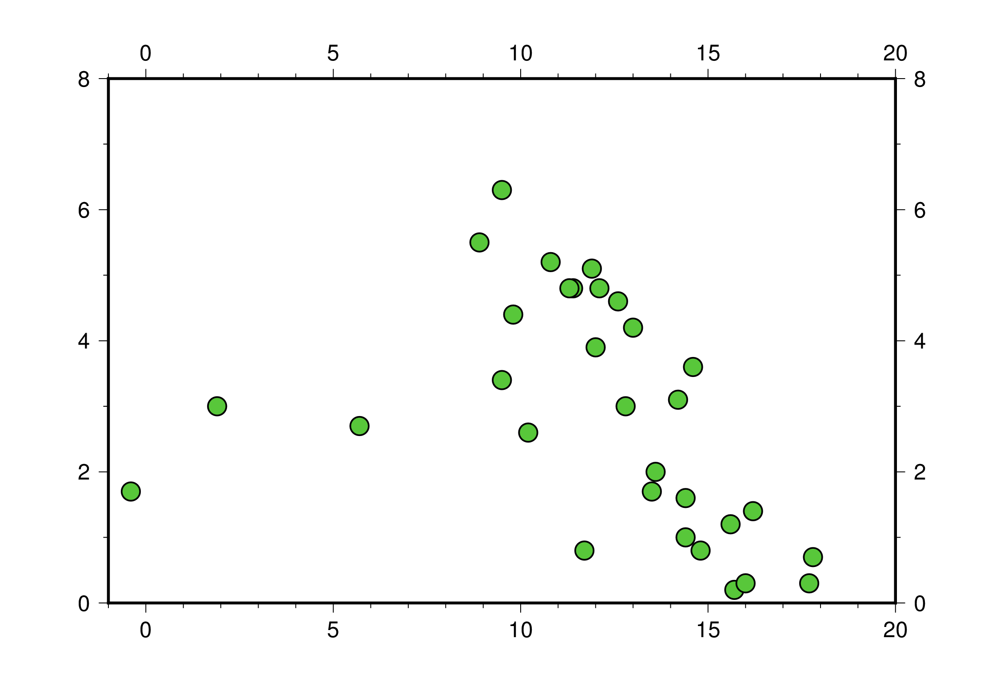

======================================
XY 點散佈圖
======================================

在數據分析中最重要也最常用的圖表形式，非 XY 散佈圖莫屬。雖然 GMT 是繪製地圖的專門工具，\
但它仍然能處理跟地理空間無關的資料，並做出精美的視覺化分析。在本章中，將會解說用來繪製點、線、面的\
重要指令 ``psxy``，以及一些衍伸的作圖設定技巧，這些技巧實際上在處理地理空間資料時，仍然適用。

目標
--------------------------------------
使用台灣\ *中央氣象局*\ 的氣象資料，製作風速 (Wind Speed) 對氣溫 (Temperature) 的 XY 散佈圖。\
圖中使用了 2016 年 1 月，位於竹子湖 (Zhuzihu) 與蘇澳 (Su'ao) 兩個測站的每日資料，並用不同顏色與不同標記表示。\
在圖中可以看出幾點有趣的事情：

- 風速與氣溫看來呈現負相關，也就是說，氣溫越低，風速越快。
- 一般來說，竹子湖的氣溫要比蘇澳來得冷一點，而且蘇澳在一月份還有超過攝氏 20 度以上的日子。
- 竹子湖有一天的溫度掉到了攝氏 0 度以下。事實上，這天是竹子湖\
  睽違了 11 年後，再度下雪的日子\ [#]_。\
  這些受「超級寒流」影響的資料點，看起來就像是整個負相關趨勢的離群值。

.. _最終版圖片:

.. image:: scatter_plot/windspeed_vs_temperature.png

直接觀看\ `指令稿`_

使用的指令與概念
--------------------------------------
- ``psxy`` - **繪製點、線與多邊形**
- ``psbasemap`` - **設定繪圖區、座標軸與邊框**
- ``pstext`` - **在圖上標記文字**
- 外部指令 ``echo`` - **把資料輸入到管線命令中**
- GMT 共用選項：``-JX`` (直角座標作圖)
- 如何輸入 ASCII (純文字) 格式的資料到 GMT 中
- 如何從螢幕或腳本輸入資料到 GMT 中 (標準輸入重導向)
- 繪製 XY 散佈圖
- 設定座標軸標籤與特殊文字的處理方法
- 製作簡易的圖例
- 正確設定 ``-O`` 與 ``-K`` 的小技巧

前置作業
--------------------------------------
我們這次使用的資料是\ **中央氣象局的天氣觀測紀錄**\ 。這些資料可以從中央氣象局建置的「\
`觀測資料查詢系統 <http://e-service.cwb.gov.tw/HistoryDataQuery/index.jsp>`_\ 」取得。選擇\
位於臺北市 (TaipeiCity) 的竹子湖 (ZHUZIHU) 測站，資料格式為「月報表」，時間為 2016 年 1 月，\
按下查詢鈕後，應該會看到如下頁面：

.. image:: scatter_plot/scatter_plot_fig1.png

把表格全選後複製貼上到 *Microsoft Excel* 或 *Libre Office Calc* 之類的試算表軟體，資料就會自動對到不同的欄位。\
接下來，你可以選擇以下兩種作法的任一種：

1. 直接在試算表軟體中刪除不要的資料，只留「氣溫」與「風速」兩欄。把第一列「檔頭列」(也就是欄位名稱) 也刪除，\
   接著「另存新檔」為逗號分隔檔 (``.csv`` 檔)。
2. 把第一列「檔頭列」(欄位名稱) 刪除，「另存新檔」為逗號分隔檔 (``.csv`` 檔)，再使用 shell 指令操作逗號分隔檔。\
   例如在大部分的 Linux shell 下，可以使用

   .. code-block:: bash

       $ cut -d ',' -f 8,17 你的檔案.csv > 新檔案.csv

   其中第 8 欄和第 17 欄分別就是「氣溫」與「風速」的資料。

處理完的 ``.csv`` 檔可以直接使用文字編輯器打開，以竹子湖的資料為例，前幾欄應該會是這樣

.. code-block:: bash

    14.6,3.6
    15.7,0.2
    16,0.3
    17.7,0.3
    17.8,0.7
    # ....以下略....
    # 第 1 欄：氣溫 (攝氏)；第 2 欄：風速 (秒/公尺)

如此一來資料就整理成 GMT 的輸入格式了。再次使用同樣流程，可以取得位於宜蘭縣 (YiLanCounty) 的蘇澳 (SU-AO) 測站\
的相同資料，把它們命名為 ``zzh.txt`` (竹子湖) 與 ``suao.txt`` (蘇澳)。GMT 並不依據副檔名讀取純文字資料，但是相對的，\
它只接受兩種欄位分隔符號：「\ **空格**\ 」與「\ **逗號**\ 」。在把資料輸入 GMT 前，務必確認你的資料能被 GMT 正確讀取。

.. tip::

    事實上，你也可以不用刪除任何檔頭和欄位，只要把資料存成 ``.csv`` 檔或其他 GMT 能接受的純文字格式，GMT 
    自己就有帶有功能選項來讀取資料表中的特定欄位，請參考 GMT 官方手冊或\ **之後的章節**。

為了方便起見，你也可以直接從以下連結取得本章節會使用的檔案：

:download:`zzh.txt <scatter_plot/zzh.txt>`

:download:`suao.txt <scatter_plot/suao.txt>`

操作流程
--------------------------------------
``psxy`` 是用來把點資料描繪到地圖上的工具。對於一般不與地理座標相關的資料，在畫圖時的 ``-J`` 選項是
``-JX``，GMT 會使用單純的直角座標來畫圖。至於要怎麼決定 ``-R`` 的範圍？你可以先用文字編輯器稍微查看\
一下所有資料的數值，第一欄會被解讀成 X 值，第二欄則會被解讀成 Y 值，因此，所有的資料都會落在
``-1/20/0/8`` 這個區間內。馬上來畫畫看我們的資料：

.. code-block:: bash

    $ psxy zzh.txt -R-1/20/0/8 -JX15c -P -Bafg > zzh.ps

.. image:: scatter_plot/scatter_plot_fig2.png

雖然資料是畫上去了，不過這並不是我們想要的樣子...這是因為 ``psxy`` 的預設繪圖模式為\ **折線圖**\ ，\
會把所有的點以線連接起來，如果我們只想要 ``psxy`` 畫點，必須要加上 ``-S`` 選項。此選項除了使 ``psxy`` 轉換\
成\ **散佈圖**\ 模式外，還可以使用以下語法設定資料點的樣式：

.. code-block:: bash

    -S代號[尺寸]

``代號`` 為單一字元的符號，而尺寸指定的東西則依符號的不同而不同。完整的代號列表可以在\
`psxy 的說明頁面 <http://gmt.soest.hawaii.edu/doc/5.1.2/psxy.html#optional-arguments>`_\ 找到。\
舉個例子，``-Sc0.25c`` 是把資料點設為直徑為 ``0.25cm``
的圓形 (``c``，circle)，而 ``-Sd3c`` 則是外接圓直徑為 ``3cm`` 的菱形 (``d``，diamond)。\
**如果不給尺寸的話，GMT 會尋找資料檔案中的第三欄，並且以其數值當作對應的資料點的尺寸**。\
這個規則在我們要畫不同大小的資料點時，非常方便。在這裡，我們的資料只有 X 與 Y 兩個屬性，因此把所有的點設成一樣大小就行了。\

另外，你會發現繪圖區目前是 15cm x 15cm 的正方形，如果你想要任意調整 X 或 Y 軸的長度的話，需要在 ``-JX`` 後分開指定，\
如 ``-JX15c/10c`` 會把 X 軸設成 15cm，Y 軸設成 10cm。讓我們使用以上新增的選項，重畫一次看看：

.. code-block:: bash

    $ psxy zzh.txt -R-1/20/0/8 -JX15c/10c -Sc0.35d \
                   -G#58C73A -W0.03c,black -P -Baf > zzh.ps
    # -G: 標記填色
    # -W: 標記外框畫筆

選擇了適當的標記樣式與填色，與粗一點的標記框線，看起來就會美觀許多。

``psxy`` 除了可以從檔案中讀取資料外，也可以從標準輸入 (stdin) 讀取資料。這樣一來，我們就可以\
直接在腳本或命令列中給定座標點。常見的作法有兩種：

1. 使用管線命令，把前一個指令的輸出傳給 ``psxy``。例如在各種作業系統終端機都有的 ``echo`` 指令：

   .. code-block:: bash

       $ echo "10.2 3.2" | psxy -選項們 > out.ps

   如此一來，(10.2, 3.2) 就會被當成座標點畫在圖上。

2. 使用標準輸入重導向搭配結束的輸入字元 (``<<`` 符號)：

   .. code-block:: bash

       $ psxy -選項們 > out.ps << END
       ...任意的多行資料...
       END

   在 ``<<`` 符號後可以為任意的字符串，此例為 ``END``。從下一行開始，一直到第二個 ``END`` 的前一行，\
   都會被當作 ``psxy`` 的輸入資訊。

為了完成本章目標，我們需要在 *x = 0* 之處畫一條灰色的垂直虛線，以表明有一個點溫度低於零度。運用
``psxy`` 預設的繪線模式與上述的第二種作法，就可以簡單的畫出。在以下的腳本中，我們順便把第二組數據也\
畫上去了，使用標記是藍色的菱形：

.. code-block:: bash

    # ==== 設定變數 ====
    zzh='zzh.txt'
    suao='suao.txt'
    zzh_style='-Sc0.35c -G#58C73A -W0.03c,black'
    suao_style='-Sd0.35c -G#3A6BC7 -W0.03c,black'
    out_ps='windspeed_vs_temperature.ps'
    # ==== 繪點 ====
    psxy $zzh  -R-1/23/0/7 -JX15c/10c -P -K $zzh_style -Baf > $out_ps
    psxy $suao -R -J -O -K $suao_style >> $out_ps
    # ==== 灰色垂直虛線 ====
    psxy       -R -J -O -W0.03c,100,-- >> $out_ps << LINEEND
    0 0
    0 7
    LINEEND

這條灰色的線寬度是 0.03cm，並且連接 (0, 0) 與 (0, 7) 兩點。

.. image:: scatter_plot/scatter_plot_fig4.png

.. note::
   
    ``psxy`` **無法同時畫線又畫點**\ 。如果你有這方面的需求 (例如繪製折線圖)，需要使用兩次
    ``psxy`` 指令，畫完線後再把點也標上去。

不知你是否覺得，以上腳本實在說不上美觀，要改動也很麻煩？問題的原因，出在第一個 ``psxy`` 指令。\
為了設定 ``-R``、``-J`` 與一些額外設定，第一個 ``psxy`` 指令硬是會比第二個 ``psxy`` 要長。\
考慮到這兩個指令在繪圖中有等量的效果 (都是畫上一組數據的散佈圖)，如果有更適當的方式，能夠先把\
該設定的選項設定好，讓兩個 ``psxy`` 的效果看起來更直觀就好了。

這時候，總算輪到 ``psbasemap`` 指令上場！``psbasemap`` 指令是\ **專門用來設定底圖與邊框**\
的指令，它不會在圖上畫上任何資料。\
在短的腳本中，我們可以透過其他指令附帶的 ``-B`` 或是其他選項來設定底圖與邊框，但是當腳本一長，\
或是當你想要調整許多有關的預設選項時，使用 ``psbasemap`` 可以讓你的腳本看起來更清晰易懂。\
讓我們再次回到這兩行指令

.. code-block:: bash

    psxy $zzh  -R-1/23/0/7 -JX15c/10c -P -K $zzh_style -Baf > $out_ps
    psxy $suao -R -J -O -K $suao_style >> $out_ps

我們可以把地圖的通用選項移到 ``psbasmap`` 中，因此以上指令也可以寫成這樣

.. code-block:: bash

    psbasemap -R-1/23/0/7 -JX15c/10c -P -K -Baf > $out_ps
    psxy $zzh  -R -J -O -K $zzh_style  >> $out_ps
    psxy $suao -R -J -O -K $suao_style >> $out_ps

如此一來，兩行 ``psxy`` 指令各自的功用就一目了然：它們只是處理並繪製不同的資料點，但繪製的方法是相同的。\
你可以把所有選項與語法格式都互相對齊以求美觀，而所有通用的設定，包括 ``-R``、``-J``、``-P``、``-B`` 等，\
全部都丟到 ``psbasemap`` 就對了。

這樣設置還有一個好處：如果你有額外的繪圖指定想插入，只要確定它會擺在 ``psbasemap`` 之後，你就可以一律\
加上 ``-O -K`` 與 ``>>`` 符號，而不用煩惱這些疊加圖層的選項正不正確。你可以把 ``psbasemap`` 想成是長腳本的\
「起手式」，先設定好共用選項與 PostScript 語言的疊加設定，之後的指令只要專注在繪圖上就行了。類似的概念也可用在腳本的\
結尾，讓我們再看看這個指令：

.. code-block:: bash

    psxy       -R -J -O -W0.03c,100,-- >> $out_ps << LINEEND
    0 0
    0 7
    LINEEND

如果你還想在這個指令後方加入新的繪圖指令，這個指令就必須新增 ``-K`` 選項以取消結尾符 (EOF) 的寫入。\
在腳本很長然後又時常更動時，檢查 ``-O -K`` 有沒有加對位置會耗上許多時間。幸好，``psxy`` 指令\
提供了一個方便的選項 ``-T``，專門用來設定腳本結尾：

.. code-block:: bash

    psxy       -R -J -O -K -W0.03c,100,-- >> $out_ps << LINEEND
    0 0
    0 7
    LINEEND
    psxy -R -J -O -T >> $out_ps

加上 ``-T`` 後，``psxy`` 不會讀取任何檔案；相對的，它唯一會寫入 ``.ps`` 檔的東西就只有 EOF。\
因此，相對於「起手式」，這一行的作用相當於為你的圖檔「關門」，只要你確定這一行擺在你的腳本最後，\
那們中間的指令只要一概都加上 ``-O -K``，繪圖就不會有問題。

現在腳本的第一個指令是以 ``psbasemap`` 開頭。當然，我們可以在這個指令中一併設定標題與座標軸標籤。\
在「\ :doc:`making_first_map`\ 」中，我們有提到標題可以使用 ``-B+t`` 添加，而在「\ :doc:`editing_cpt_colorbar`\ 」\
中，我們也提到了要使用 ``-B[x或y]+l`` 添加座標軸的標籤。因此，我們就來添加一些文字說明吧：

.. code-block:: bash

    # ==== 設定變數 ====
    zzh='zzh.txt'
    suao='suao.txt'
    zzh_style='-Sc0.35c -G#58C73A -W0.03c,black'
    suao_style='-Sd0.35c -G#3A6BC7 -W0.03c,black'
    out_ps='windspeed_vs_temperature.ps'
    # ==== 版面與作圖區設定 ====
    # -Baf 現在拆成了 -Bxaf 與 -Bya2f，
    # 你可以分開給定 x 軸與 y 軸的 a、f、g 選項！
    psbasemap -R-1/23/0/7 -JX15c/10c -P -K \
              -B+t"January 2016" \
              -Bxaf+l"Temperature (degree C)" \
              -Bya2f+l"Wind Speed (m s-1)" > $out_ps
    # ==== 繪點 ====
    psxy $zzh  -R -J -O -K $zzh_style  >> $out_ps
    psxy $suao -R -J -O -K $suao_style >> $out_ps
    # ==== 灰色垂直虛線 ====
    psxy       -R -J -O -K -W0.03c,100,-- >> $out_ps << LINEEND
    0 0
    0 7
    LINEEND
    # ==== 關門 (寫入 EOF) ====
    psxy -R -J -O -T >> $out_ps

以上腳本的出圖如下：

.. image:: scatter_plot/scatter_plot_fig5.png

嗯，座標軸標籤會同時出現在上下及左右兩邊，看起來有點多餘；另外，縱軸的單位 ``m s-1`` (秒/公尺)
的 ``-1`` 應該要上標，才是正確的寫法。除此之外，如果 ``degree C`` 能夠直接表示成 ``°C``
的話，更顯得簡潔有力。要做到以上修改並不困難，首先，我們可以先只畫左邊和下方的座標軸，然後右邊和上方的座標軸\
交給第二個 ``psbasemap`` 來畫，就可以讓座標軸只出現一次。如果要在文字中顯示上下標，需要加上 **GMT 專用的控制字元**
``@``。``@+`` 是上標，``@-`` 則是下標。被上下標控制字元包起來的字就會顯示為上下標。因此，我們只要把
``m s-1`` 改成 ``m s@+-1@+`` 即可。

.. tip::

    嚴格說來，這兩個控制字元控制的是上下標的開啟與關閉，因此 ``m s@+-1`` 其實就能使 ``-1`` 上標。\
    然而，筆者建議還是養成良好習慣，頭跟尾都加上控制字元，不只易於判讀跟修改，也跟 
    `LaTeX <https://zh.wikipedia.org/wiki/LaTeX>`_ 的語法概念類似。\
    有關控制字元可操作的其他字串設定，請參考 
    `GMT Cookbook <http://gmt.soest.hawaii.edu/doc/5.1.2/GMT_Docs.html#character-escape-sequences>`_。

至於攝氏度數的符號 (Degree sign) 就有點麻煩了。你需要參考\ **字符編碼表**\ 中度數符號的位置，再以 **8 進位的編碼**\ 輸入到字串內。
GMT 目前支援 *Standard* 與 *ISOLatin1* 兩種字符集，\
`GMT Cookbook 中也有附上編碼表 <http://gmt.soest.hawaii.edu/doc/5.1.2/GMT_Docs.html#f-chart-of-octal-codes-for-characters>`_\
可供參考。讓我們以 *ISOLatin1* 為例，度數符號位於 ``\260`` 的位置，因此 ``degree C`` 要改成 ``\260C``。\
此外，我們還要利用長指令 ``--PS_CHAR_ENCODING`` 來指定 GMT 使用 *ISOLatin1* 字符編碼 (``ISOLatin1+``)。\

.. note::

    不指定 ``--PS_CHAR_ENCODING`` 的話，GMT 會使用預設的字符集。你也可以使用 ``gmtset`` 來調整預設的字符集，\
    詳情請參閱\ **之後的章節**\ 。

把以上更動整理到腳本中，「版面與作圖區設定」的部份就會變成這樣：

.. code-block:: bash

    # ==== 版面與作圖區設定 ====
    # 注意第一個 psbasemap 只畫 -BWS！
    # 第二個 psbasemap 則是 -Bne，只標座標軸，不顯示數值與標籤
    psbasemap -R-1/23/0/7 -JX15c/10c -P -K \
              -BWS+t"January 2016" \
              -Bxaf+l"Temperature (\260C)" \
              -Bya2f+l"Wind Speed (m s@+-1@+)" \
              --PS_CHAR_ENCODING=ISOLatin1+ > $out_ps
    psbasemap  -R -J -O -K -Bne -Bxaf -Bya2f >> $out_ps

修改後的座標軸看起來就清爽多了！

.. image:: scatter_plot/scatter_plot_fig6.png

為了完成 XY 散佈圖，我們最後還得加上圖例，告訴讀者兩筆資料個別代表的意義。GMT 本身其實備有
``pslegend`` 指令，用來繪製豪華的圖例，但在本例子中，我們將會示範另一種比較「土法煉鋼」，但是\
較為直觀的作法，這種作法對於簡單的圖例繪製是綽綽有餘。首先，我們要畫一個圖例框架，``psxy`` 又會再次派上用場。\
如果要用 ``psxy`` 畫封閉的多邊形，只要指定所有的頂點座標，然後輔以 ``-G`` 指定填色，圖中所有的頂點就會連起來\
形成多邊形。以下的腳本片段，會以 (16, 5)、(22, 5)、(22, 6.5) 和 (16, 6.5) 為頂點，畫一個顏色為
``#E6F4F2`` 的矩形。你可以把此片段插在「灰色垂直線」後，「關門指令」之前：

.. code-block:: bash

    # ==== 圖例框與圖例內容 ====
    psxy       -R -J -O -K -W0.05c,black -G#E6F4F2 >> $out_ps << BOXEND
    16 5
    22 5
    22 6.5
    16 6.5
    BOXEND

接下來，圖例框中需要放入之前使用過的符號與相對應的文字說明。符號同樣可以透過 ``psxy`` 繪製，\
這次我們使用 ``echo`` 指令與管線命令，來把前面用的符號畫到圖例框中。當然，你必須要自己決定\
符號出現的座標，如下所示：

.. code-block:: bash

    echo "17 6.05" | psxy -R -J -O -K $zzh_style  >> $out_ps
    echo "17 5.45" | psxy -R -J -O -K $suao_style >> $out_ps

畫完符號後，只要再標上文字說明，本章目標就大功告成。GMT 具有 ``pstext`` 指令，可以在指定的座標\
擺上給定的文字。``pstext`` 的用法與 ``psxy`` 極為相似，只不過至少要有三欄輸入資料，\
**前兩欄為 xy 座標，第三欄為欲顯示的文字**。另外，``pstext`` 還具有專有的文字格式調整選項
``-F``。``-F`` 下比較重要的選項為

.. code-block:: bash

    -F+f[字體大小,字體名稱,顏色]+j[對齊選項]    # 實際上不只這些，但其餘暫略

其中 ``字體大小,字體名稱,顏色`` 的給定方法非常類似畫筆屬性 (請參閱\ :doc:`pen_and_painting`\ )，\
這裡我們暫時只改動字體大小為 14 點 (``14p``)，其餘維持預設。``對齊選項`` 則是使用兩個大寫英文字來表達\
文字該怎麼對齊給定的座標點：

- L：靠左對齊、C：水平置中對齊、R：靠右對齊
- B：靠底對齊、M：垂直置中對齊、T：靠頂對齊

因此，``+jML`` 即是「靠左對齊、垂直置中」。輸入文字的指定整體來看就如下所示，第一行會把
(18, 6.05) 設為 ``Zhuzihu`` (竹子湖) 文字的最左側，而第二行則是使用相同的指令設定
``Su'ao`` (蘇澳) 文字出現的地方，圖例到此就設計完成！

.. code-block:: bash

    echo "18 6.05 Zhuzihu" | pstext -R -J -O -K -F+f14p+jML >> $out_ps
    echo "18 5.45 Su'ao"   | pstext -R -J -O -K -F+f14p+jML >> $out_ps

.. tip::

    ``pstext`` 也可以讓使用者一次輸入多個字串，所以其實這兩行 ``pstext`` 指令也可以寫成

    .. code-block:: bash

        pstext -R -J -O -K -F+f14p+jML >> $out_ps << TEXTEND
        18 6.05 Zhuzihu
        18 5.45 Su'ao
        TEXTEND

    兩種寫法效果一模一樣，端看你喜歡哪種都可以。事實上，``pstext`` 也接受多欄的輸入，這樣一來\
    你可以把所有想輸入的文字都寫在檔案內，再分別指定不同的顏色、文字格式等等。詳細說明請參閱\ **之後的章節**\ 。

指令稿
--------------------------------------

本地圖的最終指令稿如下：

.. code-block:: bash

    # ==== 設定變數 ====
    zzh='zzh.txt'
    suao='suao.txt'
    out_ps='windspeed_vs_temperature.ps'
    zzh_style='-Sc0.35c -G#58C73A -W0.03c,black'
    suao_style='-Sd0.35c -G#3A6BC7 -W0.03c,black'

    # ==== 版面與作圖區設定 ====
    psbasemap -R-1/23/0/7 -JX15c/10c -P -K \
              -BWS+t"January 2016" \
              -Bxaf+l"Temperature (\260C)" \
              -Bya2f+l"Wind Speed (m s@+-1@+)" \
              --PS_CHAR_ENCODING=ISOLatin1+ > $out_ps
    psbasemap  -R -J -O -K -Bne -Bxaf -Bya2f >> $out_ps

    # ==== 點散佈圖 ====
    psxy $zzh  -R -J -O -K $zzh_style  >> $out_ps
    psxy $suao -R -J -O -K $suao_style >> $out_ps

    # ==== 灰色垂直線 ====
    psxy       -R -J -O -K -W0.03c,100,-- >> $out_ps << LINEEND
    0 0
    0 7
    LINEEND

    # ==== 圖例框與圖例內容 ====
    psxy       -R -J -O -K -W0.05c,black -G#E6F4F2 >> $out_ps << BOXEND
    16 5
    22 5
    22 6.5
    16 6.5
    BOXEND
    echo "17 6.05" | psxy -R -J -O -K $zzh_style  >> $out_ps
    echo "17 5.45" | psxy -R -J -O -K $suao_style >> $out_ps
    echo "18 6.05 Zhuzihu" | pstext -R -J -O -K -F+f14p+jML >> $out_ps
    echo "18 5.45 Su'ao"   | pstext -R -J -O -K -F+f14p+jML >> $out_ps

    # ==== 關門 (寫入 EOF) ====
    psxy -R -J -O -T >> $out_ps

.. note::

    「以兩個不同氣象站的 2016 年 1 月風速與氣溫觀測資料，繪製 XY 散佈圖。圖例、座標軸已清楚的標示，\
    圖中也可清楚看到 Zhuzihu 測站有一個測量點位於攝氏 0 度的灰色虛線左側。」

觀看\ `最終版圖片`_

習題
--------------------------------------
1. 本章使用的資料事實上是依照時間排序的，每日只有一個測量數值。因此，請利用本章中提供的數據，畫出竹子湖與蘇澳測站\
   在 2016 年 1 月份的氣溫每日變化的\ **折線圖**。

2. 請利用 ``psxy`` 畫出「`大衛之星 <https://zh.wikipedia.org/wiki/%E5%A4%A7%E8%A1%9B%E6%98%9F>`_」。

.. [#] `頻果日報，2016 年 1 月 24 日新聞 <http://www.appledaily.com.tw/realtimenews/article/new/20160124/782086/>`_。
